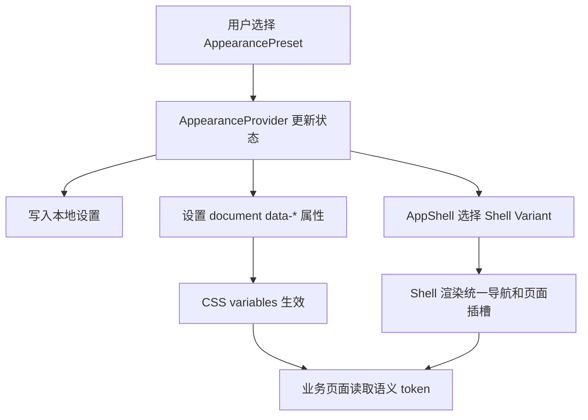

# 前端外观系统设计

本文档定义 Helsincy Mod Manager 的前端外观系统。这里的“外观”不只等于浅色、深色主题，也包括导航布局、侧边栏形态、信息密度、动效偏好等会影响应用整体使用方式的 UI 结构。具体扩展步骤、命名规范和验收清单见 [前端外观系统扩展指南](APPEARANCE_EXTENSION_GUIDE.md)。

## 背景

Helsincy 会长期维护多个功能域：Mod 管理、分类标签、配置档、替换目标、存档备份、游戏管理、任务队列、日志诊断和设置。后续还会支持《怪物猎人：崛起》《怪物猎人：荒野》以及 Linux / Steam Deck 实验性场景。

如果只用一个 `AppShell.tsx` 和一个大型 CSS 文件承载所有 UI 变化，后续很容易出现：

- 新增主题时到处覆盖颜色。
- 新增浮动按钮侧边栏时复制整套页面。
- 每个业务页面都判断当前布局形态。
- 样式文件继续膨胀，难以维护。
- 主题配置、导航结构、业务状态互相耦合。

因此项目需要把外观系统设计成可组合、可扩展、可测试的前端基础设施。

## 目标

- 支持多种颜色主题，例如浅色、深色、猎人绿、冰原冷色等。
- 支持多种应用外壳形态，例如经典侧边栏、浮动按钮 Dock、紧凑 Rail。
- 支持信息密度配置，例如舒适模式和紧凑模式。
- 支持动效偏好，例如关闭动效、轻动效、正常动效。
- 让业务页面不关心当前使用哪一种外壳形态。
- 让导航结构只维护一份，避免每个 Shell 变体复制导航项。
- 让主题配置数据驱动，避免把颜色、间距、圆角等值散落在组件里。
- 为后续用户自定义外观预设留下安全边界。

## 非目标

- 不在第一阶段实现插件式主题市场。
- 不允许用户直接注入任意 CSS 或脚本。
- 不把外观系统用于修改核心业务流程。
- 不为每个游戏复制一套前端 Shell。
- 不要求 MVP 阶段一次性完成所有外观变体。

## 核心概念

### Appearance Preset

外观预设是玩家能选择的完整外观组合。它不是单独的颜色主题，而是多个维度的组合。

```ts
type AppearancePreset = {
  id: string;
  name: string;
  colorScheme: ColorSchemeId;
  shellVariant: ShellVariantId;
  density: DensityId;
  motion: MotionId;
};
```

示例：

```ts
const iceborneFocusPreset: AppearancePreset = {
  id: "iceborne-focus",
  name: "冰原专注",
  colorScheme: "iceborne",
  shellVariant: "compact-rail",
  density: "compact",
  motion: "subtle",
};
```

### Color Scheme

颜色方案只负责颜色语义，不负责布局。它通过 CSS variables 提供设计 token。

桌面端的有效颜色方案还必须同步给 Tauri 主窗口，使 Windows 原生标题栏与 WebView 内容使用同一浅色/深色外观。普通浏览器预览不具备该能力时应静默降级，不能因原生主题 API 不可用导致白屏。

示例：

```css
:root[data-color-scheme="light"] {
  --color-bg: #f8fafc;
  --color-surface: #ffffff;
  --color-border: #e2e8f0;
  --color-text: #1f2933;
  --color-text-muted: #64748b;
  --color-accent: #2563eb;
  --color-danger: #dc2626;
  --color-warning: #d97706;
}
```

业务组件只能使用语义变量：

```css
.mod-card {
  color: var(--color-text);
  background: var(--color-surface);
  border: 1px solid var(--color-border);
}
```

业务组件禁止直接绑定某个主题名称：

```css
/* 禁止 */
.mod-card.light-theme-only {
  background: #ffffff;
}
```

### Shell Variant

Shell 变体负责应用整体布局和全局导航呈现方式。它可以改变侧边栏、顶部栏、浮动导航、状态栏位置，但不能改变业务页面的功能语义。

首批规划的 Shell 变体：

| 变体 | 说明 | 适用场景 |
|------|------|----------|
| `classic-sidebar` | 左侧固定侧边栏 + 顶部状态栏 | 默认桌面布局，信息最稳定 |
| `floating-dock` | 主导航以悬浮按钮或 Dock 形式出现 | 更强视觉风格，适合宽屏或沉浸式主页 |
| `compact-rail` | 左侧窄 Rail，仅显示图标，必要时展开 | 小屏、Steam Deck Desktop Mode、紧凑工作流 |

Shell 变体只消费统一的导航定义和全局状态，不直接实现 Mod 安装、备份、替换目标等业务规则。

### Density

密度控制间距、控件高度、表格行高和卡片内边距。

```css
:root[data-density="comfortable"] {
  --space-control-y: 10px;
  --size-nav-item: 36px;
  --size-table-row: 44px;
}

:root[data-density="compact"] {
  --space-control-y: 7px;
  --size-nav-item: 30px;
  --size-table-row: 36px;
}
```

密度不应通过给业务页面写分支实现，而应通过 token 影响布局。

### Motion

动效偏好控制过渡、展开收起、浮动 Dock 显隐和页面切换。

```css
:root[data-motion="none"] {
  --motion-duration-fast: 0ms;
  --motion-duration-normal: 0ms;
}

:root[data-motion="subtle"] {
  --motion-duration-fast: 120ms;
  --motion-duration-normal: 180ms;
}
```

必须尊重系统级 `prefers-reduced-motion`。当系统要求减少动效时，应用不应强行播放复杂动画。

全屏遮罩与模态弹层在 Windows WebView2 中应避免叠加多层 `backdrop-filter`。嵌套 blur/saturate 容易触发 GPU 分块合成瑕疵；优先使用单层纯色半透明遮罩、不透明语义表面和短时 opacity/transform 过渡。动画结束后应移除稳定态的 identity transform、opacity transition 和不可见的全尺寸渐变装饰层，让 WebView2 释放临时合成层，避免深色表面残留矩形纹理分块。减少动效模式下可保留短时淡入淡出，但应取消明显位移和缩放。

## 推荐目录结构

```text
src/
  app/
    appearance/
      appearanceTypes.ts
      appearanceRegistry.ts
      AppearanceProvider.tsx
      useAppearance.ts
      persistAppearance.ts
    shell/
      AppShell.tsx
      shellRegistry.ts
      layouts/
        classic-sidebar/
          ClassicSidebarShell.tsx
          ClassicSidebarShell.css
        floating-dock/
          FloatingDockShell.tsx
          FloatingDockShell.css
        compact-rail/
          CompactRailShell.tsx
          CompactRailShell.css
      navigation/
        navItems.ts
        NavigationButton.tsx
        NavigationIcon.tsx
  shared/
    styles/
      reset.css
      tokens.css
      color-schemes/
        light.css
        dark.css
        hunter-green.css
        iceborne.css
      density/
        comfortable.css
        compact.css
      motion/
        none.css
        subtle.css
        normal.css
```

说明：

- `appearance/` 负责外观状态、预设注册、持久化和 hook。
- `shell/` 负责应用外壳，不负责具体功能页面。
- `shell/layouts/` 下每个变体独立维护组件和样式。
- `navigation/` 维护统一导航定义和导航按钮基础组件。
- `shared/styles/` 维护全局 token，不放业务页面样式。

## Runtime 数据流



推荐渲染方式：

```tsx
const Shell = shellRegistry[appearance.shellVariant];

return (
  <Shell navItems={navItems} status={status}>
    {children}
  </Shell>
);
```

业务页面只接收路由、数据和用户操作，不应该读取 `shellVariant` 决定自己变成另一个页面。

## Shell 变体契约

每个 Shell 变体至少需要实现同一组输入：

```ts
type AppShellLayoutProps = {
  navItems: NavItem[];
  status: AppStatusSummary;
  children: React.ReactNode;
};

type ShellDefinition = {
  id: ShellVariantId;
  name: string;
  component: React.ComponentType<AppShellLayoutProps>;
};
```

Shell 变体必须保证：

- 主内容区域有稳定的 `main` landmark。
- 主导航有明确的 `aria-label`。
- 当前页面通过 `aria-current="page"` 标记。
- 禁用导航项使用真实 `disabled` 或可解释的不可用状态。
- 浮动导航不遮挡主要内容、弹窗、任务提示或底部状态。
- 窄屏下仍然能访问所有一级导航。

Shell 变体禁止：

- 直接调用 Tauri command。
- 直接读写 Mod、游戏目录或备份状态。
- 在变体内部复制业务页面。
- 根据具体游戏硬编码导航行为。

## 浮动 Dock 方案

`floating-dock` 不是普通侧边栏换个颜色，而是一个独立 Shell 变体。

建议布局：

- 左下或左侧中部显示可折叠的悬浮 Dock。
- 默认显示核心导航图标。
- 悬停或点击后展开文字标签。
- 顶部状态栏保持独立，显示当前游戏、配置档、目录状态和任务状态。
- 主内容区域保持完整宽度，但为 Dock 预留安全点击区域。
- 小屏下 Dock 可切换为底部导航或紧凑 Rail。

交互要求：

- 所有 Dock 按钮必须有 tooltip 或可见标签。
- 键盘 Tab 顺序必须可预测。
- 展开收起不能改变业务页面内部布局状态。
- Dock 展开时不能遮挡模态框和危险确认按钮。
- 当前页面状态必须在折叠和展开两种状态都可见。

## 导航系统

导航项只维护一份：

```ts
type IconComponent = React.ComponentType<{ size?: number; strokeWidth?: number }>;

type NavItem = {
  id: string;
  label: string;
  icon: IconComponent;
  route: string;
  capability?: string;
  disabledReason?: string;
};
```

示例：

```ts
export const navItems: NavItem[] = [
  { id: "dashboard", label: "工作台", icon: LayoutDashboard, route: "/" },
  { id: "mods", label: "Mod 管理", icon: Puzzle, route: "/mods" },
  { id: "categories", label: "分类 / 标签", icon: Tags, route: "/categories" },
  { id: "profiles", label: "配置档", icon: User, route: "/profiles" },
  { id: "replacements", label: "替换目标", icon: Crosshair, route: "/replacements" },
  { id: "backups", label: "存档备份", icon: Archive, route: "/backups" },
  { id: "games", label: "游戏管理", icon: Gamepad2, route: "/games" },
  { id: "tasks", label: "任务队列", icon: ListChecks, route: "/tasks" },
  { id: "diagnostics", label: "日志 / 诊断", icon: FileSearch, route: "/diagnostics" },
  { id: "settings", label: "设置", icon: Settings, route: "/settings" },
];
```

Shell 变体决定“怎么显示导航”，不决定“导航有哪些”。

顶部状态摘要也应由应用层统一整理，再传给 Shell：

```ts
type AppStatusSummary = {
  currentGameName: string;
  profileLabel: string;
  gameDirectoryState: "missing" | "ready" | "invalid";
  taskState: "idle" | "running" | "failed";
};
```

Shell 只负责选择合适的视觉呈现，例如状态条、状态徽标或紧凑图标提示，不负责判断目录是否有效或任务是否失败。

## 持久化策略

外观设置属于用户偏好，不属于游戏适配器规则。

推荐保存字段：

```ts
type AppearanceSettings = {
  presetId: string;
  custom?: {
    colorScheme?: ColorSchemeId;
    shellVariant?: ShellVariantId;
    density?: DensityId;
    motion?: MotionId;
  };
};
```

MVP 阶段可以先保存在前端本地存储。后续当应用设置进入 SQLite 后，再通过设置服务统一持久化。

持久化要求：

- 配置缺失或损坏时回退到安全默认值。
- 未识别的 preset 或变体不能导致白屏。
- 设置迁移必须有版本号或兼容逻辑。
- 不记录本地路径、Steam ID、Mod 包信息或任何玩家敏感数据。

## 与游戏适配器的关系

外观系统与游戏适配器保持解耦。

允许的关系：

- Shell 显示当前游戏名称、当前 profile、任务状态等上层摘要。
- 页面根据游戏 capability 展示或隐藏特定功能入口。
- 替换目标页面根据当前游戏 catalog 展示不同内容。

禁止的关系：

- `floating-dock` 只为 MHW:I 写特殊导航。
- `iceborne` 颜色主题直接读取 MHW:I adapter。
- Shell 变体根据 `game_id` 复制页面结构。
- 游戏适配器返回 CSS、组件或前端布局配置。

## 安全边界

外观系统不能成为执行任意代码或泄露玩家信息的入口。

要求：

- 用户自定义主题第一阶段只允许选择预设和受控 token。
- 不允许导入任意 CSS、HTML、JS。
- 不允许主题配置引用本地文件路径作为背景图。
- 不允许远程加载用户提供的图片或字体。
- 日志中只记录外观预设 ID，不记录任何本地隐私路径。
- 主题导入功能若未来出现，必须单独做格式校验、大小限制和安全评审。

## 可访问性要求

- 颜色对比度必须满足常规文本可读性要求。
- 不能只靠颜色表达危险、警告、启用或禁用状态。
- 浮动 Dock 折叠状态下必须提供可访问名称。
- 键盘用户必须能打开、关闭和切换导航。
- 当前页面、当前游戏和任务状态必须能被屏幕阅读器理解。
- 动效必须可降低或关闭。

## 测试策略

文档阶段不需要新增自动化测试。实现阶段需要覆盖：

- `appearanceRegistry` 能拒绝未知 preset 并回退默认值。
- `AppearanceProvider` 能正确设置 `data-color-scheme`、`data-density`、`data-motion`。
- `shellRegistry` 找不到变体时回退 `classic-sidebar`。
- 每个 Shell 变体都能渲染同一份 `navItems`。
- 浮动 Dock 在折叠、展开、键盘导航下都能访问所有入口。
- 业务页面不依赖具体 Shell 变体。
- 构建、lint、类型检查通过。

涉及 UI 视觉实现时，应补充浏览器截图或人工 smoke test，重点检查：

- 桌面宽屏。
- 1366px 常见窗口。
- 860px 以下窄屏。
- Steam Deck Desktop Mode 近似分辨率。

## 迁移计划

### 阶段 1：抽离导航和 Shell

- 从当前 `AppShell.tsx` 中抽出 `navItems.ts`。
- 保留现有经典侧边栏视觉，迁移为 `classic-sidebar`。
- `AppShell.tsx` 改为根据 registry 渲染 Shell。

### 阶段 2：引入 token

- 从 `AppShell.css` 中抽出基础颜色、间距、圆角、阴影变量。
- 建立 `tokens.css` 和第一批 `color-schemes`。
- 业务组件逐步改用语义 token。

### 阶段 3：引入 AppearanceProvider

- 增加外观状态和默认预设。
- 支持浅色 / 深色切换。
- 将顶部主题按钮改为真正更新外观状态。

### 阶段 4：新增 Shell 变体

- 新增 `compact-rail`，验证小屏和紧凑模式。
- 新增 `floating-dock`，验证悬浮导航不会影响业务页面。
- 补充可访问性和响应式测试。

### 阶段 5：设置页整合

- 在设置页提供外观预设选择。
- 支持颜色方案、Shell 形态、密度、动效的独立选择。
- 设置写入统一用户设置存储。

## 反模式

禁止在业务页面中写：

```tsx
if (appearance.shellVariant === "floating-dock") {
  return <SpecialModsPage />;
}
```

禁止在通用组件中硬编码主题颜色：

```tsx
return <div style={{ background: "#ffffff", color: "#1f2933" }} />;
```

禁止为了新增布局复制整套页面：

```text
features/mods/ModsPageForSidebar.tsx
features/mods/ModsPageForFloatingDock.tsx
```

禁止把主题配置和游戏规则混在一起：

```text
hmm-games-mhw/theme.ts
```

正确方向是：

- Shell 变体负责应用外壳。
- 业务页面负责业务内容。
- CSS variables 负责视觉 token。
- 游戏 adapter 负责游戏规则。
- Appearance preset 负责组合选择。

## 默认落地建议

MVP 默认启用：

```ts
const defaultAppearancePreset: AppearancePreset = {
  id: "default-light",
  name: "默认浅色",
  colorScheme: "light",
  shellVariant: "classic-sidebar",
  density: "comfortable",
  motion: "subtle",
};
```

第一版实现不急于提供大量主题。优先把边界搭好：导航一份、Shell 可替换、颜色 token 化、业务页面不感知 Shell。只要这四点成立，后续做浮动按钮 UI、冰原风格主题或 Steam Deck 紧凑布局时，就不会把项目拖回单文件堆叠。
