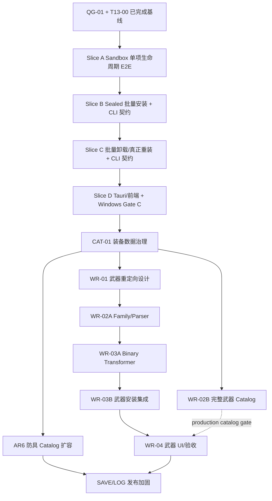

# Windows 自主迭代路线图

本文档是 Helsincy Mod Manager 无人值守迭代的活跃执行队列，也是唯一按日常推进持续更新的任务状态
真源。产品阶段见 [路线图](ROADMAP.md)，历史能力证据见
[项目任务状态快照](PROJECT_TASK_STATUS.md)，可复制执行提示词见
[Codex 目标模式提示词](CODEX_GOAL_MODE_PROMPTS.md)。路线图和状态快照只在纵向切片合并或里程碑结论
变化时同步，不随每个 commit、review 修复或 CI 轮次重复更新。

更新时间：2026-08-07
规划基线：`main@5897fbc`；Gate C、WR-04 Gate D 与 SAVE-02 安装态后台保护均已完成受控验收

## 固定范围

- 平台：Windows。
- 游戏：MHW:I。
- 首要目标：单项安装/卸载/真正重装基线之上的批量安装、批量卸载和批量真正重装。
- 后续目标：装备重定向 catalog 与武器链路、狩技来源导入验收、自动存档备份、日志和 CLI。
- Linux / Steam Deck 明确不在本轮范围，不创建实现、打包、验收或兼容任务，也不阻塞 Windows 队列。
- 纯视觉美化不进入无人值守队列；涉及 UI 的 task 必须有行为测试，必要时保留人工视觉 smoke gate。

## 状态口径

| 状态 | 含义 |
| --- | --- |
| `completed` | 已实现并有当前自动化证据 |
| `certified` | 除实现外，已完成对应独立复审与受控 Windows 纵向验收 |
| `implemented` | 当前切片分支已实现，但仍需完成 CI、review 和合并门禁 |
| `ready` | 前置已满足，可以作为下一个纵向切片 |
| `blocked` | 缺少明确依赖、外部环境或维护者决策 |
| `conditional` | 只在出现复现缺陷或获得受控验收输入时启动 |
| `out_of_scope` | 本轮不处理 |

## 已完成基线

以下能力不重新实现：

- 单项安装、manifest 驱动卸载、真正重装、失败回滚/恢复和重启恢复：Gate A `certified`。
- Armor Retarget AR1-AR5、同 revision target switch、重启恢复和 manifest 卸载：Gate B
  `certified`。
- T17 狩技来源批量迁移 Slice 1-4C：`completed`，保持 import-only。
- 多 Steam 用户存档候选发现、显式选择、昵称/头像展示和隐私降级：`completed`。
- 手动/运行期自动备份、后台 worker/Scheduled Task 软件核心、App/Task/Audit Log、诊断页和
  support export：核心已完成；SAVE-02 安装态 runtime acceptance 已 `certified`，installer cleanup、
  玩家存档恢复和 retention/备份中心仍有缺口。
- CLI-0A/0B/1A/1B/2A/2B/2C：`completed`；Sandbox 单项 lifecycle 已闭环，Production 写命令仍不可达。
- 工程治理 GOV-01 至 GOV-04：`completed`。DTO 测试外置、重装路径 dead-code 抑制清理、
  Tauri command 契约覆盖和治理检查加固已分别由 PR #211 至 #214 交付。
- QG-01：`completed`，PR #215 已把 frontend tests 与 workspace clippy 纳入本地和 CI 统一门禁。
- T13 Slice A-D：T13-07 为 `completed`；T13-08 Windows Sandbox Gate C 为 `certified`。
- CAT-01、WR-01、WR-02A、WR-03A、WR-03B 与 WR-04 已完成；WR-04 Windows Gate D 为
  `certified`。LOG-01 Task/Audit retention、LOG-02 日志总空间上限与 LOG-03 Debug Log 已完成；
  SAVE-02 安装态后台保护验收已 `certified`。production catalog 仍受 WR-02B 许可门禁约束，下一
  `ready` 纵向切片为 SAVE-03。

“已完成”不表示后续 task 可以绕过现有边界。批量和 CLI 写能力必须复用相同的领域服务、安全链和
任务/审计事实。

## 硬门禁

### 数据安全

任何游戏目录写入必须保持：

```text
sealed input
  -> analyze / preflight
  -> InstallPlan
  -> backup
  -> commit
  -> manifest
  -> rollback / recovery
```

- 原始 Mod 输入只读；派生内容只进入 sandbox/staging。
- 同一 game/profile 写入严格串行；scan/hash/extract/analyze 不持有写锁。
- 卸载只消费 manifest/recovery 事实，不根据包内容猜测。
- 重装必须消费 retained/replaced/added/stale 与 durable recovery transaction。
- 取消只发生在安全点；已经进入不可抢占 commit 的单项必须完成一致性收尾。
- Task/Audit 失败不能伪造玩家文件回滚，也不能隐藏证据健康降级。

### Git、CI 与 review

- 一个可演示的纵向产品切片或一个 release blocker 使用一个独立 `hy/` 分支、worktree 和 PR。
- 同一切片中的设计、领域/app、CLI/Tauri、前端、测试和文档按可独立 review 的 commit 拆分，但默认留在
  同一 PR。task ID 是工作包边界，不再自动等于 PR 边界。
- 文档同步、测试搬迁、dead-code 清理、文件拆分和内部前置默认并入相邻产品 PR。只有改动无关、
  可独立回滚、安全风险明显扩大，或 diff 已无法连贯 review 时才拆 PR。
- QG-01 合并后，`verify.ps1`、`verify.sh` 和 required CI 已统一包含前端 tests 与 workspace
  clippy。后续 PR 不再重复手工补跑这两项全量命令；聚焦验证仍按 touched boundary 执行。
- 开发期间只运行 touched boundary 的聚焦验证。跨层/public contract、高风险写入、安全、并发或治理
  切片在首次 PR ready 前运行一次完整 `verify.ps1` 和 `hmm-review-gate` 本地自审；低风险切片可只
  保留聚焦本地证据，由 required CI 执行统一入口。
- review 小修只重跑受影响的聚焦验证；只有安全/公共契约/治理边界扩大、依赖或基线变化，或旧的完整
  验证证据已不再适用时，才重新运行本地完整 `verify.ps1`。
- required CI 只有 terminal `success` 才算通过。`pending`、`failure`、`cancelled`、`timed_out`、
  `action_required`、`skipped` 或 `neutral` 都禁止合并。
- 获取并处理全部 review thread/comment。真实 bug 必须修复并补测试；误报必须在 PR 留下源码、测试
  或契约证据，不能凭感觉关闭。
- CodeRabbit 未 review 不能视为批准；必须完成独立全 diff 自审并记录证据。
- 优先普通合并。`--admin` 的允许条件和禁止条件以
  [合并提示词](CODEX_GOAL_MODE_PROMPTS.md#合并提示词) 为准。
- 治理、安全门禁、workflow、policy、AGENTS 或核心安全文档变更必须提升自审强度并明确标注治理
  影响；外部 review 因额度缺席时必须完整复审增量。`--admin` 只能在当前目标已获明确授权且合并
  提示词的全部条件满足时使用，绝不能绕过 CI、真实 finding 或未解决评论。

### 记录与吞吐

- 每个纵向切片只使用一个 PWF task。只在阶段转换、重要 finding、阻塞和恢复上下文时更新
  `task_plan.md` / `findings.md`；日常命令与文件列表交给 hook 记录，不手工重复抄写。
- 本文档维护活跃队列；`ROADMAP.md` 和 `PROJECT_TASK_STATUS.md` 只在切片合并或里程碑变化时同步。
- 进度指标使用已关闭 release blocker、通过的端到端玩家工作流、切片周期和剩余风险。代码行数、
  commit 数、PR 数和文档页数不作为产出目标。

## 依赖图



QG-01、T13-00 和 Slice A-D 已完成；T13-05 的 Sandbox CLI、T13-06 的窄 Tauri/typed API、T13-07
批量 UI 与 T13-08 Windows Gate C 已形成完整 Sandbox 玩家路径。CAT-01 装备数据治理、WR-01 武器
设计、WR-02A 纯解析、WR-03A 纯 binary transformer、WR-03B 安装事实链和 WR-04 受控 UI/Gate D
均已完成；LOG-01 Task/Audit retention、LOG-02 日志总空间上限、LOG-03 Debug Log 与 SAVE-02
安装态后台保护验收也已完成。AR6 与 WR-02B 等待已授权审计数据，当前下一纵向切片是 SAVE-03。Production weapon
catalog 仍受许可门禁，只有 developer/Sandbox capability 可以使用人工 seed。外部 review
因额度缺席时仍按 CodeRabbit
缺席流程完成独立全 diff 自审，且不能跳过 required CI terminal success。

## P0 核心生命周期与批量能力

推荐按以下四个纵向切片交付。每个切片默认一个 PR，内部 task 是 commit/work package：

| 切片 | 内部工作包 | 可演示完成定义 |
| --- | --- | --- |
| Slice A | CLI-2A、CLI-2B、CLI-2C、CORE-PREF-01 | 在隔离 Sandbox 中通过 CLI 完成单项安装、卸载、真正重装和恢复 E2E，并统一 preflight。 |
| Slice B | T13-01、T13-02、T13-05 的 install 子集 | sealed batch preview/start、批量安装、partial result、retry 和 CLI install contract E2E。 |
| Slice C | T13-03、T13-04、T13-05 的其余子集 | 批量卸载和真正重装通过 manifest/recovery 事实运行，CLI 覆盖 cancel、partial result 和 retry。 |
| Slice D | T13-06、T13-07、T13-08 | Tauri/typed API、前端批量工作流和 disposable Windows Sandbox Gate C 形成完整玩家路径。 |

Slice A 的 CLI-2A/2B/2C 与 CORE-PREF-01、Slice B 的 sealed batch install CLI、Slice C 的
uninstall/reinstall runtime/CLI contract、Slice D 的 Tauri/UI/Gate C、CAT-01 数据治理和 WR-04
Tauri/UI/Gate D、LOG-01 Task/Audit retention、LOG-02 日志总空间上限、LOG-03 Debug Log 与 SAVE-02
安装态后台保护验收均已完成。Sandbox 写能力不因此扩张为 Production 写能力；下一任务进入 SAVE-03
installer ownership cleanup，AR6/WR-02B 在授权数据到位后恢复。

### QG-01：补齐 CI 质量门禁

状态：`completed`，PR #215 已通过完整增量自审、远端 CI、评论处理并合并。

范围：

- 同步修改 Windows/CI 验证入口，把 `pnpm run test` 和
  `cargo clippy --workspace --all-targets -- -D warnings` 纳入强制门禁。
- 保证 `.ps1` 与 `.sh` 行为等价，失败时整体非零退出。
- 增加验证脚本的负向测试或变异证据。

完成定义：

- 完整验证实际执行前端测试和 clippy。
- 人工制造一个前端测试失败和一个 clippy failure 时，入口均 fail closed；还原后通过。
- CI 时间增长和治理影响写入 PR。

提交边界：验证脚本/测试一个提交，文档同步一个提交。

### T13-00：冻结批量领域语义

状态：`design-complete`；领域语义、安全约束、契约和路线图已冻结，后续 T13-01 至 T13-08 已按该
设计完成并通过 Gate C。这仍是高风险设计基线，后续变更须重新按切片验证。

独立文档：[批量 Mod 生命周期领域设计](BATCH_MOD_LIFECYCLE_DESIGN.md)。

设计必须决定：

- sealed input snapshot、batch digest、跨 Mod 最终 target 冲突和 plan 过期。
- 每个 Mod 独立事务，不宣称整个批次全局原子。
- 默认 `stop_on_failure`；可选 `continue` 必须是显式领域策略。
- 首次阻断项默认在任何写入前终止整批。
- 已提交项保留真实成功事实，partial result 不回滚已成功的独立 Mod。
- 取消停止启动新项；运行中 commit 不抢占，在安全点收尾。
- retry 只消费 sealed batch 中 retryable 项，成功项不重放。
- 批量安装、卸载和真正重装分别定义输入、前置、结果和 recovery 行为。

完成定义：新增独立 T13 设计文档，更新 contract/TODO/测试矩阵；没有产品代码。

提交边界：领域语义与安全设计一个提交，契约/路线图同步一个提交。

### CLI-2A：逐阶段任务 Observer 与 JSONL

状态：`completed`，作为 Slice A 内部工作包，不单独创建 PR。

范围：

- runner 在任务实际推进时调用 observer，不再只在结束后返回事件集合。
- Tauri event、CLI JSONL 和 Task Log 共享 task id、phase 与顺序事实。
- 每个已启动任务恰好一个 terminal event，sequence 从 0 单调递增。
- observer 写入失败不改变已经提交的玩家文件事实。

完成定义：

- 安装、卸载、重装和恢复 runner 的顺序/terminal/cancel tests 通过。
- Tauri wire DTO 不发生未记录变化。
- CLI JSONL 不包含自由文本 message、原始 error、result ref 或路径。

提交边界：app/runtime observer 接线一个提交，Tauri/CLI adapter 与 contract tests 一个提交。

### CLI-2B：Sandbox 写许可与 containment

状态：`completed`，CLI-2A 依赖已满足。

范围：

- 版本化 sandbox marker 和不可伪造的进程内 write capability。
- 词法与 canonical containment；拒绝 symlink/junction/reparse point 和祖先替换。
- game/save/backup/app-data 根全部位于显式 sandbox 根。
- Production 始终拒绝，不存在环境变量/debug flag 绕过。
- 外部 sentinel 在所有成功/失败场景保持不变。

完成定义：只建立安全写 admission，不开放业务写命令。

提交边界：marker/capability 一个提交，containment/负向 fixture 一个提交。

### CLI-2C：单项生命周期 Sandbox CLI E2E

状态：`completed`，CLI-2B 依赖已满足。

范围：

- 接入 `install apply`、`uninstall`、`reinstall` 和 `recovery apply` 的 Sandbox 命令。
- 写操作要求 `--commit --yes` 和短期 opaque plan token；锁内重建并重验计划。
- 复用现有 application service，不复制 Tauri command 或 executor。
- 覆盖 install -> restart -> uninstall、reinstall、manifest save failure、rollback/recovery、Ctrl+C。

完成定义：真实 `hmm` binary 在 temp root 复验 Gate A 类闭环；Production 写命令 parser/runtime 双重
不可达。

提交边界：plan/apply token 一个提交，单项命令 adapter 一个提交，E2E/failure injection 一个提交。

### CORE-PREF-01：单项安装前置检查一致化

状态：`completed`，CLI-2C 依赖已满足。

范围：

- 审计当前 `game prerequisites`、InstallPlan preflight 和桌面安装/重装的 decision 是否同源。
- 固定 required/warning/unverified 的稳定 code 和阻断语义。
- 单项、批量预览、Tauri 和 CLI 只消费同一 app-level decision。
- 如果现有实现已满足，增加证明性回归测试；发现真实缺口才做最小修复。

完成定义：缺失必需前置在任何写入前阻断；warning 不被误当 success；规则不可用 fail closed 且不泄漏
原始路径或配置。

交付结果：证明性 binary contract 暴露真实分叉后，已增加 app-level decision provider、install/
reinstall preview 与锁内重验、CLI/Tauri/frontend 投影和脱敏测试；未复制 game adapter 规则。

### T13-01：Sealed BatchPlan 与预览

状态：`completed`，T13-00、CLI-2A/2B/2C 和 CORE-PREF-01 依赖已满足。

范围：

- 领域模型、ports、app service、batch digest、跨 Mod conflict/preflight。
- 输入顺序规范化并封存；结果顺序确定。
- 预览完全只读，不写游戏目录、manifest、backup、DB 投影或 Audit。
- 限制批次数量、计划大小和资源预算。

完成定义：相同 snapshot 生成相同 digest；任何阻断项默认使整个 apply 不可用；plan 过期必须重建。

提交边界：core/ports 一个提交，app preview 一个提交，聚焦测试一个提交。

### T13-02：批量安装

状态：`completed`，T13-01 已完成；批量安装 runner、SQLite journal、retry、failure/cancel 证据、
入口 fail-closed 规则与 T13-05 install CLI 公开契约均已落地。

范围：

- 确定性逐项执行，每项复用单项安装事务。
- 同一 game/profile 写入串行；项目间释放不需要的资源。
- 默认首个失败停止；已成功项保留；结果明确 success/blocked/failed/cancelled/retryable。
- batch 与 per-item Audit 只记录短 ID、计数和稳定 code。
- batch journal 持久化 sealed/attempt/item intent 与终态；journal 终结不确定时使用
  `interrupted`，证据降级且禁止 retry。
- exact revision 同时约束 planner、source sandbox、commit 校验和 schema v2 manifest；replacement
  snapshot 在 materialize workflow 接入前显式阻断。

完成定义：成功、首项失败、中途失败、取消、Audit writer 失败、manifest save 失败、journal
故障、exact revision fail-closed 和重试均有 temp/fake 测试；外部 sentinel 不变。当前实现已完成
核心代码、聚焦测试、完整 `verify.ps1`、全 diff review 和远端门禁。启动级遗留
非终态 `queued/running/stopping` attempt 已由写入口 fail closed 阻断；Sandbox batch 最终
admission 已在 SQLite 短写事务中按 game/profile 跨进程串行，指定 attempt 的只读 result 仍保持
诊断可用。进程重启不得自动继续破坏性写入，后续如要提供 reconciliation 必须单独设计和验收。

提交边界：runner/state machine 一个提交，audit/result repository 一个提交，failure/cancel tests 一个提交。

### T13-03：批量卸载

状态：`completed`。app/core facts/executor 与 T13-05 Sandbox runtime/CLI contract 已落地；Tauri 与
前端入口属于 T13-06/T13-07。

范围：

- 只消费 manifest/recovery facts；未知文件和玩家修改文件 fail closed。
- 预检跨 Mod 共享目标、backup ownership 和旧 manifest 摘要。
- 每项独立 rollback/recovery；默认首个失败停止。
- 锁外重验完整 item facts，锁内重验 exact revision 与 Mod 级 manifest snapshot digest；同 revision
  replacement binding/target 漂移零写入拒绝。

完成定义：未知文件保留，已成功卸载项不被伪回滚，失败项仍可由 recovery 扫描识别。

提交边界：uninstall plan 一个提交，executor/recovery 一个提交，负向测试一个提交。

### T13-04：批量真正重装

状态：`completed`。app/core facts/executor 与 T13-05 Sandbox runtime/CLI contract 已落地；Tauri 与
前端入口属于 T13-06/T13-07。

范围：

- 每项复用真正重装 retained/replaced/added/stale 和 durable transaction。
- revision/binding lineage、plan token 和候选状态在写锁内重验。
- 支持 Armor target switch，但不增加独立 retarget 写入旁路。
- item seal 使用 Mod 级稳定摘要，执行前重新 prepare；commit 继续使用当次完整 token 做锁内全事实重验。
- 结构化区分 rollback succeeded、recovery required 和 committed evidence degraded，不从错误文本猜测。

完成定义：多 Mod mixed result、重启恢复、同 revision target switch、stale plan、失败收敛和幂等 retry
由 app 层聚焦测试、既有 durable reinstall fault matrix，以及 T13-05 的纯只读 retarget facts、
Sandbox CLI 跨进程 E2E 共同覆盖。

提交边界：batch reinstall plan 一个提交，runner/recovery 一个提交，retarget regression 一个提交。

### T13-05：CLI 批量契约

状态：`completed`。Slice B 的 install 与 Slice C 的 uninstall/reinstall 已统一接入 Sandbox
`install batch plan|apply|result|retry`；Production 继续拒绝。

范围：

- CLI 适配领域 batch service，不在 shell 中循环单项命令。
- `hmm install batch plan|apply|result|retry` 使用 JSON/JSONL，包含 batch/task/item 状态和
  exit code `5` partial success。
- `plan` 返回脱敏 projection 与短期 opaque `previewToken`；apply 先做只读 stale 验证，再初始化
  journal 并在 seal 时重验。
- apply/retry 的最终 scope admission 由 SQLite 短写事务原子完成；result 只读指定 attempt，retry
  admission 竞争失败时安全回收未执行的 sealed retry attempt。
- 首版仅 Sandbox；Production 继续拒绝。

完成定义：Slice B/C 已覆盖批量安装、卸载和真正重装的 conflict、partial success、stale preview、
retry、same-revision Armor switch、legacy result 可读性和敏感 canary contract tests。

提交边界：CLI parser/schema 一个提交，runtime adapter/E2E 一个提交。

### T13-06：Tauri command 与 typed API

状态：`completed`。

范围：

- 窄 plan/start/query/retry commands，稳定 camelCase DTO 和 error/phase codes。
- 大结果通过 result query 分页读取，不塞进 progress event。
- 前端不传路径、manifest、backup、plan 内部或 adapter metadata。

完成定义：contract 文档、Rust serialization、feature-local typed API 和 taskId tests 同步。

提交边界：Tauri DTO/commands 一个提交，typed API/contract tests 一个提交。

### T13-07：批量操作 UI

状态：`completed`。代码、行为测试和 4 viewport 视觉 smoke 均已完成。

范围：

- 恢复多选消费能力；提供批量安装、卸载、重装的预览、确认、进度、结果和 retry。
- 只允许后端返回可用的动作；不恢复永远 disabled 的占位按钮。
- page-local/cross-page selection 语义明确；选择变化使旧 batch plan 失效。
- loading/error/empty/partial/cancelled/recovery-required 状态完整。

完成定义：前端行为测试、typecheck/lint/build 和 `1440x900`、`1366x768`、`1280x800`、`480x800`
受控 smoke；无重叠、截断或路径泄漏。

完成证据：4 个视口均按实际窗口尺寸复验；480x800 暴露的浮层 stacking、浅色主题面板和批量终态后
列表刷新问题已修复并重新验收。预览/结果的按钮、警告、滚动区域和路径脱敏均符合完成定义。

提交边界：state/workflow 一个提交，UI 一个提交，行为/视觉回归一个提交。

### T13-08：Windows Sandbox Gate C

状态：`certified`（2026-08-05）。T13-05/T13-07 依赖已满足。

使用全新 disposable Windows Sandbox 和人工 fixture 验收：

```text
批量安装
  -> 完全重启
  -> 批量真正重装（包含一个 Armor target switch）
  -> 制造一个受控 partial failure
  -> 重试 retryable 项
  -> 再次重启
  -> 批量卸载
  -> exact baseline
```

完成定义：source/旧 target/staging/recovery 无残留，manifest/backup/Audit/taskId 一致，外部 sentinel
未变化。Gate C 只有完整自动化、独立 review、CI 与该纵向验收全部通过后才能标记 `certified`。

认证证据：最终 release artifact SHA-256 为
`08EF5FF15DAFDC00790C0975FAA160C792AF487D47C186271E93D09D84AB8C8D`。主链完成 batch install ->
GUI restart -> Alpha v2 true reinstall + Armor target switch -> restart -> recovery 归零 -> batch uninstall ->
9 文件/212 字节 exact baseline。补充受控文件锁场景中，batch
`batch-94eedbc4-3006-4f76-aa39-b0d1bae71650` attempt 0 为 0 成功/1 失败/2 跳过且全部 retryable，attempt 1
为 3 成功；随后 batch `batch-aab2d50e-7412-4694-9a7f-5433eed50b89` 卸载 3 成功。最终 manifest 与
replacement bindings 为空、Recovery Center 归零、backup/recovery 标准目录为空、无 staging 残留，
10 文件/243 字节补充 baseline 的路径、大小和 SHA-256 全部一致，所有 attempt evidence health 正常。

## P1 装备重定向

候选数据审计已确认：

- 防具候选有 272 条相对路径；display name 不能作为稳定 ID。
- 武器候选有 14 类、3125 个展示名称，但只有 603 个唯一目标路径；同一路径最多 48 个名称。
- 原始 JSON 不是运行时信任源，必须先验证 schema、路径、大小写碰撞、重复项、别名、dummy 条目、
  版本和可分发权利，再生成 bundled artifact。

### CAT-01：装备数据治理

状态：`completed`，2026-08-05 完成 schema/validator、聚焦验证、完整验证和 findings-first 自审。

- 定义候选输入 schema、validator、stable ID 生成、alias/localization、dummy/隐藏条目策略和版本。
- 明确数据 provenance/licensing；未确认可分发权利时不得把候选数据提交为 bundled catalog。
- validator 覆盖绝对路径、`..`、大小写碰撞、重复稳定 ID、重复展示名和路径族错误。

提交边界：schema/validator 一个提交；经过审计的生成 artifact 另一个提交。

完成证据：`hmm-games-mhw` 已提供 candidate v1 JSON Schema、严格 typed/semantic validator、完整
SHA-256 stable ID、locale/alias、active/hidden/dummy、legacy ID 和 provenance/licensing 门禁，以及
只读 developer example。13 个纯人工 JSON 测试覆盖绝对/drive/UNC、`..`、大小写碰撞、重复 ID、
重复展示名、错误 path family、许可审核事实和报告脱敏；完整 `scripts/verify.ps1` 终态通过。未提交
272/3125 条来源未明候选数据，也未生成 bundled artifact。正式契约见
[装备 Catalog 候选数据治理](EQUIPMENT_CATALOG_GOVERNANCE.md)。

### AR6：防具 Catalog 扩容

状态：`blocked`，CAT-01 已完成；当前等待具有明确再分发权和完整审核事实的 armor 候选输入。

- 把最小 seed 扩展为经过审计、版本化的防具 catalog。
- 保持 `mhw-games-mhw` 中的 Unicode、alias、monster/rank/variant 和 `pl/f_equip` 规则。
- 增加全 catalog 唯一性、搜索隔离、加载性能和旧 target ID 兼容测试。

不改变 AR1-AR5 安装链；数据扩容不得触发新的文件写入实现。

### WR-01：武器重定向设计

状态：`design-complete`，2026-08-05 完成设计、安全矩阵和 WR-02 至 WR-04 分阶段计划。

- 独立定义 weapon target kind、14 类 family、stable identity、alias 与 source/target path schema。
- 明确多名称同一路径是 alias/display variant，不生成重复安装目标。
- 不复用或扩张 `MhwArmorReplacementAdapter`；武器 parser/adapter 留在 `hmm-games-mhw`。
- 决定哪些资源只需路径重定向，哪些需要二进制 transformer；未证明安全的类别 fail closed。

完成证据：14 类 family、普通/`bs_` main id、主/副件配对、stable identity/alias、同 family 约束、
MOD3 path-only 条件、MRL3 transformer-required 契约、未知资源 fail-closed、manifest/recovery facts 和
Windows Gate 矩阵已写入 [MHW:I 武器重定向设计](WEAPON_RETARGET_DESIGN.md)。未提交私有 catalog，
未实现真实文件写入。

### WR-02：武器 Catalog、Parser 与 RetargetPlan

状态：WR-02A `completed`；WR-02B `blocked-external-data`，等待满足 CAT-01 的可再分发审计输入。

- WR-02A 使用人工最小 catalog 实现 14-family registry、source closure、结构化 parser 和分析。
- WR-02B 只从 `bundled_eligible` 候选生成完整 versioned weapon catalog。
- 只替换经过 parser 识别的 target 段，不做整路径字符串替换。
- WR-02A 覆盖 14 类、alias、unknown family/part、多 source 和碰撞；603 唯一路径覆盖留给 WR-02B。

WR-02A 完成证据：14-family/六类副件、普通与 `bs_` main/part、严格 resource/model path、完整 pair
source closure、stable ID、alias/legacy resolver 和 fail-closed 错误已由人工 fixture 覆盖；15 项聚焦
测试、`hmm-games-mhw` crate 全测与三 crate clippy 通过。没有 production provider、bundled weapon
catalog、binary transformer、staging 或真实文件写入，也尚未实现 `RetargetPlan`。

### WR-03：武器 staging、InstallPlan 与 manifest

状态：WR-03A/WR-03B `completed`。WR-02B 的外部数据阻塞没有阻止使用人工 binary/catalog fixture
完成通用安装事实链。

- WR-03A 使用人工 MOD3/MRL3 bytes 实现有界 preflight、pair compatibility 和纯 transformer。
- WR-03B 保持原始输入只读，materialize 只写 staging。
- WR-03B 把最终 target 接入 InstallPlan/conflict、binding snapshot、manifest、backup、rollback/recovery。
- 首次安装、真正重装 target switch 和卸载复用 Gate A/T13 单项事务。

WR-03A 完成证据：完全人工 bytes 覆盖受支持 header/version/count/offset/bounds、精确 JAMCRC material
pair、路径安全、六类副件 mapping、changed-range postcondition、确定性 digest 和脱敏错误；固定入口
9/9、`hmm-games-mhw` 72 项及 doc-tests、三 crate all-targets clippy 通过。没有 staging、
InstallPlan/manifest、runtime registry、production catalog 或真实文件写入。

WR-03B 完成证据：versioned invocation/registry、source/dependency/output/mapping digest 重验、sibling
`.partial` 原子发布、plan/reinstall/batch/manifest/recovery/Audit facts 已落地；temp-root 使用人工
MOD3/MRL3 bytes 完成 install -> restart -> same-revision target switch -> restart -> uninstall -> exact
baseline。受影响六 crate tests/doc-tests、all-targets clippy 与独立 lifecycle integration test 通过；
未读取真实游戏、存档、AppData 或第三方 Mod。

### WR-04：武器 Tauri/UI 与 Windows 验收

状态：`certified`（2026-08-06），仅认证人工 developer/Sandbox seed；production catalog 仍受 WR-02B
许可门禁约束。

- 窄 Tauri DTO、feature-local typed API、Mod 详情目标选择/预览/确认。
- 后端提供 category/capability/catalog；前端不解析 `nativePC/wp`。
- 使用人工最小 fixture 完成安装 -> 重启 -> target switch -> 重启 -> manifest 卸载 -> baseline。

完成证据：最终 `hmm-tauri.exe` SHA-256 为
`156c42118c6620d803c1611397c55c1847ab782bb6505cd713c56a17398ea2af`；完整 `verify.ps1` 通过，
Tauri 为 188 passed / 1 ignored。Gate D 在全新 disposable Windows Sandbox 中使用人工 archive
`85ca8fb179ccaaa8b3e22d13de8e3f2d46e0135a09ca8c5f258230ae31d4dacf`，完成 initial install
`install-1785952182807-1`、`one001 -> one002` true reinstall `install-1785953522595-0`、重启持久化与
manifest uninstall `install-1785955067791-0`。最终 manifest entries/bindings、Recovery Center、backup、
recovery、reinstall-recovery 和 retarget-staging 均为空；游戏文件为 10 文件/316 bytes，路径、大小和
SHA-256 与 baseline 完全一致。light 覆盖 1440x900/1366x768/1280x800/480x800，dark 覆盖
1280x800/480x800，system 覆盖 1366x768；replacement modal 的层级、滚动、warning、按钮和路径脱敏通过。

不阻断本次 replacement 主链的已知问题：顶栏目录状态可能陈旧；无元数据导入名回退为技术型
`mod-import-*`；空 NexusMods ID 显示 `null`；`weapon_binary_pair_incompatible` 仅显示通用失败提示；
主题入口不在设置页，且 `AppFrame.css` 在宽度不超过 1360px 时隐藏 `.window-tools`，使窄屏无法打开
主题菜单。这些问题必须保留在后续 UI/诊断债务中，不得被 Gate D `certified` 隐去。

## P1 条件任务：狩技来源导入

T17 Slice 1-4C 已 `completed`，不重新创建同名开发任务。

### T17-ACCEPT：脱敏真实来源 smoke

状态：`conditional`。

只有维护者主动提供可使用、已脱敏的来源目录，或出现明确可复现缺陷时启动。验收只覆盖：

- 来源选择、分页预览、sealed selection、显式决定。
- import-only、partial success、权威结果、retry 和 10,000 项门禁。
- 不安装、不启用、不写游戏目录。

发现 bug 时创建聚焦 bugfix task；没有 bug 就只记录验收证据，不改代码。正式项目材料不得记录、
引用或复制任何未授权外部实现。

## P2 Windows 存档备份

### 已完成且必须保持

- 多 Steam 用户候选必须由用户显式确认；最近修改项只能作为推荐。
- 真实路径和 account id 留在后端 pending cache；前端只传 opaque candidate id。
- 昵称和头像只是展示增强；网络失败不阻断本地选择。
- scheduler/worker 只能使用 Profile 已确认的 `save_directory`，备份执行时不得重新猜测或切换账号。

### SAVE-01：多账号回归门禁

状态：`blocked`，在装备链路后执行。

- 增加 scheduler/worker 针对已确认目录的证明性回归测试。
- 覆盖多候选、推荐项变化、资料网络失败、头像 URL 拒绝和 Profile 切换。
- 任何自动账号绑定、Steam Cloud/OAuth/API key 都不在范围。

### SAVE-02：安装态后台保护验收

状态：`certified`（2026-08-07）。

验收 sibling worker -> user Scheduled Task -> trigger -> fresh heartbeat -> idempotent cleanup。不得在日常
Windows 账户中为完成 checklist 注册真实任务。

完成证据：一次性 Windows Sandbox 中的安装 bundle 包含主程序 sibling worker；生命周期 smoke 完成
initial missing、register exact read-back 与幂等 register，Task Scheduler 人工 Run 返回成功；打开全局
后台保护后，唯一 synthetic Profile 的只读 probe 看到新鲜 heartbeat，并实际完成一个 1 文件 synthetic
automatic backup。Terminal A 未接收 stdin acknowledgement，因此最终 unregister/idempotent unregister/
missing inspect 使用 dedicated ownership-checked cleanup smoke 完成；Task Scheduler UI 刷新确认无残留。
Sandbox 随后销毁，宿主 synthetic fixture 已移入回收站。应用 `0.1.0-alpha.0`，Windows 10 Enterprise
build `19041`，`AMD64`；未使用真实游戏、Steam userdata 或玩家存档。

不阻断 SAVE-02 的视觉 follow-up：删除 synthetic Profile 的破坏性确认在卡片内联展开，而非共享悬浮
确认层。该问题不得被 `certified` 隐去；SAVE-04 恢复确认必须使用统一 Modal。

### SAVE-03：Installer ownership cleanup

状态：`implemented`，build/static gate 已通过；disposable Windows VM runtime gate 已完成 WiX
核心卸载矩阵，最终 `0.1.10` NSIS/WiX 候选包也已重建并完成静态产物审计，仍等待该候选包的
NSIS runtime、WiX upgrade/repair 与 Settings 自动收敛复验。

- [x] 实现 ownership-checked cleanup helper、双 Windows sidecar、NSIS `PREUNINSTALL` 和 WiX custom action。
- [x] foreign task 保留；running/unknown owned task fail closed，并有 fake/static 测试覆盖。
- [x] 最终 `0.1.10` NSIS/WiX debug artifact 已生成并检查三个 sibling、hook、MSI sequence 与错误文案；
  未在开发者账户安装或运行 artifact。
- [ ] disposable VM 已覆盖 WiX missing/exact/drift/foreign/running 与 running retry；继续覆盖最新 NSIS、
  WiX upgrade/repair 和新包后台保护自动收敛，完成后才可标记 runtime acceptance。

### SAVE-04：玩家存档恢复

状态：`blocked`，等待 SAVE-03 disposable VM runtime gate。

- 独立设计 preview、manifest/hash 校验、统一悬浮确认、restore 前安全备份和 rollback/recovery。
- restore 前安全备份默认开启并持久化为 Profile 级开关；必须写入独立 `pre-restore/` 目录并使用清晰的
  Profile/UTC/purpose 命名，成功后才允许覆盖。用户关闭时显示高风险警告并要求额外确认。
- 备份与恢复均提供任务进度、持久成功/失败通知和 Audit Log；pre-restore 备份失败时 fail closed。
- source/target containment、账号/Profile 一致性和游戏运行状态必须 fail closed。
- 不复用 Mod 安装恢复中心来冒充存档恢复。

### SAVE-05：Retention 与备份中心

状态：`blocked`，依赖 SAVE-04。

- 增加按时间/空间 retention、不可删/部分清理结果和空间预算。
- 建立独立备份中心，展示 Profile、确认的 Steam 账号摘要、历史、状态和受控恢复入口。

## P2 日志与空间治理

### LOG-01：Task/Audit retention

状态：`completed`。完整写侧 runtime 启动时通过共享 composition 执行 Task 30 天、Audit 90 天清理；
Tauri、Sandbox lifecycle CLI 与 worker 复用同一策略。

- Task Log 30 天、Audit Log 90 天；使用 capability-relative handle 和 fail-closed containment。
- 删除失败只影响 evidence health，不篡改玩家文件事实。
- CLI/Tauri/worker 使用相同策略和稳定健康码。
- 未知文件、非法日期、link/reparse entry 保留；Task/Audit 类别独立失败，write/post-commit health
  严重度不会被 retention 降级覆盖。

### LOG-02：总空间上限

状态：`completed`。完整写侧 runtime 启动时读取 schema v1 可选 `logStorageMaxBytes`，缺失时使用
128 MiB，显式配置不得低于 1 MiB；Tauri 通过窄 settings command 读写，写设置不立即清理。

- 只统计固定 App/Task/Audit/Debug owned 普通文件；未知、非法日期、non-regular、link/reparse 保留。
- 优先清理最旧 Debug/Task，再处理 App，最后只处理 30 天硬下限之外的 Audit；当前日 App/Debug 保留。
- 为单条维护 Audit 预留 16 KiB；无法收敛时返回稳定 health/count，不突破保护边界。
- 删除使用 capability-relative no-follow 与扫描/打开后/删除前三次指纹复验；维护 Audit 至多一条且不递归。

### LOG-03：Debug Log

状态：`completed`，2026-08-07 完成默认关闭的持久化开关、受控 writer/reader、7 日 UTC retention、
诊断页面/export、Tauri/typed API、runtime 重启持久化和 no-follow/category-isolation 负测。

- 用户主动开启、默认关闭；旧/损坏 settings fail closed，保存成功后立即更新共享原子开关。
- 只接受稳定 code、受控 ID 与数值字段，不提供 raw path/error/manifest/hash dump 或 Mod/save 内容。
- 默认关闭时不创建目录；开启后按 UTC 日写入并保留 7 日，reader/export 和总预算复用 managed-log。
- Debug 类别失败独立投影 health/count，不阻断 Task/Audit 清理或改变安装、备份、rollback/recovery 事实。

LOG-03 与 SAVE-02 均已完成。SAVE-03 的实现和 build/static gate 已完成，WiX 核心卸载矩阵已通过，
当前停在 `0.1.10` NSIS、WiX upgrade/repair 和 Settings 自动收敛的 disposable Windows VM 尾部 gate；
在该人工 gate 完成前不推进 SAVE-04 或 CLI-3A。AR6/WR-02B 继续等待可再分发的审计数据。

## P3 Production CLI 写能力

### CLI-3A：跨进程 admission

状态：`blocked`，T13-08 与 LOG-01 已满足，仍依赖 SAVE-03。

- 定义 `game-profile-write`、`save-profile-write`、`background-registration-write` scopes。
- GUI、CLI、worker 使用相同 admission；锁内重验，固定获取顺序。
- 至少两个独立进程竞争、timeout、崩溃释放和 stale owner 测试。

### CLI-3B：逐命令开放 Production 写入

状态：`blocked`，依赖 CLI-3A。

按 install/uninstall/reinstall/recovery、backup、background registration、diagnostics export 分开评审。
每个命令只有在对应 scope、测试、Audit、Windows 验收和文档齐全后单独开放；不提供全局 `--force`。

## P3 工程治理已完成基线

GOV-01 至 GOV-04 已在 QG-01 前完成。后续 task 必须保留这些门禁和回归测试；除非出现明确复现，
不要重新开启同名治理任务。

### GOV-01：外置 `dto.rs` 内联测试

状态：`completed`，PR #211。

`src-tauri/src/dto.rs` 已降为 1416 行，并通过 `dto_tests.rs` 外置测试模块：

- 把测试模块迁入独立 `dto_tests.rs`，生产 DTO、序列化和断言行为不变。
- 同步迁移 test-only import，不能用新的 allow 绕过 unused import。
- 迁移前后比对 `hmm-tauri` 测试清单/数量，防止外置文件未被加载却“测试通过”。

完成定义：`cargo test -p hmm-tauri`、`cargo check -p hmm-tauri` 和文件大小门禁通过；生产代码
diff 只包含测试模块引用所需的最小变化。

### GOV-02：收窄重装路径 `dead_code` 抑制

状态：`completed`，PR #212。

重装生产路径的文件级和三处局部过期 `allow(dead_code)` 已移除；manifest、backup、rollback 和
recovery 语义未改变：

- 禁止为了让 clippy 通过而删除 manifest、backup、rollback 或 recovery 字段/分支。
- 如果出现真正的 never-read 字段，只能先收窄到字段级 allow、写明证据并停止等待人工判断。
- 不在该 task 改变任何重装、提交、回滚或恢复语义。

完成定义：`cargo clippy -p hmm-app --all-targets -- -D warnings`、
`cargo test -p hmm-app` 和 workspace clippy 通过；完整 diff 经安装安全自审。

### GOV-03：补齐 Tauri 契约命令与防回归测试

状态：`completed`，PR #213。

`FRONTEND_BACKEND_CONTRACT.md` 已补齐 8 个已注册命令：
`create_category`、`update_category`、`delete_category`、`list_categories`、
`set_mod_categories`、`get_mod_categories`、`update_mod_metadata` 和
`delete_mod_metadata`。

- 参数、返回值和错误码来自当前 Rust command 与 typed API。
- 防回归测试解析 `generate_handler!` 注册表并断言每个命令都出现在契约文档。
- 变异验证已证明临时删除命令名时测试失败，还原后通过。

### GOV-04：治理检查加固

状态：`completed`，PR #214。

已按三个独立提交完成：

1. 为文件大小门禁增加 byte 上限和单行长度上限，PowerShell/Node 检查器行为等价，lockfile 明确豁免。
2. secret 扫描同步覆盖 `.py`/`.sql`，file-size policy 增加 SQL 类别和合理阈值。
3. `governanceFiles` 与 CODEOWNERS 对齐，覆盖 `.github/CODEOWNERS`、`policy/**` 和
   `docs/release/**`。

每个提交必须有正/负 fixture 或变异测试；最后执行完整验证，确认既有文件没有被误报。

## P4 与本轮无关

- Linux / Steam Deck：`out_of_scope`。
- Rise / Wilds：`out_of_scope`。
- Steam Cloud/OAuth/跨设备同步：`out_of_scope`。
- 纯视觉美化、无行为证据的 UI 重构：`out_of_scope`。

## 每个纵向切片的完成定义

每个切片只有同时满足以下条件才算完成：

1. 一个独立 branch/worktree/PR；内部工作包按可 review 的步骤拆分 commit。
2. 当前切片的专题设计、源码、contract、测试和必要文档同步；状态快照只在切片合并或里程碑变化时更新。
3. touched boundary 的聚焦测试实际通过；跨层/public contract、高风险或治理切片在首次 PR ready 前还要
   有一次完整 `verify.ps1` 证据。review 小修是否重跑完整验证按风险变化判断。
4. PR 候选完成 `hmm-review-gate` findings-first 本地自审。
5. 全部 required CI terminal success。
6. 所有评论逐条处理；真实 bug 已修复，误报已有证据。
7. CodeRabbit 缺席时已有独立全 diff 自审记录。
8. 所有已确认的真实 bug、测试或契约缺口均已处理，且没有未处理 Critical/Important finding。
9. 需要 disposable Windows 环境的切片已完成真实安装态验收和 cleanup。
10. 普通合并优先；使用 `--admin` 时满足目标模式提示词的额外限制。

## 停止条件

- 当前切片需要维护者选择未定义的产品/安全/许可策略。
- required CI 无法达到 success。
- 缺少 disposable Windows 环境且该环境是完成定义。
- 数据来源或分发权利未确认。
- 发现会扩大到真实玩家数据、真实第三方 Mod 或未授权外部状态。
- 路线图没有 `ready` 切片。

停止时保留分支、PR、测试证据和 findings，汇报阻塞点；不要降低门禁或自拟范围外任务。
