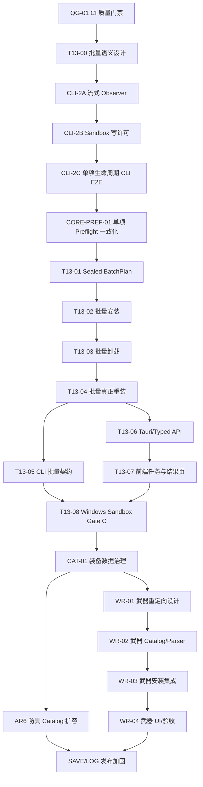

# Windows 自主迭代路线图

本文档是 Helsincy Mod Manager 的无人值守任务队列。产品阶段见 [路线图](ROADMAP.md)，当前事实见
[项目任务状态快照](PROJECT_TASK_STATUS.md)，可复制执行提示词见
[Codex 目标模式提示词](CODEX_GOAL_MODE_PROMPTS.md)。

更新时间：2026-07-30
规划基线：`main@a439112ab61425f4b89fee010a9e953ff9d92fb5`

## 固定范围

- 平台：Windows。
- 游戏：MHW:I。
- 首要目标：单项安装/卸载/真正重装基线之上的批量安装、批量卸载和批量真正重装。
- 后续目标：装备重定向 catalog 与武器链路、狩技来源导入验收、自动存档备份、日志和 CLI。
- Linux / Steam Deck 明确不在本轮范围，不创建实现、打包、验收或兼容任务，也不阻塞 Windows 队列。
- 纯视觉美化不进入无人值守队列；涉及 UI 的 task 必须有行为测试，必要时保留人工视觉 smoke gate。

## 状态口径

| 状态 | 含义 |
| --- | --- |
| `completed` | 已实现并有当前自动化证据 |
| `certified` | 除实现外，已完成对应独立复审与受控 Windows 纵向验收 |
| `ready` | 前置已满足，可以作为下一个独立 task |
| `blocked` | 缺少明确依赖、外部环境或维护者决策 |
| `conditional` | 只在出现复现缺陷或获得受控验收输入时启动 |
| `out_of_scope` | 本轮不处理 |

## 已完成基线

以下能力不重新实现：

- 单项安装、manifest 驱动卸载、真正重装、失败回滚/恢复和重启恢复：Gate A `certified`。
- Armor Retarget AR1-AR5、同 revision target switch、重启恢复和 manifest 卸载：Gate B
  `certified`。
- T17 狩技来源批量迁移 Slice 1-4C：`completed`，保持 import-only。
- 多 Steam 用户存档候选发现、显式选择、昵称/头像展示和隐私降级：`completed`。
- 手动/运行期自动备份、后台 worker/Scheduled Task 软件核心、App/Task/Audit Log、诊断页和
  support export：核心已完成，发布/保留治理仍有缺口。
- CLI-0A/0B/1A/1B：`completed`，Production 写命令仍不可达。
- 工程治理 GOV-01 至 GOV-04：`completed`。DTO 测试外置、重装路径 dead-code 抑制清理、
  Tauri command 契约覆盖和治理检查加固已分别由 PR #211 至 #214 交付。

“已完成”不表示后续 task 可以绕过现有边界。批量和 CLI 写能力必须复用相同的领域服务、安全链和
任务/审计事实。

## 硬门禁

### 数据安全

任何游戏目录写入必须保持：

```text
sealed input
  -> analyze / preflight
  -> InstallPlan
  -> backup
  -> commit
  -> manifest
  -> rollback / recovery
```

- 原始 Mod 输入只读；派生内容只进入 sandbox/staging。
- 同一 game/profile 写入严格串行；scan/hash/extract/analyze 不持有写锁。
- 卸载只消费 manifest/recovery 事实，不根据包内容猜测。
- 重装必须消费 retained/replaced/added/stale 与 durable recovery transaction。
- 取消只发生在安全点；已经进入不可抢占 commit 的单项必须完成一致性收尾。
- Task/Audit 失败不能伪造玩家文件回滚，也不能隐藏证据健康降级。

### Git、CI 与 review

- 一个 task 一个独立 `hy/` 分支、worktree 和 PR。
- 每个可独立验证步骤立即 commit；不把多个 task 攒成一个提交或一个 PR。
- 当前 `verify`/CI 尚不包含前端测试和 clippy。在 QG-01 合并前，每个相关 PR 必须额外运行：

```powershell
cmd /c corepack pnpm run test
cargo clippy --workspace --all-targets -- -D warnings
```

- 每次最后变更后运行聚焦验证、完整 `verify.ps1` 和 `hmm-review-gate` 本地自审。
- required CI 只有 terminal `success` 才算通过。`pending`、`failure`、`cancelled`、`timed_out`、
  `action_required`、`skipped` 或 `neutral` 都禁止合并。
- 获取并处理全部 review thread/comment。真实 bug 必须修复并补测试；误报必须在 PR 留下源码、测试
  或契约证据，不能凭感觉关闭。
- CodeRabbit 未 review 不能视为批准；必须完成独立全 diff 自审并记录证据。
- 优先普通合并。`--admin` 的允许条件和禁止条件以
  [合并提示词](CODEX_GOAL_MODE_PROMPTS.md#合并提示词) 为准。
- 治理、安全门禁、workflow、policy、AGENTS 或核心安全文档变更必须提升自审强度并明确标注治理
  影响；外部 review 因额度缺席时必须完整复审增量。`--admin` 只能在当前目标已获明确授权且合并
  提示词的全部条件满足时使用，绝不能绕过 CI、真实 finding 或未解决评论。

## 依赖图



QG-01 是最先执行的治理 task。它合并前不得开始 T13-00；如果外部 review 因额度缺席，按
CodeRabbit 缺席流程完成独立全 diff 自审，但仍必须等待全部 CI 到 terminal success。

## P0 核心生命周期与批量能力

推荐开启顺序如下。先完成 QG-01，让后续产品 PR 的统一门禁实际包含前端测试和 clippy，再启动
T13-00；不得把尚未合并的治理分支作为产品 task 的隐式基线。

```text
QG-01
  -> T13-00
  -> CLI-2A
  -> CLI-2B
  -> CLI-2C
  -> CORE-PREF-01
  -> T13-01
  -> T13-02
  -> T13-03
  -> T13-04
  -> T13-05 / T13-06
  -> T13-07
  -> T13-08
```

### QG-01：补齐 CI 质量门禁

状态：`ready`，治理变更，需要完整增量自审和远端门禁。

范围：

- 同步修改 Windows/CI 验证入口，把 `pnpm run test` 和
  `cargo clippy --workspace --all-targets -- -D warnings` 纳入强制门禁。
- 保证 `.ps1` 与 `.sh` 行为等价，失败时整体非零退出。
- 增加验证脚本的负向测试或变异证据。

完成定义：

- 完整验证实际执行前端测试和 clippy。
- 人工制造一个前端测试失败和一个 clippy failure 时，入口均 fail closed；还原后通过。
- CI 时间增长和治理影响写入 PR。

提交边界：验证脚本/测试一个提交，文档同步一个提交。

### T13-00：冻结批量领域语义

状态：`blocked`，依赖 QG-01 合并；高风险设计 task。

设计必须决定：

- sealed input snapshot、batch digest、跨 Mod 最终 target 冲突和 plan 过期。
- 每个 Mod 独立事务，不宣称整个批次全局原子。
- 默认 `stop_on_failure`；可选 `continue` 必须是显式领域策略。
- 首次阻断项默认在任何写入前终止整批。
- 已提交项保留真实成功事实，partial result 不回滚已成功的独立 Mod。
- 取消停止启动新项；运行中 commit 不抢占，在安全点收尾。
- retry 只消费 sealed batch 中 retryable 项，成功项不重放。
- 批量安装、卸载和真正重装分别定义输入、前置、结果和 recovery 行为。

完成定义：新增独立 T13 设计文档，更新 contract/TODO/测试矩阵；没有产品代码。

提交边界：领域语义与安全设计一个提交，契约/路线图同步一个提交。

### CLI-2A：逐阶段任务 Observer 与 JSONL

状态：`blocked`，依赖 T13-00 合并。

范围：

- runner 在任务实际推进时调用 observer，不再只在结束后返回事件集合。
- Tauri event、CLI JSONL 和 Task Log 共享 task id、phase 与顺序事实。
- 每个已启动任务恰好一个 terminal event，sequence 从 0 单调递增。
- observer 写入失败不改变已经提交的玩家文件事实。

完成定义：

- 安装、卸载、重装和恢复 runner 的顺序/terminal/cancel tests 通过。
- Tauri wire DTO 不发生未记录变化。
- CLI JSONL 不包含自由文本 message、原始 error、result ref 或路径。

提交边界：app/runtime observer 接线一个提交，Tauri/CLI adapter 与 contract tests 一个提交。

### CLI-2B：Sandbox 写许可与 containment

状态：`blocked`，依赖 CLI-2A。

范围：

- 版本化 sandbox marker 和不可伪造的进程内 write capability。
- 词法与 canonical containment；拒绝 symlink/junction/reparse point 和祖先替换。
- game/save/backup/app-data 根全部位于显式 sandbox 根。
- Production 始终拒绝，不存在环境变量/debug flag 绕过。
- 外部 sentinel 在所有成功/失败场景保持不变。

完成定义：只建立安全写 admission，不开放业务写命令。

提交边界：marker/capability 一个提交，containment/负向 fixture 一个提交。

### CLI-2C：单项生命周期 Sandbox CLI E2E

状态：`blocked`，依赖 CLI-2B。

范围：

- 接入 `install apply`、`uninstall`、`reinstall` 和 `recovery apply` 的 Sandbox 命令。
- 写操作要求 `--commit --yes` 和短期 opaque plan token；锁内重建并重验计划。
- 复用现有 application service，不复制 Tauri command 或 executor。
- 覆盖 install -> restart -> uninstall、reinstall、manifest save failure、rollback/recovery、Ctrl+C。

完成定义：真实 `hmm` binary 在 temp root 复验 Gate A 类闭环；Production 写命令 parser/runtime 双重
不可达。

提交边界：plan/apply token 一个提交，单项命令 adapter 一个提交，E2E/failure injection 一个提交。

### CORE-PREF-01：单项安装前置检查一致化

状态：`blocked`，依赖 CLI-2C。

范围：

- 审计当前 `game prerequisites`、InstallPlan preflight 和桌面安装/重装的 decision 是否同源。
- 固定 required/warning/unverified 的稳定 code 和阻断语义。
- 单项、批量预览、Tauri 和 CLI 只消费同一 app-level decision。
- 如果现有实现已满足，增加证明性回归测试；发现真实缺口才做最小修复。

完成定义：缺失必需前置在任何写入前阻断；warning 不被误当 success；规则不可用 fail closed 且不泄漏
原始路径或配置。

提交边界：证明性测试一个提交；只有测试暴露缺陷时再增加实现提交。

### T13-01：Sealed BatchPlan 与预览

状态：`blocked`，依赖 T13-00 和 CORE-PREF-01。

范围：

- 领域模型、ports、app service、batch digest、跨 Mod conflict/preflight。
- 输入顺序规范化并封存；结果顺序确定。
- 预览完全只读，不写游戏目录、manifest、backup、DB 投影或 Audit。
- 限制批次数量、计划大小和资源预算。

完成定义：相同 snapshot 生成相同 digest；任何阻断项默认使整个 apply 不可用；plan 过期必须重建。

提交边界：core/ports 一个提交，app preview 一个提交，聚焦测试一个提交。

### T13-02：批量安装

状态：`blocked`，依赖 T13-01。

范围：

- 确定性逐项执行，每项复用单项安装事务。
- 同一 game/profile 写入串行；项目间释放不需要的资源。
- 默认首个失败停止；已成功项保留；结果明确 success/blocked/failed/cancelled/retryable。
- batch 与 per-item Audit 只记录短 ID、计数和稳定 code。

完成定义：成功、首项失败、中途失败、取消、Audit writer 失败、manifest save 失败和重试均有 temp/fake
测试；外部 sentinel 不变。

提交边界：runner/state machine 一个提交，audit/result repository 一个提交，failure/cancel tests 一个提交。

### T13-03：批量卸载

状态：`blocked`，依赖 T13-02。

范围：

- 只消费 manifest/recovery facts；未知文件和玩家修改文件 fail closed。
- 预检跨 Mod 共享目标、backup ownership 和旧 manifest 摘要。
- 每项独立 rollback/recovery；默认首个失败停止。

完成定义：未知文件保留，已成功卸载项不被伪回滚，失败项仍可由 recovery 扫描识别。

提交边界：uninstall plan 一个提交，executor/recovery 一个提交，负向测试一个提交。

### T13-04：批量真正重装

状态：`blocked`，依赖 T13-03。

范围：

- 每项复用真正重装 retained/replaced/added/stale 和 durable transaction。
- revision/binding lineage、plan token 和候选状态在写锁内重验。
- 支持 Armor target switch，但不增加独立 retarget 写入旁路。

完成定义：多 Mod mixed result、重启恢复、同 revision target switch、stale plan、失败收敛和幂等 retry
均有测试。

提交边界：batch reinstall plan 一个提交，runner/recovery 一个提交，retarget regression 一个提交。

### T13-05：CLI 批量契约

状态：`blocked`，依赖 T13-04。

范围：

- CLI 适配领域 batch service，不在 shell 中循环单项命令。
- JSON/JSONL 包含 batch task id、item status、唯一 terminal event 和 exit code `5` partial success。
- 首版仅 Sandbox；Production 继续拒绝。

完成定义：跨 Mod conflict、partial success、cancel、retry 和敏感 canary contract tests 通过。

提交边界：CLI parser/schema 一个提交，runtime adapter/E2E 一个提交。

### T13-06：Tauri command 与 typed API

状态：`blocked`，依赖 T13-04。

范围：

- 窄 plan/start/query/retry commands，稳定 camelCase DTO 和 error/phase codes。
- 大结果通过 result query 分页读取，不塞进 progress event。
- 前端不传路径、manifest、backup、plan 内部或 adapter metadata。

完成定义：contract 文档、Rust serialization、feature-local typed API 和 taskId tests 同步。

提交边界：Tauri DTO/commands 一个提交，typed API/contract tests 一个提交。

### T13-07：批量操作 UI

状态：`blocked`，依赖 T13-06。

范围：

- 恢复多选消费能力；提供批量安装、卸载、重装的预览、确认、进度、结果和 retry。
- 只允许后端返回可用的动作；不恢复永远 disabled 的占位按钮。
- page-local/cross-page selection 语义明确；选择变化使旧 batch plan 失效。
- loading/error/empty/partial/cancelled/recovery-required 状态完整。

完成定义：前端行为测试、typecheck/lint/build 和 `1440x900`、`1366x768`、`1280x800`、`480x800`
受控 smoke；无重叠、截断或路径泄漏。

提交边界：state/workflow 一个提交，UI 一个提交，行为/视觉回归一个提交。

### T13-08：Windows Sandbox Gate C

状态：`blocked`，依赖 T13-05 和 T13-07。

使用全新 disposable Windows Sandbox 和人工 fixture 验收：

```text
批量安装
  -> 完全重启
  -> 批量真正重装（包含一个 Armor target switch）
  -> 制造一个受控 partial failure
  -> 重试 retryable 项
  -> 再次重启
  -> 批量卸载
  -> exact baseline
```

完成定义：source/旧 target/staging/recovery 无残留，manifest/backup/Audit/taskId 一致，外部 sentinel
未变化。Gate C 只有完整自动化、独立 review、CI 与该纵向验收全部通过后才能标记 `certified`。

## P1 装备重定向

候选数据审计已确认：

- 防具候选有 272 条相对路径；display name 不能作为稳定 ID。
- 武器候选有 14 类、3125 个展示名称，但只有 603 个唯一目标路径；同一路径最多 48 个名称。
- 原始 JSON 不是运行时信任源，必须先验证 schema、路径、大小写碰撞、重复项、别名、dummy 条目、
  版本和可分发权利，再生成 bundled artifact。

### CAT-01：装备数据治理

状态：`blocked`，依赖 T13-08。

- 定义候选输入 schema、validator、stable ID 生成、alias/localization、dummy/隐藏条目策略和版本。
- 明确数据 provenance/licensing；未确认可分发权利时不得把候选数据提交为 bundled catalog。
- validator 覆盖绝对路径、`..`、大小写碰撞、重复稳定 ID、重复展示名和路径族错误。

提交边界：schema/validator 一个提交；经过审计的生成 artifact 另一个提交。

### AR6：防具 Catalog 扩容

状态：`blocked`，依赖 CAT-01。

- 把最小 seed 扩展为经过审计、版本化的防具 catalog。
- 保持 `mhw-games-mhw` 中的 Unicode、alias、monster/rank/variant 和 `pl/f_equip` 规则。
- 增加全 catalog 唯一性、搜索隔离、加载性能和旧 target ID 兼容测试。

不改变 AR1-AR5 安装链；数据扩容不得触发新的文件写入实现。

### WR-01：武器重定向设计

状态：`blocked`，依赖 CAT-01。

- 独立定义 weapon target kind、14 类 family、stable identity、alias 与 source/target path schema。
- 明确多名称同一路径是 alias/display variant，不生成重复安装目标。
- 不复用或扩张 `MhwArmorReplacementAdapter`；武器 parser/adapter 留在 `hmm-games-mhw`。
- 决定哪些资源只需路径重定向，哪些需要二进制 transformer；未证明安全的类别 fail closed。

完成定义：设计、安全测试矩阵和分阶段实现计划评审完成。

### WR-02：武器 Catalog、Parser 与 RetargetPlan

状态：`blocked`，依赖 WR-01。

- 生成 versioned weapon catalog；结构化解析 `nativePC/wp/<family>/<internal-id>`。
- 只替换经过 parser 识别的 target 段，不做整路径字符串替换。
- 覆盖 14 类、603 个唯一路径、alias、unknown family、多 source 和碰撞测试。

### WR-03：武器 staging、InstallPlan 与 manifest

状态：`blocked`，依赖 WR-02。

- 原始输入只读，materialize 只写 staging。
- 最终 target 进入 InstallPlan/conflict、binding snapshot、manifest、backup、rollback/recovery。
- 首次安装、真正重装 target switch 和卸载复用 Gate A/T13 单项事务。

### WR-04：武器 Tauri/UI 与 Windows 验收

状态：`blocked`，依赖 WR-03。

- 窄 Tauri DTO、feature-local typed API、Mod 详情目标选择/预览/确认。
- 后端提供 category/capability/catalog；前端不解析 `nativePC/wp`。
- 使用人工最小 fixture 完成安装 -> 重启 -> target switch -> 重启 -> manifest 卸载 -> baseline。

## P1 条件任务：狩技来源导入

T17 Slice 1-4C 已 `completed`，不重新创建同名开发任务。

### T17-ACCEPT：脱敏真实来源 smoke

状态：`conditional`。

只有维护者主动提供可使用、已脱敏的来源目录，或出现明确可复现缺陷时启动。验收只覆盖：

- 来源选择、分页预览、sealed selection、显式决定。
- import-only、partial success、权威结果、retry 和 10,000 项门禁。
- 不安装、不启用、不写游戏目录。

发现 bug 时创建聚焦 bugfix task；没有 bug 就只记录验收证据，不改代码。正式项目材料不得记录、
引用或复制任何未授权外部实现。

## P2 Windows 存档备份

### 已完成且必须保持

- 多 Steam 用户候选必须由用户显式确认；最近修改项只能作为推荐。
- 真实路径和 account id 留在后端 pending cache；前端只传 opaque candidate id。
- 昵称和头像只是展示增强；网络失败不阻断本地选择。
- scheduler/worker 只能使用 Profile 已确认的 `save_directory`，备份执行时不得重新猜测或切换账号。

### SAVE-01：多账号回归门禁

状态：`blocked`，在装备链路后执行。

- 增加 scheduler/worker 针对已确认目录的证明性回归测试。
- 覆盖多候选、推荐项变化、资料网络失败、头像 URL 拒绝和 Profile 切换。
- 任何自动账号绑定、Steam Cloud/OAuth/API key 都不在范围。

### SAVE-02：安装态后台保护验收

状态：`blocked`，需要 disposable Windows VM/一次性账户。

验收 sibling worker -> user Scheduled Task -> trigger -> fresh heartbeat -> idempotent cleanup。不得在日常
Windows 账户中为完成 checklist 注册真实任务。

### SAVE-03：Installer ownership cleanup

状态：`blocked`，依赖 SAVE-02 环境可用。

- 实现 ownership-checked cleanup helper、NSIS `PREUNINSTALL` 和 WiX custom action。
- foreign task 保留；running/unknown owned task fail closed。
- disposable VM 覆盖 install/run/uninstall/reinstall 和最终 cleanup。

### SAVE-04：玩家存档恢复

状态：`blocked`，依赖 SAVE-03。

- 独立设计 preview、manifest/hash 校验、二次确认、restore 前安全备份和 rollback/recovery。
- source/target containment、账号/Profile 一致性和游戏运行状态必须 fail closed。
- 不复用 Mod 安装恢复中心来冒充存档恢复。

### SAVE-05：Retention 与备份中心

状态：`blocked`，依赖 SAVE-04。

- 增加按时间/空间 retention、不可删/部分清理结果和空间预算。
- 建立独立备份中心，展示 Profile、确认的 Steam 账号摘要、历史、状态和受控恢复入口。

## P2 日志与空间治理

### LOG-01：Task/Audit retention

状态：`blocked`，在核心批量 Gate C 后执行。

- Task Log 30 天、Audit Log 90 天；使用 capability-relative handle 和 fail-closed containment。
- 删除失败只影响 evidence health，不篡改玩家文件事实。
- CLI/Tauri/worker 使用相同策略和稳定健康码。

### LOG-02：总空间上限

状态：`blocked`，依赖 LOG-01。

- 可配置总空间上限；优先清理最旧 Debug/Task，再按策略处理 App/Audit。
- Audit 最低保留边界明确；清理写最小审计但避免递归日志风暴。

### LOG-03：Debug Log

状态：`blocked`，依赖 LOG-02。

- 用户主动开启、默认关闭、7 天 retention，仍经过统一脱敏。
- 不提供 raw path/error/manifest dump，不把 Debug Log 当作绕过安全 schema 的后门。

## P3 Production CLI 写能力

### CLI-3A：跨进程 admission

状态：`blocked`，依赖 T13-08、SAVE-03 和 LOG-01。

- 定义 `game-profile-write`、`save-profile-write`、`background-registration-write` scopes。
- GUI、CLI、worker 使用相同 admission；锁内重验，固定获取顺序。
- 至少两个独立进程竞争、timeout、崩溃释放和 stale owner 测试。

### CLI-3B：逐命令开放 Production 写入

状态：`blocked`，依赖 CLI-3A。

按 install/uninstall/reinstall/recovery、backup、background registration、diagnostics export 分开评审。
每个命令只有在对应 scope、测试、Audit、Windows 验收和文档齐全后单独开放；不提供全局 `--force`。

## P3 工程治理已完成基线

GOV-01 至 GOV-04 已在 QG-01 前完成。后续 task 必须保留这些门禁和回归测试；除非出现明确复现，
不要重新开启同名治理任务。

### GOV-01：外置 `dto.rs` 内联测试

状态：`completed`，PR #211。

`src-tauri/src/dto.rs` 已降为 1416 行，并通过 `dto_tests.rs` 外置测试模块：

- 把测试模块迁入独立 `dto_tests.rs`，生产 DTO、序列化和断言行为不变。
- 同步迁移 test-only import，不能用新的 allow 绕过 unused import。
- 迁移前后比对 `hmm-tauri` 测试清单/数量，防止外置文件未被加载却“测试通过”。

完成定义：`cargo test -p hmm-tauri`、`cargo check -p hmm-tauri` 和文件大小门禁通过；生产代码
diff 只包含测试模块引用所需的最小变化。

### GOV-02：收窄重装路径 `dead_code` 抑制

状态：`completed`，PR #212。

重装生产路径的文件级和三处局部过期 `allow(dead_code)` 已移除；manifest、backup、rollback 和
recovery 语义未改变：

- 禁止为了让 clippy 通过而删除 manifest、backup、rollback 或 recovery 字段/分支。
- 如果出现真正的 never-read 字段，只能先收窄到字段级 allow、写明证据并停止等待人工判断。
- 不在该 task 改变任何重装、提交、回滚或恢复语义。

完成定义：`cargo clippy -p hmm-app --all-targets -- -D warnings`、
`cargo test -p hmm-app` 和 workspace clippy 通过；完整 diff 经安装安全自审。

### GOV-03：补齐 Tauri 契约命令与防回归测试

状态：`completed`，PR #213。

`FRONTEND_BACKEND_CONTRACT.md` 已补齐 8 个已注册命令：
`create_category`、`update_category`、`delete_category`、`list_categories`、
`set_mod_categories`、`get_mod_categories`、`update_mod_metadata` 和
`delete_mod_metadata`。

- 参数、返回值和错误码来自当前 Rust command 与 typed API。
- 防回归测试解析 `generate_handler!` 注册表并断言每个命令都出现在契约文档。
- 变异验证已证明临时删除命令名时测试失败，还原后通过。

### GOV-04：治理检查加固

状态：`completed`，PR #214。

已按三个独立提交完成：

1. 为文件大小门禁增加 byte 上限和单行长度上限，PowerShell/Node 检查器行为等价，lockfile 明确豁免。
2. secret 扫描同步覆盖 `.py`/`.sql`，file-size policy 增加 SQL 类别和合理阈值。
3. `governanceFiles` 与 CODEOWNERS 对齐，覆盖 `.github/CODEOWNERS`、`policy/**` 和
   `docs/release/**`。

每个提交必须有正/负 fixture 或变异测试；最后执行完整验证，确认既有文件没有被误报。

## P4 与本轮无关

- Linux / Steam Deck：`out_of_scope`。
- Rise / Wilds：`out_of_scope`。
- Steam Cloud/OAuth/跨设备同步：`out_of_scope`。
- 纯视觉美化、无行为证据的 UI 重构：`out_of_scope`。

## 每个 Task 的完成定义

每个任务只有同时满足以下条件才算完成：

1. 独立 branch/worktree/PR，提交按可验证步骤拆分。
2. 当前 task 的专题设计、源码、contract、TODO/状态文档同步。
3. 聚焦测试、完整 `verify.ps1`、前端测试、clippy 实际通过。
4. 最后变更后完成 `hmm-review-gate` 本地自审。
5. 全部 required CI terminal success。
6. 所有评论逐条处理；真实 bug 已修复，误报已有证据。
7. CodeRabbit 缺席时已有独立全 diff 自审记录。
8. 所有已确认的真实 bug、测试或契约缺口均已处理，且没有未处理 Critical/Important finding。
9. 需要 disposable Windows 环境的 task 已完成真实安装态验收和 cleanup。
10. 普通合并优先；使用 `--admin` 时满足目标模式提示词的额外限制。

## 停止条件

- 当前 task 需要维护者选择未定义的产品/安全/许可策略。
- required CI 无法达到 success。
- 缺少 disposable Windows 环境且该环境是完成定义。
- 数据来源或分发权利未确认。
- 发现会扩大到真实玩家数据、真实第三方 Mod 或未授权外部状态。
- 路线图没有 `ready` task。

停止时保留分支、PR、测试证据和 findings，汇报阻塞点；不要降低门禁或自拟范围外任务。
