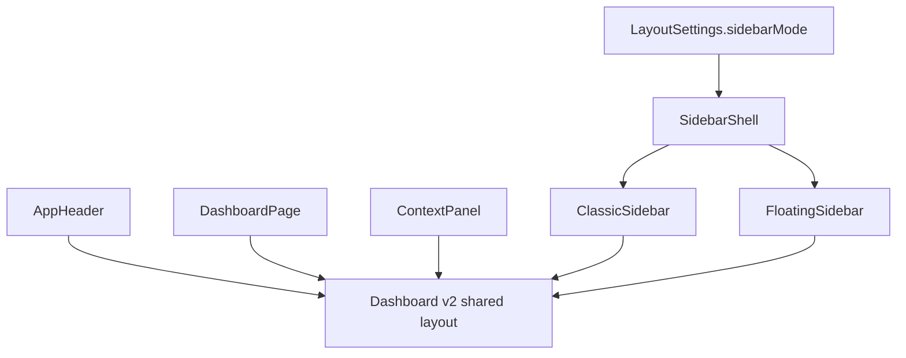

# Dashboard v2 与侧边栏模式设计

本文档定义首启工作台 Dashboard v2 的视觉基线，以及普通侧边栏和悬浮侧边栏两种导航模式的职责边界。

核心结论：Dashboard v2 是统一页面视觉基线；普通侧边栏和悬浮侧边栏只是导航 Shell 变体。切换侧边栏模式时，顶部状态栏、主内容卡片、右侧状态面板、按钮、状态 pill、字体层级和业务数据结构不应跟着改变。

## 背景

当前首启工作台已经落地一版普通侧边栏界面。后续 Pencil 中设计了更成熟的悬浮侧边栏界面：左侧是窄型浮动 Dock，顶部状态栏更轻，主工作区卡片更成熟，右侧设置状态面板更完整。

这个新设计不能简单理解为“悬浮侧边栏主题”。从产品语义上看，它包含两类变化：

- 页面视觉基线升级：顶部状态栏、主卡片、右侧状态面板、按钮、信息卡、间距、圆角和阴影。
- 侧边栏模式变化：固定普通侧边栏变成左侧悬浮 Dock。

如果把整张图作为 `floating-sidebar` 独有实现，会导致普通侧边栏和悬浮侧边栏各自复制一套 Dashboard。这样短期实现快，长期会让两个页面逐渐分叉，维护成本非常高。

因此本方案要求先建立共享的 Dashboard v2 基线，再在同一基线下提供两种侧边栏模式。

## 设计目标

- 将 Pencil 中更成熟的主内容、顶部栏和右侧面板确认为 Dashboard v2 共享视觉基线。
- 允许玩家在普通侧边栏和悬浮侧边栏之间切换。
- 切换侧边栏时，只改变导航容器的位置、尺寸、展开方式和安全边距。
- 保证工作台页面、右侧设置状态、顶部状态栏在两种侧边栏模式下保持一致。
- 避免复制业务页面、复制导航定义或让页面判断当前侧边栏模式。
- 为后续 Mod 管理、任务队列、日志诊断等页面复用同一 App Frame 打基础。

## 非目标

- 本方案不定义新的颜色主题。
- 本方案不实现深色、冰原、猎人绿等 `colorScheme`。
- 本方案不定义完整设置页。
- 本方案不接入真实 Mod 安装、游戏目录扫描或存档备份逻辑。
- 本方案不允许侧边栏模式影响游戏 adapter 规则。

## 术语

### Dashboard v2

Dashboard v2 是首启工作台的新页面视觉基线。它包括：

- 顶部状态栏。
- 主工作区。
- 首启目录识别主卡片。
- 完成设置后启用的模块预览区。
- 右侧设置状态面板。
- 状态 pill、按钮、信息卡、日志卡等视觉样式。

Dashboard v2 不包含具体侧边栏形态。

### Sidebar Mode

Sidebar Mode 表示导航容器形态。

```ts
type SidebarMode = "classic" | "floating";
```

它不是完整主题，也不等于颜色方案。

### Classic Sidebar

普通侧边栏。左侧固定区域，默认展示图标和文字，适合首次使用和功能可发现性要求更高的场景。

### Floating Sidebar

悬浮侧边栏。左侧窄型浮动 Dock，默认以图标为主，适合视觉更轻、更沉浸的宽屏场景。

## 总体结构

推荐结构：

```text
AppFrame
  AppHeader
  SidebarShell
    ClassicSidebar | FloatingSidebar
  AppMain
    DashboardPage
  ContextPanel
```

职责：

- `AppHeader`：顶部状态栏，共享。
- `SidebarShell`：根据 `sidebarMode` 渲染普通或悬浮导航。
- `DashboardPage`：工作台主体，共享。
- `ContextPanel`：右侧设置状态面板，共享。

切换侧边栏时，只有 `SidebarShell` 变化。



## 允许变化与禁止变化

### 允许侧边栏模式改变

- 侧边栏位置。
- 侧边栏宽度。
- 导航图标是否带文字。
- 导航项 tooltip。
- 当前项高亮方式。
- 折叠、展开、悬停和焦点行为。
- 主内容区域为悬浮 Dock 预留的安全边距。
- 小屏下导航降级方式。

### 禁止侧边栏模式改变

- 顶部状态栏样式。
- 主工作台卡片样式。
- 右侧设置状态面板样式。
- Dashboard v2 页面信息层级。
- 状态 pill 的语义和视觉。
- 按钮语义和主次关系。
- 业务数据结构。
- 游戏目录扫描流程。
- Mod 管理、备份、任务队列等功能逻辑。

禁止写法：

```tsx
if (sidebarMode === "floating") {
  return <FloatingDashboardPage />;
}
```

正确方向：

```tsx
return (
  <AppFrame sidebarMode={sidebarMode}>
    <DashboardPage />
  </AppFrame>
);
```

## 与外观系统的关系

本方案是 [前端外观系统设计](APPEARANCE_SYSTEM.md) 的具体落地场景。

关系如下：

| 概念 | 本方案中的角色 |
------|----------------|
| `shellVariant` | 可包含普通侧边栏和悬浮侧边栏 |
| `colorScheme` | 不在本方案中改变 |
| `density` | 可作为后续独立维度，不由侧边栏切换隐式改变 |
| `motion` | 控制侧边栏展开收起动效，但不改变业务语义 |
| Dashboard v2 | 共享页面视觉基线，不属于某个单独 Shell |

建议实现时可以选择保留 `shellVariant` 命名，也可以在 UI 文案中称为“侧边栏模式”。内部语义必须清楚：它只控制导航外壳，不控制颜色主题。

## 信息架构

Dashboard v2 首屏建议保留三列关系：

```text
左侧导航区
  ClassicSidebar 或 FloatingSidebar

中部主工作区
  页面标题
  目录未配置主卡片
  设置后启用模块预览

右侧状态面板
  设置状态
  下一步
  设置摘要
  设置日志
```

顶部状态栏横跨主内容区域，承担全局状态摘要：

- 当前游戏。
- Profile 状态。
- 目录状态。
- 任务状态。
- 主题 / 设置等窗口工具入口。

## Dashboard v2 共享基线

### 顶部状态栏

顶部状态栏应在两种侧边栏模式下保持一致。

内容：

- 当前游戏名称。
- Profile 状态 pill。
- 游戏目录状态 pill。
- 任务状态 pill。
- 主题切换按钮。
- 设置入口。

要求：

- 不随侧边栏模式改变颜色和文案。
- 不在普通侧边栏模式下挤回旧版顶部栏。
- 长游戏名必须省略或换行策略明确。
- 状态 pill 不能只靠颜色表达状态。

### 主目录识别卡片

主卡片承载首启工作流最重要操作。

内容：

- 状态 badge：目录未配置。
- 主标题：未找到游戏目录。
- 说明文案。
- 主操作：自动扫描 Steam。
- 次操作：手动选择游戏目录。
- 三个信息卡：当前支持、当前平台、Linux / Steam Deck。

要求：

- 普通侧边栏和悬浮侧边栏下布局一致。
- 主按钮和次按钮位置一致。
- 卡片尺寸可响应式变化，但视觉层级不变。
- 不因悬浮 Dock 而改变按钮文案。

### 模块预览区

模块预览区展示设置完成后会启用的能力。

内容：

- Mod 概览。
- 冲突状态。
- 前置检查。
- 最近备份。

要求：

- 这是 Dashboard v2 内容，不属于侧边栏。
- 不随侧边栏模式改变模块数量。
- 骨架条和禁用状态应使用共享 token。

### 右侧设置状态面板

右侧面板用于承载首启流程上下文。

内容：

- 设置状态。
- 下一步列表。
- 设置摘要。
- 设置日志。

要求：

- 两种侧边栏模式下同一个组件复用。
- 宽度可以响应式调整，但组件结构不变。
- 小屏下可移动到主内容下方。
- 不因为悬浮侧边栏而复制一份右侧面板。

## 普通侧边栏方案

普通侧边栏是默认模式，目标是清晰、稳定、可发现。

建议：

- 固定在左侧。
- 显示图标和文字。
- 当前项使用明显背景和左侧标记。
- 禁用项显示弱化状态，并提供禁用原因。
- 底部保留设置或侧边栏模式切换入口。

适用场景：

- 首次启动。
- 新用户。
- 窄屏但仍可显示文字导航的窗口。
- 需要快速识别功能名称的用户。

风险：

- 占用横向空间。
- 视觉上不如悬浮 Dock 轻。
- 功能很多后需要分组和滚动策略。

## 悬浮侧边栏方案

悬浮侧边栏是高级模式，目标是轻量、聚焦、视觉成熟。

建议：

- 左侧窄型浮动 Dock。
- 默认展示图标。
- 当前项使用蓝色高亮圆形或胶囊背景。
- 支持 tooltip。
- 支持键盘焦点。
- 底部保留侧边栏模式切换按钮。
- 主内容区域由 App Frame 统一预留安全边距。

适用场景：

- 宽屏。
- 熟悉功能位置的用户。
- 更偏沉浸、轻量的工作台体验。

风险：

- icon-only 可发现性较弱。
- 功能继续增加后纵向空间紧张。
- tooltip、可访问名称、当前状态必须做扎实。
- 悬浮层级如果不控制，可能遮挡弹窗或危险操作。

## 导航定义

导航项必须只有一份。

```ts
type NavItem = {
  id: string;
  label: string;
  icon: IconComponent;
  route: string;
  disabled?: boolean;
  disabledReason?: string;
};
```

示例：

```ts
export const navItems: NavItem[] = [
  { id: "dashboard", label: "工作台", icon: LayoutDashboard, route: "/" },
  { id: "mods", label: "Mod 管理", icon: Package, route: "/mods", disabled: true },
  { id: "categories", label: "分类 / 标签", icon: Tags, route: "/categories", disabled: true },
  { id: "profiles", label: "配置档", icon: User, route: "/profiles", disabled: true },
  { id: "replacements", label: "替换目标", icon: Crosshair, route: "/replacements", disabled: true },
  { id: "backups", label: "存档备份", icon: Archive, route: "/backups", disabled: true },
  { id: "games", label: "游戏管理", icon: Gamepad2, route: "/games" },
  { id: "tasks", label: "任务队列", icon: ListChecks, route: "/tasks" },
  { id: "diagnostics", label: "日志 / 诊断", icon: FileSearch, route: "/diagnostics" },
  { id: "settings", label: "设置", icon: Settings, route: "/settings" },
];
```

禁止为不同侧边栏复制导航定义：

```text
classicNavItems.ts
floatingNavItems.ts
```

如果某个侧边栏模式需要不同分组，应在对应导航组件里基于同一份 `navItems` 呈现。

## 推荐前端目录

```text
src/
  app/
    frame/
      AppFrame.tsx
      AppHeader.tsx
      AppFrame.css
    shell/
      sidebarTypes.ts
      sidebarRegistry.ts
      SidebarModeProvider.tsx
      navigation/
        navItems.ts
        NavIconButton.tsx
        NavLabelButton.tsx
      layouts/
        classic-sidebar/
          ClassicSidebar.tsx
          ClassicSidebar.css
        floating-sidebar/
          FloatingSidebar.tsx
          FloatingSidebar.css
  features/
    dashboard/
      DashboardPage.tsx
      DashboardHeroCard.tsx
      DashboardModulePreview.tsx
      SetupStatusPanel.tsx
      Dashboard.css
  shared/
    styles/
      tokens.css
```

拆分原则：

- `AppFrame` 负责整体布局槽位。
- `AppHeader` 负责顶部状态栏。
- `ClassicSidebar` 和 `FloatingSidebar` 只负责导航呈现。
- `DashboardPage` 不读取 `sidebarMode`。
- `SetupStatusPanel` 不属于任何侧边栏。
- `tokens.css` 提供共享视觉变量。

## 状态模型

建议最小模型：

```ts
export type SidebarMode = "classic" | "floating";

export type LayoutSettings = {
  sidebarMode: SidebarMode;
};
```

未来可以纳入外观系统：

```ts
type AppearanceSettings = {
  colorScheme: ColorSchemeId;
  shellVariant: ShellVariantId;
  density: DensityId;
  motion: MotionId;
};
```

其中 `shellVariant` 可以映射到 `SidebarMode`，但不要把它与颜色主题合并成类似 `floating-blue` 的字符串。

## 持久化策略

MVP 阶段可以先使用前端本地存储：

```ts
type PersistedLayoutSettings = {
  version: 1;
  sidebarMode: SidebarMode;
};
```

要求：

- 缺失配置回退 `classic`。
- 未知值回退 `classic`。
- 读取失败不应白屏。
- 后续迁移到 SQLite 时保留版本号。
- 不记录路径、Steam ID、Mod 包信息或任何玩家敏感数据。

## 响应式策略

### 宽屏

- 支持普通侧边栏和悬浮侧边栏。
- 右侧设置状态面板固定在主工作区右侧。
- 中部主工作区保持足够宽度。

### 中等窗口

- 普通侧边栏可以保持固定宽度，必要时略收窄。
- 悬浮侧边栏保持窄 Dock。
- 右侧状态面板可下移或变窄。

### 小屏和 Steam Deck 近似窗口

- 默认优先可用性，不强求悬浮效果。
- 悬浮侧边栏可以降级为底部导航或顶部抽屉。
- 右侧状态面板移动到主内容下方。
- 主操作按钮不能被导航遮挡。

## 可访问性要求

普通侧边栏：

- 导航区域有 `aria-label="主导航"`。
- 当前页有 `aria-current="page"`。
- 禁用项有禁用原因。

悬浮侧边栏：

- 每个 icon-only 按钮必须有可访问名称。
- hover tooltip 不能替代 `aria-label`。
- 键盘焦点状态必须明显。
- 当前项在折叠状态下仍可识别。
- 模式切换按钮必须说明当前模式和切换结果。

通用要求：

- 不只靠颜色表达状态。
- 触控目标不能过小。
- 减少动效模式下仍可使用。

## 视觉 token

Dashboard v2 应尽量使用共享 token。

示例：

```css
:root {
  --color-bg: #f5f8fc;
  --color-surface: #ffffff;
  --color-surface-muted: #f8fafc;
  --color-border: #dbe4ef;
  --color-text: #0f172a;
  --color-text-muted: #64748b;
  --color-accent: #0969ff;
  --radius-panel: 28px;
  --radius-card: 18px;
  --shadow-panel: 0 18px 50px #1f29371a;
  --space-page: 36px;
}
```

规则：

- 侧边栏组件可以有局部 token。
- Dashboard 内容不能使用 `floating-sidebar` 前缀变量。
- 颜色方案变化应通过 `colorScheme` 完成，不通过侧边栏模式完成。

## 实现顺序

建议拆成小步：

1. 抽离 `navItems`，保持现有 UI 不变。
2. 抽出 `AppHeader`，保持现有 UI 不变。
3. 抽出 `DashboardPage` 和右侧 `SetupStatusPanel`。
4. 建立 `AppFrame` 槽位。
5. 将当前普通侧边栏迁移为 `ClassicSidebar`。
6. 将 Pencil 中非侧边栏部分落成 Dashboard v2 基线。
7. 新增 `FloatingSidebar`。
8. 新增 `SidebarModeProvider` 和切换入口。
9. 做桌面、窄屏和近似 Steam Deck 分辨率截图验证。

这样可以避免一次性重写整个 `AppShell.tsx` 和 `AppShell.css`。

## 测试与验证

实现阶段至少验证：

- `navItems` 只有一份。
- 两种侧边栏模式渲染相同导航项。
- `DashboardPage` 不依赖 `sidebarMode`。
- 切换侧边栏后顶部状态栏文本不变。
- 切换侧边栏后右侧设置面板文本不变。
- 悬浮侧边栏 icon-only 按钮有可访问名称。
- 小屏下主操作按钮不被遮挡。
- `cmd /c corepack pnpm run typecheck` 通过。
- `cmd /c corepack pnpm run lint` 通过。
- `cmd /c corepack pnpm run build` 通过。

如果接入 Tauri 设置持久化，还需要补充 Rust 和 Tauri command 验证。

## PR 验收清单

- [ ] 文档说明是否同步。
- [ ] CHANGELOG 是否记录。
- [ ] 是否只新增一份导航定义。
- [ ] 普通侧边栏和悬浮侧边栏是否共享 Dashboard v2。
- [ ] 是否没有复制 `DashboardPage`。
- [ ] 是否没有页面级 `if sidebarMode === "floating"`。
- [ ] 是否没有把颜色主题写进侧边栏模式。
- [ ] 是否保留可访问名称和键盘焦点。
- [ ] 是否执行统一验证脚本。

## 反模式

### 把悬浮侧边栏做成整页主题

```text
FloatingDashboardPage
ClassicDashboardPage
```

这会造成两个工作台长期分叉。

### 用侧边栏模式控制颜色

```css
[data-sidebar-mode="floating"] {
  --color-accent: #0969ff;
}
```

颜色应该由 `colorScheme` 控制。

### 让业务页面读取侧边栏模式

```tsx
const { sidebarMode } = useSidebarMode();

return sidebarMode === "floating" ? <FloatingSetupPanel /> : <ClassicSetupPanel />;
```

业务页面应保持同一结构。

### 为每个侧边栏复制导航

```text
classicNavItems.ts
floatingNavItems.ts
```

导航定义必须只有一份。

## 结论

Dashboard v2 应成为 Helsincy 新的首启工作台 UI 基线。普通侧边栏和悬浮侧边栏都应该共享这套基线，只在导航 Shell 层发生变化。

这条边界很重要：如果切换侧边栏会让主内容和右侧面板一起变化，玩家感知到的就不是“侧边栏模式”，而是“整套主题切换”。本项目需要保留这种语义清晰度，才能在后续继续扩展主题、密度、动效和更多页面时不失控。
