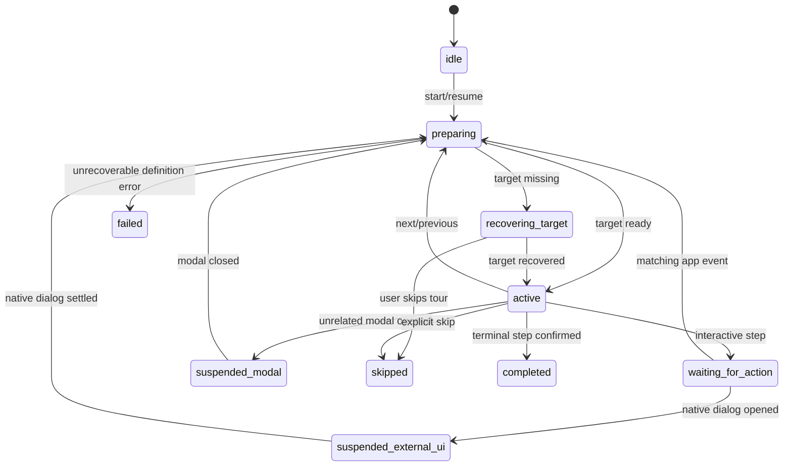

# 精准锚定式新手引导设计

状态：Phase 1 任务型导航与页面关键功能说明已实现；Phase 2 至 Phase 4 保持 Proposal

范围：React 前端 UI

风险等级：设计文档为 Low；后续实现涉及 App Shell、全局 overlay、焦点与跨页面交互，按 Medium 前端改动验证

当前实现基线（2026-08-17）：

- 已交付任务型 `hmm.first-run`：首次自动启动为欢迎页加 43 个上下文步骤，顶部入口手动启动为 43 步。
- 顶部全局栏提供固定入口；用户从哪个页面启动，就从该页面开始，再按导航顺序旋转访问其余已启用页面。
- 引导是独立 body portal overlay，只给全局头部、路由层和导航按钮增加入口或 `data-tour-id`；工作台、右栏内容、顺序和行为不变。
- 使用 `@floating-ui/react@0.27.20` 的 offset/flip/shift/size/autoUpdate，spotlight 使用实时 DOMRect。
- 页面介绍和页面内功能说明使用 `blocked + controls`；导航任务使用四块 blocker 实现
  `target-only + route-change`，等待用户真实点击和 route id 变化后推进。
- 8 个页面共覆盖 28 个关键功能区：游戏目录与前置检查、Mod 导入与安装计划、恢复处理、配置档与
  存档备份、备份整理、诊断导出、窗口行为与后台保护、关于与支持信息。引导解释真实入口，但不放行业务控件点击。
- 条件渲染的功能区支持 primary anchor + fallback anchor：正常状态精准高亮具体面板，空状态或未配置状态
  自动回落到稳定页面容器，不会永久停在目标定位中。
- 引导打开与关闭使用 320ms 柔和过渡，步骤内容使用 360ms、7px 内的小幅方向切换；Floating UI 只控制
  外层 positioner，内层视觉面板通过 460ms FLIP/WAAPI 从上一布局位置连续迁移，高亮 mask/ring 以
  440ms 同步改变几何；reduced motion 下全部压缩到近即时反馈。
- 当前覆盖工作台、Mod 管理、恢复中心、存档备份、备份整理、日志/诊断、设置和关于的重要操作区；
  不自动点击任何目标。
- 不自动执行扫描、目录选择、安装、备份、恢复或其他业务动作。
- 完成与跳过按内容版本写入 `helsincy.onboarding`；首次进入 Dashboard 自动启动。
- Phase 1 已覆盖 pure/source tests、typecheck、lint、前端边界检查，以及 Classic/Floating、浅色/深色、
  `1280x800`、`480x800` 浏览器 smoke；真实 Tauri/WebView2 DPI 仍保留为人工验收门槛。
- 新增的 43 步内容与 primary/fallback anchor 已覆盖 pure/source tests 和完整前端验证；由于本次工具宿主
  启动的 Vite 长驻进程无法处理 HTTP 请求，页面内步骤的新版浏览器 smoke 仍需在普通本地终端重跑。

## 1. 结论

HMM 的新手引导不应保存截图坐标，也不应按窗口宽高推算目标位置。每个步骤只保存稳定的 UI 锚点标识，运行时解析当前真实 DOM 元素，并使用该元素最新的 `getBoundingClientRect()` 作为唯一定位事实。

浏览器缩放、Windows DPI、窗口尺寸、侧边栏模式、路由动画、滚动容器和目标自身尺寸变化后，目标元素与引导层仍处于同一套 CSS pixel 坐标系。只要每次布局变化后重新测量，不把 `devicePixelRatio` 再乘进坐标，也不缓存启动时矩形，spotlight 就能继续贴合真实 UI。

推荐技术路线：

- HMM 自己维护 tour registry、状态机、持久化、交互策略、overlay 层级和可访问性语义。
- 使用成熟定位原语处理 popover 的 offset、flip、shift、size 和自动更新。首选候选为 `@floating-ui/react`，最终版本与许可证在实现前 Spike 中确认。
- spotlight 由 HMM 自绘，不修改目标元素的 `position` 或 `z-index`。
- 锚点统一使用 `data-tour-id`，但步骤定义不直接保存任意 CSS selector。
- 高风险业务动作只由现有业务流程完成；tour 不直接调用 Tauri command，不替用户确认，不绕过预览、manifest、backup 或 recovery 门禁。

`sub2api` 使用 `driver.js@1.4.0` 的方向是正确的：真实 DOM 锚定、声明式步骤、等待异步目标、业务成功后推进。HMM 不建议直接复制其整套实现，因为 HMM 已有更严格的 route stacking、body portal、focus trap、overlay token 和安全模态语义。

## 2. 背景与目标

参考界面包含三类典型步骤：

1. 高亮侧栏导航项，引导用户进入功能页。
2. 高亮页面操作按钮，引导用户打开下一层 UI。
3. 高亮对话框或表单字段，引导用户完成真实输入。

HMM 需要支持相同思路，但必须适配当前架构：

- Tauri 2 + React 19 + TypeScript。
- 内存路由，路由切换期间 entering 与 exiting layer 会短暂并存。
- Classic/Floating 两种侧边栏共享导航定义，但 DOM 结构不同。
- 大多数页面由 `.app-surface` 滚动，Mod Library 使用 `.mod-library__content` 内层滚动。
- Dialog、Sheet、Toast、Context Menu 等存在多个 body portal 和全局层级。
- 首次游戏目录配置会打开 WebView 外部的原生系统对话框。

### 2.1 目标

- 精准绑定真实 UI，在缩放、DPI、响应式和滚动后持续更新。
- 支持介绍步骤、目标点击、跨路由、异步成功事件、原生对话框暂停和条件分支。
- 同一份 tour 同时适配 Classic/Floating sidebar，不复制步骤。
- 支持浅色、深色、未来主题、窄窗口和 reduced motion。
- 支持键盘、焦点恢复、屏幕阅读器语义和明确的跳过/完成状态。
- 让 feature 只发布稳定 tour event，不反向查询 selector 或控制引擎实例。
- 提供可量化的几何验收，而不是只凭截图判断“看起来差不多”。

### 2.2 非目标

- 本功能不新增 Tauri command、Rust DTO、SQLite 表或文件系统能力。
- 首期不自动执行 Mod 安装、卸载、重装、回滚或存档恢复。
- 不定位或控制 Windows 文件选择器、系统托盘菜单等 WebView 外部 UI。
- 不使用任意 HTML 字符串作为引导内容。
- 不为不同侧边栏、主题、游戏或窗口宽度复制 tour。
- 不在首期建设行为遥测；未来若增加，也只能记录稳定 tour/step/status 标识。

## 3. 参考实现分析

参考项目的相关前端边界包括：

- `frontend/src/composables/useOnboardingTour.ts`
- `frontend/src/stores/onboarding.ts`
- `frontend/src/components/Guide/steps.ts`
- `frontend/src/styles/onboarding.css`
- 页面与侧栏中的 `data-tour` anchor

### 3.1 值得复用的思路

| 机制 | 价值 |
| --- | --- |
| 使用真实 DOM selector/anchor | 不依赖固定截图坐标 |
| 定位和产品状态分层 | 定位库负责 spotlight/popover，应用负责流程 |
| 步骤声明 placement | 侧栏、工具栏、表单可以使用不同首选方向 |
| 完成状态带内容版本 | 新版 tour 可以与旧完成状态区分 |
| 异步目标等待 | 页面、modal 或下一步目标尚未挂载时不立即失败 |
| 提交成功后由业务代码推进 | 失败不会错误进入下一步 |
| 页面提供稳定 `data-tour` 标记 | UI 重构时比层级 selector 和文本 selector 更稳定 |

### 3.2 不直接照搬的部分

| 参考做法 | HMM 风险 | HMM 方案 |
| --- | --- | --- |
| `document.querySelector()` 取第一个匹配 | 路由过渡、重复 sidebar/portal 可能命中旧元素 | 解析全部候选并做 active route、可见性、交互性和唯一性校验 |
| 150ms 轮询和固定 500/800ms 延迟 | 慢机、动画、异步请求下不可证明稳定 | MutationObserver + 状态事件 + 连续稳定帧 |
| 通过按钮集合或 DOM tag 推断交互步骤 | 步骤语义隐式、测试困难 | 显式 `advance` 与 `interaction` 类型 |
| Enter 直接调用目标 `.click()` | 可能触发业务动作或与 modal 键盘冲突 | 键盘只控制 tour；业务动作等待真实用户激活和成功事件 |
| Escape/关闭直接标记已完成 | 跳过和完成事实混淆 | `skipped` 与 `completed` 分开持久化 |
| HTML 字符串作为描述 | 样式耦合与注入面 | 受控结构化内容，由 React 渲染 |
| 重排第三方 popover DOM | 依赖内部 class 和 DOM 结构 | HMM 自己渲染 popover，只复用定位原语 |
| 一亿级 z-index 与大量 `!important` | 绕过 HMM overlay 合约 | 使用语义 token，并治理能逃逸到 body 的历史高层级 |
| overlay 全局 `pointer-events:none` | 所有步骤共用一套穿透策略 | 每步显式选择 blocked、target-only 或 passthrough |

## 4. 方案选型

| 方案 | 优点 | 主要问题 | 结论 |
| --- | --- | --- | --- |
| 直接使用 driver.js 完整 tour | 最快接近参考效果，spotlight 已内置 | 第三方 DOM/样式所有权、focus trap、modal、layer token 和 React 状态接入成本高 | 不作为首选 |
| 全部自研定位与碰撞 | 控制力最高，无新增依赖 | flip、shift、scroll ancestor、layout shift、arrow、RTL 等维护成本高 | 不推荐 |
| 自有 tour 引擎 + 成熟定位原语 | 保留 HMM 语义与 UI 控制，复用成熟定位算法 | 仍需实现 spotlight、状态机和测试 | 推荐 |

推荐候选为 `@floating-ui/react`：

- reference 使用真实目标元素。
- middleware 使用 `offset`、`flip`、`shift`、`size`，按需要增加 `arrow`。
- mounted 更新使用 `autoUpdate` 或等价机制。
- route 动画或 transform 期间短时启用逐帧更新，稳定后关闭持续 animation frame。

Phase 0 Spike 已完成并采用 `@floating-ui/react@0.27.20`：许可证为 MIT，React/ReactDOM peer
dependency 为 `>=17.0.0`，与当前 React 19 基线兼容。WebView2 下的最终 DPI/缩放验收仍按第 19.5 节执行。

## 5. 模块边界

建议目录：

```text
src/
  shared/
    onboarding/
      onboardingTypes.ts
      onboardingState.ts
      onboardingStorage.ts
      targetResolver.ts
      geometry.ts
      scrollAncestors.ts
      TourSpotlight.tsx
      TourPopover.tsx
      TourHost.tsx
      onboarding.css
  app/
    onboarding/
      TourProvider.tsx
      tourRegistry.ts
      tourEvents.ts
      useTour.ts
      useTourEvent.ts
      tours/
        firstRunTour.ts
  features/
    dashboard/
      onboarding/
        dashboardTourAnchors.ts
    game-setup/
      onboarding/
        gameSetupTourEvents.ts
    mods/
      onboarding/
        modLibraryTour.ts
```

职责：

| 边界 | 职责 |
| --- | --- |
| `src/shared/onboarding` | 纯状态、geometry、target resolver、spotlight 和通用 UI |
| `src/app/onboarding` | provider、registry、路由协调、自动启动、全局 overlay 仲裁 |
| `src/features/*/onboarding` | feature anchor、稳定事件和 feature-owned tour 定义 |
| 现有 feature 组件 | 只添加 anchor 或发布成功/失败/外部 UI 事件 |

禁止把文件系统、游戏 adapter、安装、备份、manifest 或 recovery 规则放入 tour 定义。

## 6. 数据模型

以下类型用于说明契约形状，最终命名可以按实现调整。

```ts
type TourId = string;
type TourStepId = string;
type TourAnchorId = string;
type TourEventId = string;

type TourDefinition = {
  id: TourId;
  contentVersion: number;
  title: string;
  replayPolicy: "manual" | "once-per-version";
  autoStart?: TourAutoStartPolicy;
  steps: readonly TourStep[];
};

type TourStep = {
  id: TourStepId;
  route?: string;
  target?: TourTarget;
  fallbackTarget?: TourTarget;
  content: TourContent;
  placement?: TourPlacement;
  spotlight?: TourSpotlightOptions;
  interaction: TourInteractionPolicy;
  advance: TourAdvancePolicy;
  condition?: TourCondition;
  missingTarget?: TourMissingTargetPolicy;
  modalPolicy?: TourModalPolicy;
};

type TourTarget =
  | { kind: "anchor"; id: TourAnchorId; scope?: "document" | "active-route" | "topmost-modal" }
  | { kind: "none" };

type TourContent = {
  title: string;
  paragraphs?: readonly string[];
  bullets?: readonly string[];
  callout?: {
    tone: "info" | "success" | "warning";
    title?: string;
    body: string;
  };
};

type TourInteractionPolicy =
  | { kind: "blocked" }
  | { kind: "target-only" }
  | { kind: "passthrough" };

type TourAdvancePolicy =
  | { kind: "controls" }
  | { kind: "target-activation" }
  | { kind: "app-event"; event: TourEventId }
  | { kind: "terminal" };

type TourMissingTargetPolicy =
  | { kind: "wait"; timeoutMs?: number }
  | { kind: "skip-step" }
  | { kind: "pause" }
  | { kind: "abort-tour" };
```

`condition` 只能消费受控前端 facts，例如：

- 当前 route 是否启用。
- game setup 状态是 configured / not_configured / invalid。
- 当前 sidebar mode。
- 某个 feature capability 是否可用。

不得读取或保存游戏目录、Steam ID、Mod 名称、表单输入值或任意本地路径。

## 7. Anchor 契约

### 7.1 命名

建议使用有作用域的稳定名称：

```text
app.navigation
nav.dashboard
nav.mods
nav.settings
dashboard.game-setup
dashboard.game-setup.scan-steam
dashboard.game-setup.manual-select
dashboard.game-candidates
dashboard.setup-status
mods.import
settings.onboarding
```

组件示例：

```tsx
<button data-tour-id="dashboard.game-setup.scan-steam">...</button>
```

同一语义目标在 Classic/Floating sidebar 中使用相同 id。例如两个 `Mod 管理` 按钮都使用 `nav.mods`。正常运行时只有当前 sidebar mode 的实例可见。

### 7.2 禁止的 target

- 文案 selector，例如 `button:has-text("Mod 管理")`。
- CSS 层级 selector，例如 `.sidebar > nav > button:nth-child(2)`。
- 截图像素坐标。
- React 自动生成 id。
- 包含玩家路径、Mod 名称或动态隐私值的 anchor。

### 7.3 唯一解析

resolver 必须查询所有相同 anchor，然后按以下条件过滤：

1. `isConnected === true`。
2. 没有 `hidden`，不在 `[inert]` 或 `[aria-hidden="true"]` 下。
3. computed style 不是 `display:none`、`visibility:hidden` 或不可见透明态。
4. `DOMRect.width > 0` 且 `DOMRect.height > 0`。
5. `active-route` target 不属于 `.is-exiting` route layer。
6. 要求用户操作的 target 不是 `disabled` 或 `aria-disabled="true"`。
7. 至少一个采样点位于 viewport，并通过 `elementFromPoint()` 命中 target 或其后代。

过滤后：

- 只有一个候选：进入测量。
- 没有候选：按 `missingTarget` 等待、跳过、暂停或终止。
- 仍有多个候选：视为 anchor 定义错误，不能静默选择第一个。

这一规则专门防止 RouterOutlet 的 entering/exiting 双层 DOM、高级 modal portal 和未来重复 UI 命中错误元素。

## 8. 精准定位与缩放策略

### 8.1 坐标原则

`getBoundingClientRect()` 返回相对当前 viewport 的 CSS pixel 浮点坐标。TourHost 使用 `position:fixed`，因此 spotlight 与 popover reference 使用同一坐标系。

必须遵守：

- 不把 `devicePixelRatio` 乘到 `DOMRect`。
- 不在步骤开始后永久缓存矩形。
- 不提前取整 fractional pixel。
- 所有 padding、clamp 和 collision 也使用 CSS pixel。
- 仅在最终 CSS/SVG 输出时保留合理小数，不通过整数舍入制造 1px 漂移。

浏览器 zoom、Windows scale factor 或跨显示器 DPI 变化后，CSS pixel 与 device pixel 的换算由 WebView 完成。引擎只需要重新读取 DOMRect。

### 8.2 Readiness pipeline

每个带 target 的步骤按固定顺序准备：

```text
解析步骤条件
  -> 如有 route，调用现有 navigate(path)
  -> 等待目标 route layer 成为最新非 exiting layer
  -> MutationObserver 等待 anchor 挂载
  -> 解析唯一、可见、可交互 target
  -> 找出所有 scrollable ancestors
  -> 如 target 不在安全可视区，滚入视口
  -> 连续两个 animation frame 测量矩形
  -> 矩形差值低于稳定阈值后显示 spotlight/popover
  -> active 期间持续订阅布局变化
```

稳定阈值建议为每条边变化小于 `0.5 CSS px`。如果 route 动画仍在运行，最多等待一个有界时限，同时继续逐帧更新，不能永久阻塞。

### 8.3 更新来源

active step 至少监听：

- `window.resize`。
- `visualViewport.resize` 与 `visualViewport.scroll`，若当前 WebView 支持。
- target 的所有 scrollable ancestors 的 `scroll`。
- `ResizeObserver(target)`。
- `ResizeObserver(document.documentElement)` 或实际 app root。
- 等待目标期间的 `MutationObserver`。
- 分辨率 media query 变化或等价的 DPR 变化检测。
- 已知 route/sidebar/view-transition 期间的短时 `requestAnimationFrame` 更新。

所有更新必须合并到单个 animation frame。一次 frame 中先统一读取 geometry，再统一更新 React state，避免交替读写导致 layout thrash。

### 8.4 Scroll 处理

不能只监听 `window`。当前 HMM 至少有：

- `.app-surface`
- `.mod-library__content`
- Classic sidebar 自身滚动
- modal/sheet body 滚动

引擎应从 target 向上检查 computed `overflow-x/y`，收集所有实际可滚动祖先。target 切换后先清理旧监听，再订阅新祖先。

自动滚动使用：

- reduced motion：`behavior: "auto"`。
- 普通模式：可用 `smooth`，但必须等待滚动稳定后再宣布 step ready。
- sticky header 存在时，验证 target 没有被 header dock 遮挡；必要时使用额外 block offset，而不是只相信 `scrollIntoView()` 已完成。

### 8.5 Spotlight 矩形

```ts
spotlightRect = expand(targetRect, padding)
spotlightRect = clampToViewport(spotlightRect, visualViewportBoundary)
```

默认 padding 建议为 4 至 8 CSS px，具体步骤可以覆盖。圆角使用 HMM token 或受控数值，不解析任意 CSS 字符串。

目标大于 viewport 时：

- spotlight 使用目标与可视区域的交集。
- popover 切换为底部 sheet/固定面板。
- 不尝试把整个超大容器缩放进屏幕。

## 9. Spotlight 与交互阻挡层

不要像参考实现一样给目标强行添加超高 z-index。HMM 使用两个独立层：

1. 视觉层：全屏 fixed SVG mask，绘制半透明 scrim 和带圆角的透明孔洞，`pointer-events:none`。
2. 交互层：按步骤策略绘制 blocker，决定哪些区域能接收输入。

`target-only` 可以使用 spotlight 四周的四个 fixed blocker：

```text
top blocker
left blocker | target hole | right blocker
bottom blocker
```

孔洞区域没有 blocker，点击自然落到真实 target；不需要修改 target 的 stacking context。

### 9.1 Interaction policy

| 模式 | 行为 | 适用步骤 |
| --- | --- | --- |
| `blocked` | 页面全部阻挡，只允许 tour panel | 欢迎、纯说明、完成页 |
| `target-only` | 只允许目标和 tour panel | 导航按钮、打开面板、单一字段 |
| `passthrough` | 页面交互不阻挡，spotlight 仅提示 | 预期 portal 下拉、多控件组合，谨慎使用 |

高风险动作即使使用 `target-only`，tour 也不能自动触发。用户激活目标后仍进入原有预览和确认流程。

## 10. Popover 与响应式布局

桌面端 placement：

- 步骤提供 preferred placement，例如 `right-start`、`bottom-end`。
- 定位中间件负责 offset、flip、shift 和 size。
- popover 与 visual viewport 保留至少 12px gutter。
- 避免覆盖 spotlight；若所有方向都不足，允许降级为固定面板。

窄屏策略：

- `<=600px` 或可用空间不足时，popover 改为底部 sheet。
- spotlight 仍定位真实 target，不把 target 和文案塞进同一卡片。
- footer 操作允许换行或堆叠，最长中文按钮不得溢出。
- 不使用 viewport width 缩放字体。

视觉要求：

- 使用 `tokens.css` 的 surface、text、border、accent、shadow 和 radius token。
- 新增 `--z-tour: 190`，顺序为 task < toast < sheet < dialog < tour < window safety。
- `prefers-reduced-motion: reduce` 下取消位移和跟随动画，只保留必要淡入或即时切换。
- 图标使用 lucide-react。
- 不在 footer 显示键盘快捷键说明；快捷键支持写入可访问名称和文档即可。

## 11. Overlay、Modal 与 Portal 仲裁

### 11.1 层级前置

当前标准 token 到 dialog 180，窗口关闭安全 overlay 为 200，但部分历史 context menu/popover 使用 999/1000。实现 tour 前必须审计所有能 portal 到 body 的高层级：

- 可迁移项改用统一 overlay token。
- tour 启动前关闭 transient menu/popover。
- 不得通过把 tour 提升到一亿级解决冲突。

### 11.2 非预期 modal

默认规则：出现与当前步骤无关的 `[aria-modal="true"]` 时，tour 进入 `suspended_modal`：

- 隐藏或冻结 spotlight/popover。
- 不消费 Escape、Tab、Enter 或方向键。
- 保留当前 step id。
- modal 关闭后重新解析 target，不复用旧 DOM 引用。

窗口关闭、卸载、恢复等安全 modal 永远优先。

### 11.3 Modal 内目标

参考截图中的表单引导需要支持 modal 内 target，但不建议作为第一实现切片。第二阶段应增加复合 focus scope：

- 当前 step 显式声明 `modalPolicy: "inside-topmost"`。
- target 必须位于当前 topmost modal 内。
- tour popover 作为该 modal focus scope 的 affiliate，而不是建立第二个互相竞争的 focus trap。
- Tab 顺序包含 target 与 popover 控件，不能跳到背景页面。
- modal 关闭后，如果下一步依赖提交成功，则等待 app event；如果只是用户取消，回到可恢复步骤。

可通过扩展共享 `useModalFocusTrap` 的 allowed roots/affiliate host 实现。不要再增加一套独立 document-level Tab trap。

### 11.4 Portal 下拉和菜单

Select、Context Menu 等可能 portal 到 body。步骤必须显式声明预期 portal：

- resolver 允许 target scope 为 topmost modal 或 document portal。
- interaction 可临时使用 `passthrough`，或把 portal surface 注册为额外交互区域。
- app event 由选项真正提交后发布，不依赖事件冒泡穿过原始 trigger。

## 12. 状态机与事件

建议状态：

```text
idle
preparing
active
waiting_for_action
suspended_modal
suspended_external_ui
recovering_target
completed
skipped
failed
```



### 12.1 Stable events

feature 只发布稳定事件，不发布路径或自由文本：

```ts
type TourEvent =
  | { type: "navigation.mods.opened" }
  | { type: "game-setup.scan.settled"; outcome: "configured" | "candidates" | "empty" | "failed" }
  | { type: "game-setup.directory-dialog.opened" }
  | { type: "game-setup.directory-dialog.closed"; outcome: "selected" | "cancelled" | "failed" }
  | { type: "game-setup.configured" }
  | { type: "game-setup.configuration-failed" };
```

事件字段必须是短的 enum/ID。禁止加入选中目录、错误原文、候选路径或玩家输入。

### 12.2 推进原则

- 纯说明步骤由 Next/Previous 控制。
- 导航或打开无副作用 UI 可以在真实 target activation 后推进。
- 异步请求、保存、创建和提交必须等待 app event。
- error event 不推进，保留当前步骤并允许重试或退出。
- late event 必须带 run generation，不能推进已经重启或切换到其他 tour 的实例。

## 13. 持久化

存储 key：

```text
helsincy.onboarding
```

建议 schema：

```ts
type PersistedOnboardingState = {
  schemaVersion: 1;
  tours: Record<TourId, {
    contentVersion: number;
    status: "in_progress" | "skipped" | "completed";
    lastStepId?: TourStepId;
  }>;
};
```

要求：

- 读取缺失、损坏或未知 schema 时回退安全默认值，不白屏。
- 写入失败只影响恢复能力，不影响主业务页面。
- 不保存 target rect、CSS selector、路径、输入值、Steam ID 或 Mod 信息。
- `skipped` 不等于 `completed`。
- `lastStepId` 不存在或已被新版本删除时，从第一个仍满足条件的步骤开始。
- 完成后的普通文案修改不应强制重播。只有 registry 明确使用 `once-per-version` 才按 contentVersion 重播。

Phase 1 只保存终态 `{ contentVersion, outcome }`，不保存进行中步骤；`in_progress` / `lastStepId` 与
Settings 的继续/重播/重置入口留到 Phase 4 产品化切片。

Settings 增加“帮助与引导”区域：

- 继续未完成引导。
- 重新开始某条引导。
- 重置全部引导状态。
- 显示完成/跳过状态，不显示内部 selector 或调试数据。

## 14. 首条 Tour 建议

建议 tour id：

```text
hmm.first-run
```

Phase 1 先交付跨页面任务型导航切片，用于验证 overlay、spotlight、定位、焦点、target-only、
route-change 和持久化；不进入页面内的业务操作。下表中的游戏配置动作仍属于 Phase 2。后续 Mod
导入、分类、配置档和备份的真实操作应拆成独立短 tour，不继续扩张当前 15/16 步页面总览。

| 步骤 | 条件 | Target | 推进方式 |
| --- | --- | --- | --- |
| 欢迎 | 始终 | 无 | controls |
| 主导航 | 始终 | `app.navigation` | controls |
| 首次设置区 | Dashboard ready | `dashboard.game-setup` | controls |
| 自动扫描 Steam | 未配置 | `dashboard.game-setup.scan-steam` | target activation 后等待 scan settled |
| 候选目录 | scan 返回候选 | `dashboard.game-candidates` | 等待 configured 或 failure event |
| 手动选择 | scan empty/failed 或用户选择手动 | `dashboard.game-setup.manual-select` | 原生 dialog suspension，随后等待 configured/failure |
| 设置状态 | 始终 | `dashboard.setup-status` | controls |
| Mod 管理入口 | 已配置 | `nav.mods` | target activation + route ready |
| 导入入口说明 | 已配置且 mods route ready | `mods.import` | terminal，不要求用户真实导入 Mod |

自动启动门禁：

- 当前 route 是 Dashboard。
- startup detection 已 settled，而不是 mount 后固定延迟。
- 没有 topmost modal、外部对话框或正在切换的 tour。
- 当前 tour 未完成，且 auto-start policy 允许。
- 首个步骤 target 已 ready，或首步是无 target 欢迎页。

如果启动检测已经自动完成配置，跳过扫描、候选和手动选择步骤，直接介绍状态与 Mod 管理入口。

## 15. 原生系统对话框

DOM tour 无法定位 Tauri dialog plugin 打开的 Windows 文件选择器。正确流程：

1. 用户激活 `手动选择游戏目录`。
2. feature 发布 `directory-dialog.opened`。
3. tour 进入 `suspended_external_ui`，移除视觉层和键盘监听。
4. `open()` promise settled 后发布 selected/cancelled/failed。
5. cancelled：恢复同一步。
6. selected：继续等待 `game-setup.configured` 或 configuration-failed。
7. 应用重新获得焦点后重新解析 DOM，不使用打开前 target 引用。

不要单纯依赖 `window.blur/focus` 判断，因为用户 Alt+Tab 也会触发相同事件。显式业务事件才是权威事实。

## 16. 可访问性与键盘

### 16.1 基础语义

- popover 使用有标题关联的 `role="dialog"` 或适合当前模式的非模态 dialog 语义。
- 步骤变化通过受控 `aria-live="polite"` 宣布标题和进度。
- spotlight 不能是唯一提示，标题必须明确说出当前目标。
- 不只靠颜色表达目标、成功、警告或阻断。
- 关闭后焦点返回启动引导前元素；跨路由元素已卸载时，返回当前页面主标题或安全 fallback。

### 16.2 键盘

- Escape：Phase 1 直接退出并记录 skipped，不记录 completed；交互型长流程若增加退出确认，应继续保持
  skipped/completed 事实分离。
- ArrowLeft/ArrowRight：仅在焦点不处于 input、textarea、select、contenteditable 时切换非交互步骤。
- Enter/Space：遵循当前聚焦元素原生语义，不由全局 handler 调用任意业务 target `.click()`。
- Tab：由当前 focus scope 管理，不能落到被遮罩的背景控件。
- interactive step 可把初始焦点给 target；explain step 初始焦点给 popover 主操作。

当前共享 feedback focus trap 已有 topmost、初始焦点和恢复焦点能力。实现时应抽取或扩展，不复制第二套冲突逻辑。

## 17. 错误与恢复

稳定错误分类：

```text
tour_definition_invalid
tour_route_unavailable
tour_target_missing
tour_target_ambiguous
tour_target_occluded
tour_target_disabled
tour_storage_unavailable
```

用户可见策略：

- optional target missing：跳过该步骤。
- required target 短暂 missing：显示“正在等待界面准备”，允许退出。
- required target 超时：暂停并提供重试/跳过引导，不让页面失去控制。
- target ambiguous：终止当前 tour，并在开发环境输出稳定 anchor id；这是实现缺陷，不猜测目标。
- storage unavailable：允许本次继续，但说明下次可能无法恢复。

日志或诊断不得包含：

- target 文本内容。
- input value。
- 本地路径。
- Steam ID。
- Mod/存档内容。
- 任意第三方包内容。

## 18. 性能与清理

- 同一时间只允许一个 active tour 和一个 target observer 集合。
- MutationObserver 只在等待 target 时启用，找到后立即断开。
- ResizeObserver 只观察 active target 与必要 root。
- scroll listener 使用 passive，并统一 rAF 合帧。
- 不在稳定状态永久开启 animation frame loop。
- step 切换、tour 退出、route 卸载和 provider 卸载时必须清理 observer、listener、timer 和 portal host。
- geometry read 与 React write 分帧或分阶段执行，避免强制同步回流。

## 19. 测试策略

### 19.1 Pure/unit tests

保持现有 Node test 风格，至少覆盖：

- tour reducer 的合法与非法状态转换。
- late event/run generation 丢弃。
- condition 过滤后 step 顺序。
- storage schema 解析、损坏回退、版本升级、skip/complete 区分。
- rect expand、clamp、intersection、稳定帧判断。
- scroll ancestor 识别 helper。
- target candidate 的 hidden/inert/exiting/disabled/ambiguous 过滤。
- missing target 的 wait/skip/pause/abort policy。

### 19.2 Source contract tests

- registry 中 tour id 和 step id 唯一。
- steps 不包含任意 CSS selector，只引用 anchor id。
- Classic/Floating sidebar 的相同 nav item 使用同一 anchor id。
- tokens 包含 `--z-tour` 且顺序低于 window safety。
- TourProvider 位于 SidebarMode/AppRoute context 内。
- Dashboard/feature 页面不读取 sidebar mode 决定 tour 内容。
- 高风险 tour step 不声明自动业务提交。

### 19.3 Browser geometry tests

建议增加 Playwright 或等价浏览器测试层。仅源码正则测试不能证明几何正确。

固定 viewport：

| Viewport | 重点 |
| --- | --- |
| `1440x900` | Classic/Floating desktop placement |
| `1366x768` | 常见窗口碰撞和 header sticky |
| `1280x800` | Steam Deck 近似桌面窗口 |
| `960x640` | 最小桌面窗口、popover fallback |
| `390x844` | 窄屏 bottom sheet 和按钮换行 |

几何场景：

- Classic/Floating sidebar 切换中和切换后。
- Dashboard route -> Mods route entering/exiting 并存。
- `.app-surface` 滚动。
- `.mod-library__content` 内层滚动。
- target ResizeObserver 触发。
- portal target。
- target 暂时卸载后恢复。
- primary target 缺失时按顺序命中 fallback target。
- light/dark/system theme。
- reduced motion。
- browser zoom/DPR 组合。
- popover 在四边碰撞时 flip/shift。
- unrelated modal 打开时暂停并恢复。

### 19.4 精度验收

稳定状态：

- spotlight 目标矩形等于 `expand(target.getBoundingClientRect(), padding)`。
- 四条边误差各不超过 `1 CSS px`。
- popover 位于 visual viewport 内，边缘 gutter 至少 12px。
- target 与 popover 不发生无策略遮挡。

动态状态：

- scroll、resize、zoom、sidebar 切换后，spotlight 在最多 2 个 animation frame 内收敛到 `<=1 CSS px`。
- route 动画期间可以连续跟随，但结束后必须稳定。
- overlay 挂载不得改变 target 的布局尺寸或 document scroll position。

### 19.5 Tauri/WebView2 人工验收

- Windows 显示缩放 100%、125%、150%。
- 应用在不同 DPI 显示器之间移动。
- 窗口最大化、还原、拖拽调整尺寸。
- 原生目录选择器打开、取消、选择、返回应用。
- 系统对话框打开期间 tour 不拦截键盘。
- WebView2 下 target-only 孔洞能真实点击目标，背景不能误点。

## 20. 分阶段实施计划

### 20.1 Phase 0：定位 Spike

目标：确认依赖和 geometry 方案，不接业务 tour。

- 在隔离 fixture 中比较 `@floating-ui/react` 与 driver.js 的定位更新能力。
- 覆盖 nested scroll、ResizeObserver、route transform、visualViewport、DPR 和 cleanup。
- 复核包大小、React 19 兼容、许可证和维护状态。
- 输出决策：采用 Floating UI 候选，或明确回退 driver.js wrapper 的原因。

完成门槛：第 19.4 节几何门槛在 fixture 通过。

### 20.2 Phase 1：核心引擎、任务型导航与页面内功能说明（已实现，待 Tauri 人工门槛）

- 新增 shared onboarding 状态、storage、resolver、geometry、spotlight 和 popover。
- 新增 app TourProvider、registry、portal host 和 z-index token。
- 审计/治理会逃逸到 body 的 999/1000 transient overlays。
- 为全局头部、App navigation、两种侧栏按钮和全部已启用 route layer 添加入口或 anchor。
- 页面介绍与关键功能说明由 controls 推进；导航任务只允许真实目标点击，并在 route id 变化后继续。
- 为 8 个页面的 28 个重要功能区增加稳定 anchor；条件渲染区域使用 primary/fallback anchor。
- 不触发扫描、选择目录或其他业务动作。

完成门槛：两种 sidebar、五个 viewport、route transition 和 reduced motion 通过。

当前证据：两种 sidebar、浅色/深色、真实 anchor/ring DOMRect、背景 blocker、目标孔洞命中、
真实路由推进、Esc、Enter、焦点和完成后不重播已通过浏览器；`1280x800`、`480x800` 无横向溢出，
顶部入口在窄窗口仍可见。pure/source tests、typecheck、lint、build 与 frontend boundary check 由本
切片验证。真实 Tauri WebView2/DPI 仍需人工验收后才能把 Phase 1 标记为 certified。

### 20.3 Phase 2：首次游戏配置交互

- 为 scan/manual/candidates 添加 anchor。
- game setup 发布稳定 tour event。
- 增加 startup detection settled gate。
- 支持原生 dialog suspension。
- 支持 configured/candidates/empty/failed 条件分支。

完成门槛：成功、取消、失败、超时都不会错误推进；不记录路径。

### 20.4 Phase 3：Modal/Portal 交互步骤

- 扩展共享 focus scope，支持 topmost modal affiliate。
- 支持表单 field、portal select 和 submit-success 步骤。
- modal 取消、校验失败和提交成功有明确状态转换。

完成门槛：键盘和屏幕阅读器可以在 target 与 popover 间工作，背景不可达。

### 20.5 Phase 4：产品化与更多 Tour

- Settings 增加继续、重播、重置入口。
- 增加 Mod 导入、分类/标签、配置档、备份等独立 tour。
- 每条 tour 控制在一个清晰用户旅程内。
- 只有明确产品需求时才增加脱敏聚合遥测。

## 21. 当前实现与后续预计影响文件

Phase 1 已修改或新增以下边界；Phase 2 以后会继续在相同边界内扩展：

```text
package.json
pnpm-lock.yaml
src/App.tsx
src/shared/styles/tokens.css
src/shared/onboarding/**
src/app/onboarding/**
src/app/shell/layouts/classic-sidebar/ClassicSidebar.tsx
src/app/shell/layouts/floating-sidebar/FloatingSidebar.tsx
src/features/dashboard/**
src/features/game-setup/**
src/features/mods/ModImportAction.tsx
src/features/settings/SettingsPage.tsx
docs/TESTING.md
```

如果 Phase 3 支持 modal 内步骤，还可能触及：

```text
src/shared/feedback/focusTrap.ts
src/shared/feedback/useModalFocusTrap.ts
src/shared/feedback/ModalSurface.tsx
```

不要在首次 PR 同时接入所有 feature tour。推荐按第 20 节拆成可独立 review 的纵向切片。

## 22. 安全与隐私边界

- frontend-only，不增加文件系统 authority。
- 不自动确认安装、卸载、恢复、覆盖或删除。
- 不把 tour 变成业务规则副本。
- 不采集 target 文本、表单值、路径、Steam ID、Mod 或存档内容。
- 不把真实游戏目录或原生 dialog 截图写入 fixture。
- 自动测试使用人工 UI 状态和 mock event，不访问真实游戏、Steam、AppData 或玩家数据。
- anchor 和 event 只使用稳定、短、无隐私的内部标识。

## 23. 风险与缓解

| 风险 | 影响 | 缓解 |
| --- | --- | --- |
| route transition 出现重复 target | 高亮旧页面 | 排除 exiting/inert layer，ambiguity fail closed |
| sidebar 切换改变 DOM | target 暂时丢失 | 同 anchor id + recovering_target + 重新解析 |
| nested scroll 未监听 | spotlight 漂移 | 动态收集所有 scroll ancestor |
| zoom/DPI 二次缩放坐标 | 明显偏移 | 只用 CSS px DOMRect，不乘 DPR |
| portal/modal 抢焦点 | 键盘不可用 | overlay 仲裁，后续复合 focus scope |
| 原生 dialog 不在 DOM | 引导残留遮罩 | 显式 external UI suspension |
| 固定延迟不足 | 下一步 target 找不到 | route/DOM/event/stable-frame readiness pipeline |
| target 多匹配时取错 | 误导用户操作 | 唯一性校验，多个候选直接报定义错误 |
| tour 自动触发业务按钮 | 绕过确认或误操作 | 全局键盘不 `.click()`，业务成功事件推进 |
| 历史 999/1000 浮层盖住 tour | 层级混乱 | Phase 1 前置 overlay token 治理 |
| 长 tour 维护困难 | 文案和步骤易失效 | 多 tour registry，每条控制在单一旅程 |

## 24. 完成定义

核心能力完成需要同时满足：

- anchor 不使用固定坐标或脆弱 CSS 层级。
- Classic/Floating sidebar 共用同一 tour 定义。
- route transition 不会命中 exiting UI。
- App Surface、Mod Library 和 sidebar 滚动后持续贴合。
- 100%/125%/150% DPI 与固定 viewport 达到 `<=1 CSS px` 稳态误差。
- resize/scroll/zoom 后两帧内收敛。
- unrelated modal 和原生 dialog 会暂停，关闭后重新解析。
- 跳过、完成、继续未完成和重播语义分离。
- 键盘与焦点行为不破坏现有 feedback/window safety modal。
- 不新增后端 authority，不记录敏感信息，不自动确认高风险动作。
- pure tests、source contract、browser geometry tests 和 Tauri smoke 都有实际证据。

## 25. 最终建议

先实现一个短的 shell/Dashboard 说明 tour，验证 anchor、geometry、overlay 和响应式质量；再接入游戏目录配置的异步事件；最后才支持 modal 内表单步骤。这个顺序能最早证明“缩放后仍精准定位”，同时把焦点、portal 和业务提交等高复杂度边界隔离在后续切片中。

参考项目的最大价值不是它的文案或 CSS，而是证明了真实 DOM 锚定和业务成功事件推进这条路线可行。HMM 应沿用这条路线，但用自己的 typed state、overlay contract、focus semantics 和安全边界完成产品化。
