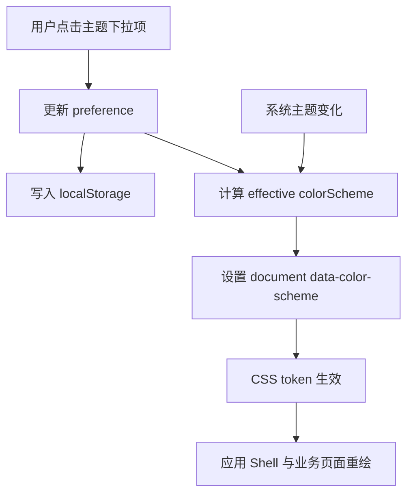

# 黑白主题切换与顶部下拉菜单设计

## 背景

当前前端顶部栏里只有静态的 Sun / Moon 两个按钮，`Sun` 固定为选中态；全局样式也只有浅色 `:root` token。用户在 Pencil 中已经确认新的黑白颜色切换 UI，并通过 visual companion 反复校准了顶部主题下拉菜单。

本设计只覆盖本轮要落地的 `light` / `dark` / `system` 颜色方案切换基础设施，不一次性实现完整 Appearance Preset 系统、设置页高级外观配置或新的 Shell 变体。

## 已确认视觉基线

视觉和交互基线采用 visual companion 的 `theme-dropdown-v9-demo-interactive.html`，其来源是用户提供的 `theme_toggle_demo.html`。

确认点：

- 顶部触发器是小胶囊按钮。
- 收起态只显示当前有效主题图标和 chevron，不显示“浅色 / 深色 / 系统”文字。
- chevron 初始向下；菜单展开后旋转向上。
- 下拉菜单包含三项：`浅色模式`、`深色模式`、`跟随系统`。
- 菜单文字只在展开后显示。
- 当前选中项显示弱高亮背景和右侧 check 图标。
- `跟随系统` 作为用户偏好值；实际生效的颜色方案由系统媒体查询决定。
- 当偏好为 `system` 时，顶部触发器显示实际生效的浅色或深色图标，而不是固定显示系统图标。

## 目标

- 建立真实可用的 `light` / `dark` / `system` 主题偏好状态。
- 通过 `document.documentElement.dataset.colorScheme` 应用实际生效颜色方案。
- 通过 CSS 语义 token 驱动浅色和深色界面。
- 在顶部栏替换静态 Sun / Moon 按钮为已确认的下拉菜单。
- 将主题偏好持久化到前端本地设置。
- 监听系统主题变化，使 `system` 偏好能随系统更新。
- 保持 `colorScheme` 与 `sidebarMode`、Dashboard 页面、游戏适配规则解耦。

## 非目标

- 不新增完整 Appearance Preset 设置页。
- 不实现冰原、猎人绿等额外颜色方案。
- 不实现浮动 Dock、紧凑 Rail 或侧边栏模式切换。
- 不让用户导入自定义 CSS、HTML、JS 或远程主题资源。
- 不把主题设置写入游戏 adapter、Mod 安装流程或存档备份流程。

## 状态模型

本轮区分“用户偏好”和“实际生效方案”。

```ts
export type ColorSchemePreference = "light" | "dark" | "system";
export type EffectiveColorScheme = "light" | "dark";
```

含义：

- `light`：用户明确选择浅色，实际生效为 `light`。
- `dark`：用户明确选择深色，实际生效为 `dark`。
- `system`：用户选择跟随系统，实际生效由 `prefers-color-scheme: dark` 决定。

推荐状态：

```ts
type ColorSchemeState = {
  preference: ColorSchemePreference;
  effective: EffectiveColorScheme;
};
```

默认值：

- 首次启动默认 `system`，以尊重系统偏好。
- 如果读取到损坏或未知值，回退 `system`。
- 如果浏览器环境无法判断系统偏好，`system` 的实际方案回退 `light`。

## 数据流



## 推荐模块边界

推荐新增：

```text
src/app/appearance/
  colorSchemeTypes.ts
  ColorSchemeProvider.tsx
  useColorScheme.ts
  colorSchemeStorage.ts

src/app/frame/
  ThemeMenu.tsx
  ThemeMenu.css
```

推荐修改：

```text
src/app/frame/AppHeader.tsx
src/shared/styles/tokens.css
```

职责：

- `colorSchemeTypes.ts`：只放类型和常量。
- `colorSchemeStorage.ts`：只负责读写、校验、迁移本地偏好值。
- `ColorSchemeProvider.tsx`：负责状态、系统媒体查询监听、`data-color-scheme` 写入。
- `useColorScheme.ts`：导出 hook，避免组件直接读 context 实现细节。
- `ThemeMenu.tsx`：只负责顶部主题菜单 UI 和调用 `setPreference`。
- `ThemeMenu.css`：承载 v9 基线样式，使用语义 token 和局部类名。
- `AppHeader.tsx`：组合状态标签、主题菜单和设置按钮，不承担主题业务逻辑。
- `tokens.css`：提供 `:root` / `[data-color-scheme="light"]` / `[data-color-scheme="dark"]` 语义变量。

## 组件行为

`ThemeMenu` 输入应来自 `useColorScheme()`：

```ts
type UseColorSchemeResult = {
  preference: ColorSchemePreference;
  effective: EffectiveColorScheme;
  setPreference: (next: ColorSchemePreference) => void;
};
```

菜单项：

| preference | 文案 | 菜单图标 | 选中依据 |
|---|---|---|---|
| `light` | 浅色模式 | sun | `preference === "light"` |
| `dark` | 深色模式 | moon | `preference === "dark"` |
| `system` | 跟随系统 | demo 基线的系统组合图标 | `preference === "system"` |

触发器图标：

- `effective === "light"` 时显示 sun。
- `effective === "dark"` 时显示 moon。
- 不在触发器显示 `system` 组合图标。

交互：

- 点击触发器展开 / 收起菜单。
- 点击菜单项设置偏好并关闭菜单。
- 点击外部关闭菜单。
- `Escape` 应关闭菜单。
- chevron 根据菜单开合旋转。
- 菜单展开 / 收起使用 v9 基线的短过渡。

可访问性：

- 触发器使用 `aria-haspopup="menu"`。
- 触发器使用 `aria-expanded` 表达开合状态。
- 菜单容器使用 `role="menu"`。
- 菜单项使用 `role="menuitemradio"` 和 `aria-checked`。
- 当前偏好项有可见 check 图标，同时有 `aria-checked`，不能只靠颜色表达。

## 样式边界

颜色必须通过 token 表达，避免在业务页面散落硬编码颜色。

本轮允许 `ThemeMenu.css` 内部保留少量组件级 token，例如：

```css
.theme-menu {
  --theme-menu-icon-size: 24px;
  --theme-menu-panel-width: 160px;
}
```

全局 token 建议至少补齐：

```css
:root,
:root[data-color-scheme="light"] {
  --color-bg: #f8fafc;
  --color-surface: #ffffff;
  --color-surface-raised: #ffffffd9;
  --color-surface-subtle: #f1f5f9;
  --color-border: #d8dee8;
  --color-text: #0f172a;
  --color-text-muted: #64748b;
  --color-accent: #0062ff;
  --color-accent-weak: #eaf3ff;
}

:root[data-color-scheme="dark"] {
  --color-bg: #0f172a;
  --color-surface: #1e293b;
  --color-surface-raised: #1e293bcc;
  --color-surface-subtle: #0f172a;
  --color-border: #334155;
  --color-text: #e2e8f0;
  --color-text-muted: #94a3b8;
  --color-accent: #60a5fa;
  --color-accent-weak: #1d4ed833;
}
```

实现时应优先复用现有 `tokens.css` 中的变量命名，不为了主题菜单另造一套全局变量。

## 持久化

本轮可先使用 `localStorage`。

推荐 key：

```ts
const COLOR_SCHEME_STORAGE_KEY = "helsincy.colorSchemePreference";
```

保存值只能是：

```text
light
dark
system
```

读取规则：

- `light` / `dark` / `system` 原样使用。
- 其他值忽略并回退 `system`。
- 读取异常时回退 `system`。
- 写入异常不应导致界面不可用，可保留内存状态并在后续日志系统完善后记录诊断。

隐私边界：

- 不保存本地路径。
- 不保存 Steam ID。
- 不保存当前游戏、Mod 包、profile 名称。

## 与现有外观系统的关系

本轮只落地 `colorScheme` 子能力，作为后续 Appearance Preset 的基础。

后续完整外观系统可以将当前状态迁移为：

```ts
type AppearanceSettings = {
  colorScheme: ColorSchemePreference;
  shellVariant: ShellVariantId;
  density: DensityId;
  motion: MotionId;
};
```

但本轮不引入 `shellVariant`、`density`、`motion` 状态，避免范围膨胀。

## 禁止事项

- 禁止业务页面判断 `preference` 或 `effective` 后返回不同页面结构。
- 禁止在 Dashboard 内复制浅色版 / 深色版两套页面。
- 禁止让前端主题逻辑调用 Tauri command。
- 禁止把主题偏好写入游戏 adapter。
- 禁止通过主题功能引入任意 CSS / HTML / JS 注入。
- 禁止把 visual companion 里的 `tmp/` 文件提交到仓库。

## 验证标准

实现后至少验证：

- 首次加载时 `system` 能根据系统偏好解析实际主题。
- 切换 `浅色模式` 后，`document.documentElement.dataset.colorScheme === "light"`。
- 切换 `深色模式` 后，`document.documentElement.dataset.colorScheme === "dark"`。
- 切换 `跟随系统` 后，触发器显示实际生效的 sun / moon。
- 偏好值刷新页面后仍保留。
- 将存储值改为非法字符串后，应用回退 `system`，不白屏。
- 主题菜单初始收起，chevron 向下。
- 点击触发器后菜单展开，chevron 旋转向上。
- 点击外部或 `Escape` 后菜单关闭。
- 运行项目统一验证脚本。

推荐命令：

```powershell
powershell -NoProfile -ExecutionPolicy Bypass -File .\scripts\verify.ps1
```

前端视觉验证：

- 桌面宽屏。
- 1366px 常见窗口。
- 860px 以下窄屏。
- Steam Deck Desktop Mode 近似分辨率。

## 实施顺序建议

1. 新增 `colorSchemeTypes.ts` 和 `colorSchemeStorage.ts`，先覆盖偏好值校验。
2. 新增 `ColorSchemeProvider` 和 `useColorScheme`，写入 `data-color-scheme`。
3. 在应用入口包裹 provider。
4. 扩展 `tokens.css` 的浅色 / 深色变量。
5. 新增 `ThemeMenu` 和样式，按 v9 视觉 / 交互基线实现。
6. 在 `AppHeader.tsx` 替换静态 Sun / Moon 按钮。
7. 补充测试和浏览器 smoke test。

## 开放问题

- 设置页后续是否要提供独立“外观”分组，由后续 Appearance Preset 任务决定。
- 深色 token 的最终品牌细节可在实现后基于实际页面截图微调。
- 如果后续引入 Tauri 设置存储，应迁移 `localStorage` 值，但本轮不阻塞。
