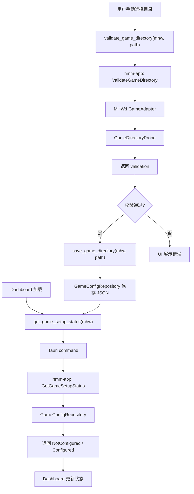

# 首次启动与 MHW:I 游戏目录配置设计

## 背景

Helsincy Mod Manager 当前已经有 Dashboard 首次启动界面骨架，主卡片包含“自动扫描 Steam”和“手动选择游戏目录”入口，右侧状态栏也展示了目录识别、校验和配置档案创建等步骤。但这些状态仍是静态展示，后端也只有最小的 `app_health` command、`GameId` 和 MHW:I adapter 名称信息。

本设计覆盖首个真实跨前后端用例：为《怪物猎人：世界 冰原》配置游戏目录。它的目标是打通“选择目录 -> 后端校验 -> 保存配置 -> Dashboard 展示真实状态”这条链路，同时保留 Steam 自动扫描的接口边界，但不在本轮实现真实 Steam 扫描。

## 已确认决策

- 首版采用“手动配置闭环 + Steam 扫描接口占位”。
- 首版真实实现手动选择目录、后端校验、保存配置和 Dashboard 状态更新。
- Steam 自动扫描首版只定义接口和 UI 状态，不读取真实 Steam library。
- 首版不实现一键启动游戏，只为后续启动功能保留游戏实例配置。
- 首版持久化使用 JSON 配置文件过渡，并通过 `GameConfigRepository` 隔离实现；后续可以迁移到 SQLite。
- 首版不写入游戏安装目录，不执行 Mod 安装，不创建 `nativePC`，不检查写权限。

## 目标

- 建立真实的 MHW:I 游戏目录配置状态。
- 支持玩家手动选择 MHW:I 安装目录。
- 由后端校验目录是否像 MHW:I 安装目录。
- 保存已验证的游戏实例配置到应用数据目录。
- Dashboard 根据真实配置状态显示未配置、校验失败或已配置。
- 为 Steam 自动扫描定义稳定接口，后续实现时不需要重写前端 API 形状。
- 保持前端、Tauri command、应用层、接口层、基础设施层和游戏适配器边界清晰。

## 非目标

- 不实现真实 Steam library 扫描。
- 不实现进程扫描或从正在运行的游戏反查路径。
- 不实现一键启动游戏。
- 不实现 Mod 导入、安装、卸载、备份或回滚。
- 不写入真实游戏目录。
- 不读取真实玩家存档。
- 不把游戏目录规则写进 React 组件或通用前端逻辑。
- 不在首版引入 SQLite migration。

## 用户体验

首次启动时，Dashboard 根据配置状态展示：

- 未配置：提示需要先选择 MHW:I 游戏目录，主操作为“手动选择游戏目录”。
- 校验中：按钮进入 loading 或 disabled 状态，状态栏显示正在校验。
- 校验失败：展示可读错误原因，例如缺少游戏可执行文件。
- 已配置：展示已配置状态、游戏名称和脱敏后的路径摘要，后续模块可以从“待启用”过渡到“可继续配置”。

“自动扫描 Steam”按钮首版不执行真实扫描。建议行为：

- 点击后调用 `scan_game_candidates("mhw")`。
- 后端返回 `not_implemented` 或空候选列表。
- UI 显示“自动扫描暂未启用，请先手动选择目录”。

这样按钮不是假装可用，也不会让玩家以为扫描失败是本地问题。

## 前端模块边界

推荐新增或拆出：

```text
src/features/game-setup/
  gameSetupTypes.ts
  gameSetupApi.ts
  useGameSetup.ts
  GameDirectoryActions.tsx
```

推荐修改：

```text
src/features/dashboard/
  DashboardPage.tsx
  DashboardHeroCard.tsx
  SetupStatusPanel.tsx
  dashboardData.ts

src/shared/api/
  tauri.ts
```

职责：

- `gameSetupTypes.ts`：定义前端使用的游戏配置状态、校验状态、错误码类型。
- `gameSetupApi.ts`：封装 typed Tauri API，组件不直接散落 `invoke`。
- `useGameSetup.ts`：负责加载状态、触发校验、保存目录、处理 loading/error。
- `GameDirectoryActions.tsx`：承载手动选择和自动扫描按钮逻辑。
- Dashboard 组件只展示状态和组合子组件，不直接判断 MHW:I 文件规则。
- `dashboardData.ts` 保留纯静态展示数据，不能继续承载真实状态。

前端可以知道 `gameId = "mhw"`，但不能知道 `MonsterHunterWorld.exe`、`nativePC`、DLL 或 Steam 路径规则。

## Tauri Command 边界

推荐命令：

```rust
get_game_setup_status(game_id: String) -> Result<GameSetupStatusDto, CommandErrorDto>
validate_game_directory(game_id: String, directory: String) -> Result<GameDirectoryValidationDto, CommandErrorDto>
save_game_directory(game_id: String, directory: String) -> Result<GameSetupStatusDto, CommandErrorDto>
scan_game_candidates(game_id: String) -> Result<Vec<GameCandidateDto>, CommandErrorDto>
```

职责：

- 校验参数是否为空、game id 是否受支持。
- 将前端 DTO 转换为应用层输入。
- 将应用层错误映射为前端可展示错误码。
- 不直接访问文件系统。
- 不直接写配置文件。
- 不硬编码 MHW:I 目录规则。

`scan_game_candidates` 首版可以返回：

```text
scan_not_implemented
```

或返回空候选并附带 `source_status = "not_implemented"`。推荐前者更明确，便于 UI 展示“功能暂未启用”。

## Rust 分层设计

### hmm-core

新增领域模型：

```rust
GameInstance
  id
  game_id
  display_name
  root_dir
  status
  configured_at

GameDirectoryValidation
  game_id
  directory
  is_valid
  confidence
  evidence
  errors

GameDirectoryStatus
  NotConfigured
  Invalid
  Configured
```

领域层只表达概念和结果，不访问真实文件系统。

### hmm-ports

扩展或新增 traits：

```rust
trait GameAdapter {
    fn game_id(&self) -> GameId;
    fn display_name(&self) -> &'static str;
    fn validate_directory(&self, directory: &GameDirectoryProbe) -> GameDirectoryValidation;
}

trait GameConfigRepository {
    fn load_game_instance(&self, game_id: &GameId) -> Result<Option<GameInstance>>;
    fn save_game_instance(&self, instance: &GameInstance) -> Result<()>;
}

trait GameDiscoveryService {
    fn scan_candidates(&self, game_id: &GameId) -> Result<Vec<GameCandidate>>;
}

trait GameDirectoryProbe {
    fn exists(&self, relative_path: &str) -> bool;
    fn is_file(&self, relative_path: &str) -> bool;
    fn is_dir(&self, relative_path: &str) -> bool;
}
```

`GameDirectoryProbe` 的目的是避免 adapter 直接依赖 `std::fs`，测试时可用 fake probe。

### hmm-games-mhw

MHW:I adapter 负责 MHW:I 目录规则。

首版校验建议：

- 必须存在 `MonsterHunterWorld.exe`。
- 可选识别 `nativePC`，但不能要求它存在。
- 可选检查常见游戏数据目录或文件作为辅助 evidence。
- 不做写权限检查。
- 不创建目录或文件。

校验结果应包含 evidence：

```text
found_executable
missing_executable
found_native_pc
```

如果只缺少 `nativePC`，不能判定失败。

### hmm-app

应用层提供用例：

```text
GetGameSetupStatus
ValidateGameDirectory
SaveGameDirectory
ScanGameCandidates
```

用例编排：

- `GetGameSetupStatus` 从 repository 读取配置；如果没有配置，返回 `NotConfigured`。
- `ValidateGameDirectory` 调用对应 adapter 校验目录，返回结构化校验结果。
- `SaveGameDirectory` 先校验目录，通过后保存 `GameInstance`。
- `ScanGameCandidates` 调用 discovery service；首版 service 返回未实现错误。

应用层只依赖 traits，不依赖 JSON 文件、SQLite 或真实文件系统实现。

### hmm-infra

首版实现：

```text
JsonGameConfigRepository
NoopGameDiscoveryService
RealGameDirectoryProbe
```

`JsonGameConfigRepository` 写入 Tauri app data 目录下的配置文件，例如：

```text
<app_data>/config/games.json
```

推荐 JSON 结构：

```json
{
  "version": 1,
  "games": [
    {
      "id": "mhw-default",
      "game_id": "mhw",
      "display_name": "Monster Hunter: World - Iceborne",
      "root_dir": "D:\\SteamLibrary\\steamapps\\common\\Monster Hunter World",
      "status": "configured",
      "configured_at": "2026-06-04T00:00:00Z"
    }
  ]
}
```

实现要求：

- 写入应用数据目录，不写仓库目录，不写游戏目录。
- 保存前确保父目录存在。
- 写入时使用临时文件 + 原子替换，降低配置损坏风险。
- 读取到损坏 JSON 时返回 `storage_corrupted`，不静默覆盖。
- 后续迁移 SQLite 时保留 repository trait，app service 不需要改。

## 数据流



## 状态模型

前端推荐状态：

```ts
type GameSetupStatus =
  | { kind: "not_configured"; gameId: "mhw" }
  | { kind: "validating"; gameId: "mhw" }
  | { kind: "invalid"; gameId: "mhw"; errorCode: GameSetupErrorCode; message: string }
  | { kind: "configured"; gameId: "mhw"; displayName: string; pathLabel: string };
```

错误码建议：

```text
unsupported_game
directory_not_found
missing_executable
permission_denied
storage_failed
storage_corrupted
scan_not_implemented
unknown
```

UI 展示应使用 `message` 或本地映射文案，不能把完整本地路径写进日志。

## 安全与隐私

- 首版只读取玩家主动选择的目录。
- 不递归扫描整个磁盘。
- 不读取真实存档。
- 不写入游戏目录。
- 不记录完整本地路径到日志。
- 如果需要展示路径，UI 可展示玩家刚选择的路径摘要；日志只记录路径 hash 或尾部摘要。
- 测试不能依赖真实 MHW:I 安装。
- 自动扫描未实现时必须明确返回，不假装扫描。

## 并发与任务

首版目录校验通常是短任务，可以同步 command 返回，不需要进入后台任务系统。

但设计上保留后续扩展：

- Steam library 扫描可能变成长任务。
- 目录校验如果加入更复杂文件探测，也可以迁移到任务系统。
- 即使未来并行扫描多个候选目录，保存同一个 game id 的配置仍应串行。

## 测试策略

Rust 单元测试：

- `hmm-games-mhw`：fake probe 覆盖有/无 `MonsterHunterWorld.exe`。
- `hmm-app`：fake repository + fake adapter 覆盖读取状态、校验目录、保存目录。
- `hmm-infra`：临时目录测试 JSON repository 读写、损坏 JSON、父目录创建。
- Tauri command：覆盖 DTO 映射和错误码映射。

前端测试或 smoke test：

- 未配置状态显示正确。
- 校验失败显示错误原因。
- 保存成功后 Dashboard 进入已配置状态。
- 自动扫描未实现时提示清晰，不被当作本机扫描失败。

验证命令：

```powershell
cmd /c corepack pnpm run typecheck
cmd /c corepack pnpm run lint
cmd /c corepack pnpm run build
cargo test --workspace
cargo check --workspace
powershell -NoProfile -ExecutionPolicy Bypass -File .\scripts\check-frontend-boundaries.ps1
```

最终提交或 PR 前优先执行：

```powershell
powershell -NoProfile -ExecutionPolicy Bypass -File .\scripts\verify.ps1
```

## 后续实施顺序

1. 新增领域模型和 ports。
2. 扩展 MHW:I adapter 的目录校验能力，并用 fake probe 覆盖测试。
3. 在 app 层实现 setup use cases。
4. 在 infra 层实现 JSON repository 和 no-op discovery service。
5. 添加 Tauri commands 和 DTO。
6. 添加前端 typed API 与 `useGameSetup`。
7. 将 Dashboard 静态状态替换为真实状态。
8. 补充验证与 smoke test。

## 风险与取舍

- JSON 过渡比 SQLite 更轻，但需要注意原子写入和损坏配置处理。
- 首版不做真实 Steam 扫描，会降低自动化体验，但能避免首个后端用例过大。
- 首版不检查写权限，意味着“目录已配置”不等于“未来一定能安装 Mod”；安装前仍必须重新检查权限并走 InstallPlan。
- 前端路径展示需要在可读性和隐私之间取平衡，日志必须更严格。

## 验收标准

- 玩家可以手动选择 MHW:I 目录并看到校验结果。
- 有效目录保存后，重启应用仍能读取配置。
- 无效目录不会保存为 configured。
- Dashboard 不再完全依赖静态首次启动文案。
- Steam 自动扫描入口有明确“暂未实现”反馈。
- 前端没有硬编码 MHW:I 文件规则。
- 应用层不依赖具体 JSON repository 实现。
- 测试不依赖真实游戏目录。
