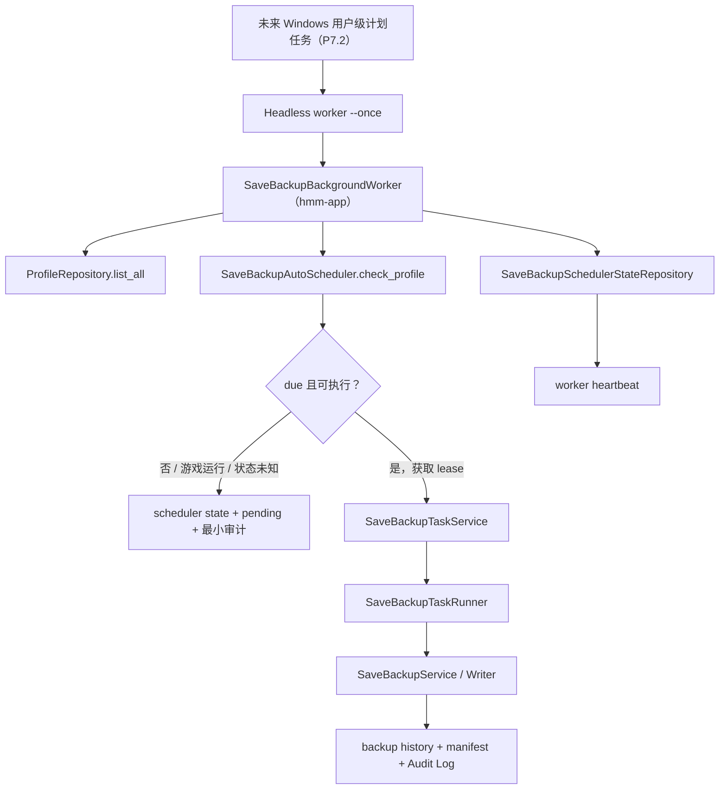

# 存档自动备份后台 Worker（P7.1）设计规格

- 日期：2026-07-10
- 对应总任务：T8 存档备份系统 / Phase 7「真实后台守护与计划任务 MVP」的首个实现切片
- 状态：已获设计批准，待实施计划

## 1. 背景与问题

当前自动备份已经具备客户端运行期调度、持久化 scheduler state、跨进程 lease 去重、游戏运行检测延后、备份历史和审计链路。但真正退出主客户端后，客户端内调度器停止；现有 `tray_only` 状态不能等同于后台保障。

本规格交付后台保障的可测试核心：无 UI 的单次 worker、后台注册契约和健康记录。它不直接调用 Windows Task Scheduler，也不向用户承诺已经具备退出后的持续自动备份能力。

## 2. 目标

1. 提供无 WebView、无 Tauri UI 生命周期依赖的 `--once` headless worker 入口。
2. worker 枚举所有 Profile，只检查启用自动备份的 Profile，并复用现有调度器判断 due。
3. worker 对 due Profile 复用现有 `SaveBackupTaskService -> SaveBackupTaskRunner -> SaveBackupService -> SaveBackupWriter/Repository/AuditLog` 链路。
4. 定义后台注册、移除和状态检查的 port，并用 fake 实现锁定 P7.2 的平台适配契约。
5. 记录 worker heartbeat，但未存在可验证的平台注册时，后台状态不得错误标记为 `protected`。
6. 通过 fake ports、临时 SQLite 和最小 fixture 测试并发、失败隔离和安全语义。

## 3. 非目标

- 不注册、删除或调用真实 Windows Scheduled Task。
- 不创建 Windows Service、常驻 daemon 或自启动项。
- 不增加 Settings/Profile 的真实后台保障开关。
- 不将 `tray_only` 改为 `protected`，也不修改用户可见的后台保障承诺。
- 不新增第二套备份写入、路径解析、manifest、保留策略、恢复或游戏运行检测逻辑。
- 不接受 CLI、Tauri command 或前端传入的存档路径、备份路径、manifest、Steam ID、scheduler lease owner 或 worker instance id。

## 4. 架构与依赖边界

### `hmm-core`

复用既有 `SaveBackupBackgroundProtectionStatus`、`SaveBackupSchedulerState` 与 `SaveBackupWorkerHeartbeat`。除非实现中证明存在稳定、游戏无关的领域概念，否则不增加新 core 类型。

### `hmm-ports`

新增后台注册 port。它只表达平台后台入口的注册状态，不表达备份文件写入：

- `inspect()`：读取注册状态；
- `register(...)`：未来注册用户级后台入口；
- `unregister(...)`：未来禁用、升级或卸载时移除入口。

返回稳定状态：`not_registered`、`registered`、`registration_failed`、`permission_required`、`unsupported_platform`。该 port 不接受路径、保存内容或前端 DTO。

继续复用：

- `ProfileRepository::list_all`；
- Profile 存档设置 repository；
- `SaveBackupSchedulerStateRepository`；
- `SaveBackupRepository`、`SaveBackupExecutor`、`AuditLogWriter`；
- `GameRunningDetector`。

### `hmm-app`

新增 `SaveBackupBackgroundWorker` 用例。其职责是：

1. 创建本轮短生命周期 `workerInstanceId`；
2. 枚举 Profile；
3. 读取并过滤自动备份设置；
4. 对每个目标调用既有 `SaveBackupAutoScheduler::check_profile`；
5. 对 scheduler 返回的 due request 使用既有 task service 和 task runner；
6. 逐 Profile 隔离可恢复失败；
7. 写入 heartbeat 和无敏感信息的聚合日志/审计信息；
8. 返回不含路径、Steam ID、manifest 或存档内容的汇总结果。

worker 不持有 game write lock 执行枚举、设置读取、due 判断或游戏运行检测。真正的备份执行仍由既有服务在 lease 已取得后自行重验源目录、目标目录、包含关系、symlink/junction、大小限制与 retention。

### `hmm-infra`

P7.1 不实现 Windows Scheduled Task registry。仅提供不支持/未注册的受控实现（如果装配需要），真实平台实现留给 P7.2。既有 SQLite scheduler state repository 继续承担 lease 与 heartbeat 持久化。

### `src-tauri`

新增独立 binary 或明确 headless 子命令入口，只接受固定 `--once` 行为。它必须通过共享服务装配创建 worker，不调用 Tauri `run()`，不初始化 WebView，也不暴露新的宽泛文件系统 command。

前端与公开 Tauri command 不在本切片新增后台保障启用能力。

## 5. 调度、并发与状态语义

### 单次执行

worker 每次启动只执行一轮扫描。未来 P7.2 的用户级 Scheduled Task 负责在登录或定时唤醒该 worker；计划任务不得承载备份文件操作。

### 去重

每个 due Profile 都必须经过现有 SQLite `acquire_due_lease`。主客户端与多个 worker 即使同时运行，也只有 lease 获得者可以启动自动备份。lease release guard 在成功、失败或 panic 清理路径上保持有效。

### 游戏运行保护

`Running` 与 `Unknown` 都表示保守延后：不获取 lease，不启动备份任务，并保存 `game_running` 或 `game_running_unknown` pending 原因。worker 不得把检测失败解释为“游戏未运行”。

### Heartbeat 与后台保护状态

worker 为已经检查的自动备份 Profile 写入 heartbeat 与 worker instance id。P7.1 没有可验证的系统级注册，因此：

- heartbeat 不得单独使 `backgroundProtectionEnabled` 变为 `true`；
- `background_status` 不得因 worker 成功一次而变为 `protected`；
- 用户界面继续使用 `tray_only` 或既有失败/不支持语义。

P7.2 只有在 registry 确认后台入口有效、并且 heartbeat 未过期时，才可以报告 `protected`。

## 6. 失败处理与可观测性

- 单个 Profile 的设置、历史、目录或备份执行失败：记录稳定错误码并继续处理其他 Profile。
- worker 初始化、状态库打开或共享服务装配失败：进程以失败退出码结束。
- 不在普通日志、审计字段、返回摘要或错误消息中记录完整路径、用户名、Steam ID、存档内容、manifest 正文、hash 列表、token、cookie 或原始底层异常。
- 备份执行继续使用现有 task id、Audit Log 和历史记录；headless worker 不依赖 WebView progress event bus。

## 7. 测试要求

### 应用层

1. 只枚举并检查启用自动备份的 Profile。
2. due Profile 只启动一次现有 auto 备份任务。
3. 同一 Profile 的客户端与 worker 并发检查时，只有一个 lease owner 能执行。
4. 游戏运行或状态未知时不获取 lease、不启动任务，并写 pending。
5. 一个 Profile 失败后，其他 Profile 继续执行。
6. heartbeat 被记录，但没有平台注册时状态保持非 `protected`。
7. 结果、审计和错误码不含敏感路径或秘密。

### Tauri/headless 入口

1. `--once` 参数解析只接受固定行为；拒绝任意路径、profile、备份根目录和内部 lease 参数。
2. worker 入口不调用 Tauri UI run path。
3. 不新增宽泛文件系统 command。

### 运行边界

- 不使用真实 MHW 安装、Steam userdata、玩家存档、游戏进程或 Windows Scheduled Task。
- SQLite 测试使用临时数据库；其余依赖使用 fake ports 与固定 clock。

## 8. 验收标准

P7.1 完成时，以下事项必须同时成立：

1. 项目可以构建独立的单次 headless worker 入口。
2. worker 会安全枚举并检查自动备份 Profile，且不会复制备份写入逻辑。
3. worker 与客户端竞争同一 due Profile 时不会重复备份。
4. 游戏运行保护、lease、审计、历史、manifest 与 retention 继续沿用现有链路。
5. worker heartbeat 有真实调用方和聚焦测试。
6. 没有 Windows Scheduled Task 时，产品状态仍诚实显示为非 `protected`。
7. 测试完全使用 fake/临时资源，且验证不泄漏敏感数据。

## 9. 后续切片

P7.2 负责 Windows 用户级 Scheduled Task 的真实 registry adapter、安装/升级/卸载维护、Settings/Profile 开关和退出前提示。P7.3 再评估 Linux / Steam Deck 的 user service 或 autostart 适配。
