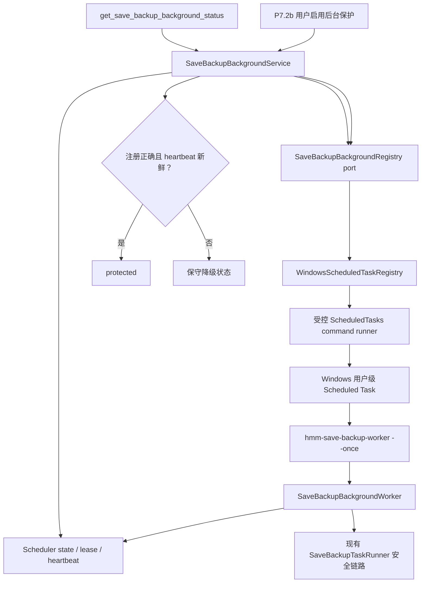

# Windows Scheduled Task 后台保护核心（P7.2a）设计规格

- 日期：2026-07-10
- 对应总任务：T8 存档备份系统 / Phase 7「真实后台守护与计划任务 MVP」
- 前置切片：P7.1 单次 headless worker、scheduler lease 与 heartbeat 基础
- 状态：平台核心已实现；安装态 bundle/runtime smoke 与 P7.2b 尚未完成

## 1. 背景与问题

P7.1 已提供只接受 `--once` 的 headless worker，并复用现有
`SaveBackupTaskRunner -> SaveBackupService -> SaveBackupWriter/Repository/AuditLog`
链路。它已经能在单次启动后安全检查自动备份计划，但没有任何 Windows
系统入口会在主客户端退出后启动该 worker。

当前还有两个会造成错误保护结论的模型问题：

1. `SaveBackupWorkerHeartbeat` 同时携带 worker 活性事实和保护状态，worker
   理论上可以越权写入 `protected`。
2. `last_checked_at` 会被主客户端调度器和 headless worker 共同更新，不能作为
   worker freshness 证据。旧 worker id 配合主客户端的新检查时间可能造成假健康。

P7.2a 交付 Windows 用户级 Scheduled Task 的受控注册核心、独立 heartbeat
时间、read-back 健康检查和 sidecar 打包基础。P7.2b 才接入用户开关、退出提示和
完整 UI 工作流。

## 2. 目标

1. 在 Windows 上以当前用户、最低权限注册一个应用级 Scheduled Task。
2. 任务 action 只能启动随应用交付的 worker，并固定传入 `--once`。
3. 注册、更新、检查和移除均由无外部路径参数的 backend use case 控制。
4. register 是幂等 create-or-update；每次写入后必须 read-back 验证。
5. unregister 是幂等操作，删除前必须确认当前读到的任务具有本应用 ownership marker。
6. 只有“平台注册配置正确”和“当前 Profile 的 worker heartbeat 新鲜”同时成立时，
   才派生 `protected`。
7. 自动化测试使用 fake registry、fake command runner、固定 clock 和临时 SQLite，
   不创建或删除真实系统任务。
8. 提供不接触真实玩家数据的 Windows 人工 smoke 流程，并保证流程末尾清理任务。

## 3. 非目标

P7.2a 不实现：

- Windows Service、管理员级任务或系统启动前运行。
- Linux / Steam Deck user service。
- 新的备份写入、manifest、retention、恢复或路径校验逻辑。
- 前端传入 worker 路径、task name、命令、参数、XML、SID 或调度字段。
- Profile/Settings 后台保护开关和退出前提示；这些属于 P7.2b。
- NSIS/WiX 自动卸载 hook。安装器自动清理是发布前独立 packaging gate。
- 在自动化测试中调用 `Register-ScheduledTask`、`Unregister-ScheduledTask`、
  `schtasks.exe` 或其他真实系统任务写接口。

P7.2a 的 backend `unregister` 和人工 smoke cleanup 必须可用，但完成本切片不能被
描述为“所有 Windows 安装器已自动清理计划任务”。

## 4. 方案比较与决策

### 4.1 采用：Windows ScheduledTasks 模块

Windows adapter 使用系统自带的 PowerShell `ScheduledTasks` 模块。`hmm-infra`
通过内部受控 command runner 执行固定脚本：

- 脚本文本编译在应用内，不从用户输入或配置文件读取。
- task name、ownership marker、worker path 和当前用户标识只通过子进程环境传入，
  不拼接进 PowerShell 源码。
- PowerShell 强制输出 UTF-8、schema-versioned、结构化 JSON。
- Rust 只解析白名单字段，不记录原始 stdout/stderr。
- missing/permission 分类使用 PowerShell `ErrorCategory` 和稳定 `FullyQualifiedErrorId`，不依赖
  本地化 message 或可能为空的 CIM `NativeErrorCode`；missing 同时要求
  `ObjectNotFound` 和 `CmdletizationQuery_NotFound` 前缀。
- command runner 使用隐藏窗口和固定超时，超时后终止子进程并返回稳定错误码。
- PowerShell executable 通过 Windows `GetSystemDirectoryW` 派生绝对系统路径，不使用 PATH
  搜索或可伪造的 `SystemRoot` 环境变量。
- `ScheduledTasks.psd1` 也从同一系统目录派生绝对 manifest path 并按 path 导入，不按
  `PSModulePath` 搜索同名用户模块。
- module manifest 缺失时在 spawn 前返回 `module_unavailable`，并映射为
  `unsupported_platform`，不能折叠为 generic registration failure。
- inline command 不使用 `ExecutionPolicy Bypass`，不降低系统脚本策略。

这个方案避免 `schtasks.exe` 的本地化错误文本和 XML 编码问题，同时比直接维护
Task Scheduler COM/unsafe 封装更容易测试和 review。

### 4.2 不采用：schtasks.exe + XML

`schtasks.exe` 可以创建任务，但 not-found、permission 和 generic failure 常共享
非零退出码，错误文本还会随系统语言变化。XML read-back 还需要处理 BOM、Unicode、
默认字段归一化和临时 XML 文件清理。它不作为 P7.2a 主实现。

### 4.3 暂不采用：Task Scheduler COM

COM API 可以提供直接、类型化的 Windows 集成，但会引入较多 Windows bindings、
COM 生命周期和 unsafe review 面。P7.2a 先保持 port/app 边界稳定；如果实际支持数据
证明 PowerShell 兼容性不足，可以只替换 `hmm-infra` adapter，不改变上层契约。

## 5. 总体架构



Scheduled Task 只负责唤醒。它不读取 Profile 路径、不计算 due、不处理 lease，也不写
存档。worker 启动后仍通过现有 scheduler、game-running detector、task service 和
backup service 完成全部业务判断。

## 6. 模块边界

### 6.1 `hmm-core`

- 为 `SaveBackupBackgroundRegistrationStatus` 增加稳定的
  `ConfigurationDrift` 状态，字符串为 `configuration_drift`。
- `SaveBackupWorkerHeartbeat` 只保留 worker identity 和 heartbeat 时间，不再携带
  `SaveBackupBackgroundProtectionStatus`。
- `SaveBackupSchedulerState` 增加 `worker_heartbeat_at`。
- 保留现有 public protection status 集合：
  `protected`、`tray_only`、`not_enabled`、`registration_failed`、
  `worker_unhealthy`、`permission_required`、`unsupported_platform`。

`ConfigurationDrift` 是 backend 注册事实，不直接扩展前端 status union。它映射为
`registration_failed`，并通过稳定 `lastErrorCode` 表达具体原因。

### 6.2 `hmm-ports`

继续使用无外部参数的 `SaveBackupBackgroundRegistry`：

```text
inspect() -> typed result<registration status>
register() -> typed result<registration status>
unregister() -> typed result<registration status>
```

port 不接受 worker path、task name、命令、参数、SID、XML、Profile 或存档路径。
Windows adapter 在构造时获得内部 worker locator 和受控 command runner。

port error 只包含稳定内部 code：`save_backup_background_task_ownership_conflict`、
`save_backup_background_worker_binary_unavailable`、`save_backup_background_command_timeout`、
`save_backup_background_command_invalid_output`、`save_backup_background_registration_failed`。
它不包含原始 PowerShell/CIM message、stdout/stderr 或路径。app service
把这些 code 映射为既有 public `registration_failed` 和对应 `lastErrorCode`，不扩展前端
status union。

`SaveBackupSchedulerStateRepository::record_worker_heartbeat` 继续作为 heartbeat
持久化入口，但只能更新 `worker_instance_id`、`worker_heartbeat_at` 和必要的
`updated_at`，不能写 `background_status` 或复用 `last_checked_at`。

### 6.3 `hmm-app`

新增或扩展 `SaveBackupBackgroundService`，集中负责：

- 调用 registry 的 inspect/register/unregister。
- 在 register 返回后再次 inspect，只有 read-back 完全匹配才报告 registered。
- 读取 Profile scheduler state 和当前 clock，派生保护状态。
- 将注册事实映射为稳定 public status/error code。
- 为 register/update/unregister 结果写最小 Audit Log。

Tauri command 不自行组合注册状态与 heartbeat，也不直接依赖 infra adapter。

### 6.4 `hmm-infra`

`WindowsScheduledTaskRegistry` 负责：

- 解析当前用户的稳定 identity。
- 从应用内部定位已打包 worker。
- 生成内部 expected task spec。
- 调用受控 command runner 创建、读取或删除任务。
- 对 read-back 结果做语义比较。
- 将 PowerShell module 缺失、权限不足、超时、输出损坏和配置漂移映射为稳定状态。

非 Windows 继续装配 `UnsupportedSaveBackupBackgroundRegistry`，不得尝试执行
PowerShell 或误报 registered。

### 6.5 `src-tauri`

- `AppState` 按平台装配 registry 和 `SaveBackupBackgroundService`。
- registry locator 初始化失败不阻断主应用/headless worker 启动；inspect/register 稳定返回
  worker-binary-unavailable，unregister 仍可通过 raw identity/ownership 路径清理 owned task。
- 现有 `get_save_backup_background_status` 改为 async command，通过 `spawn_blocking` 调用同步
  app service/PowerShell read-back，避免最长 15 秒的平台查询阻塞 Tauri command runtime；DTO
  shape 不扩展。
- P7.2a 不新增前端 register/unregister command；P7.2b 再暴露用户启用/停用入口。
- `--once` worker parser 保持不变，不增加路径、Profile 或内部维护参数。

## 7. Windows 任务身份与所有权

每个 Windows 用户只注册一个应用级任务，不为每个 game/profile 创建任务。

任务名由固定 app identifier 和当前用户 SID 的 SHA-256 短摘要派生：

```text
HelsincyModManager.SaveBackup.<16-hex-user-digest>
```

约束：

- task name 不包含用户名、完整 SID、路径、game id 或 profile id。
- description 只写跨版本稳定的 ownership marker，不写 worker 路径或 schema version。
- inspect 发现同名任务但 marker 不属于本应用时，返回 ownership conflict，不能覆盖。
- unregister 删除前再次校验 marker；marker 不匹配时 fail closed。
- register 只允许覆盖属于本应用、但 spec 已漂移的旧任务。

ownership marker 防止误碰预先存在或检查时已可见的 foreign task，但 Windows
`ScheduledTasks` cmdlet 不提供把 Description 比较与 update/delete 绑定为原子 CAS 的能力。
已登录的同用户恶意进程可在检查与写入之间替换用户级任务，也可修改该用户可写的应用
二进制和 AppData；这种已失陷用户会话不属于 P7.2a 防御边界。写入后 read-back 仍必须
fail closed，验收不得宣称能够阻止该同用户 TOCTOU。

任务 ownership marker 固定为跨版本不变的应用内部常量；`task_schema_version` 是独立内部/audit
常量，不参与 ownership。改变任务 schema 时递增内部版本并改变 expected semantic fields，由
register 的 create-or-update 语义完成升级，旧任务不会因版本号变化被误判为外部 owner。

## 8. Scheduled Task 规范

P7.2a 固定以下内部规范，不提供用户配置：

| 属性 | 固定值 |
| --- | --- |
| Task path | Task Scheduler root `\` |
| Principal | 当前 Windows 用户 |
| Logon type | Interactive token，仅用户登录时运行 |
| Run level | Least privilege / Limited |
| Logon trigger | 用户登录后延迟 1 分钟运行一次 |
| Periodic trigger | 每 15 分钟运行一次 |
| Missed run | `StartWhenAvailable = true` |
| Multiple instances | `IgnoreNew` |
| Battery | 允许电池供电启动，不因切换电池停止 |
| Wake | 不唤醒休眠电脑 |
| Network | 不要求网络 |
| Execution limit | 1 小时 |
| Action executable | 内部定位的 sibling `hmm-save-backup-worker` |
| Action arguments | 严格等于 `--once` |
| Working directory | 不设置 |

read-back 不比较动态生成的 start boundary 原始字符串，但必须比较固定 task path、trigger 类型/
用户/enabled/interval/无期限 duration、principal、settings、ownership marker、canonical worker
path、exact arguments 和空 working directory。

`MultipleInstances = IgnoreNew` 只避免同一 Scheduled Task 重叠。数据库 scheduler lease 仍是
主客户端与 worker、多个 worker 之间的最终去重边界，不能删除。

## 9. 生命周期语义

### 9.1 Inspect

1. 解析当前用户 identity 和 expected task name。
2. 读取同名任务。
3. 不存在时返回 `not_registered`。
4. 权限不足时返回 `permission_required`。
5. ownership marker 不匹配时返回 `registration_failed` 和 ownership conflict error code。
6. marker 匹配但任何语义字段不一致时返回 `configuration_drift`。
7. 全部匹配时返回 `registered`。

inspect 只读系统状态，不修改任务、不启动 worker、不写 scheduler lease。

### 9.2 Register / Update

1. 解析并 canonicalize 内部 worker path；worker 不存在时失败。
2. inspect 当前任务。
3. 已正确注册时幂等返回 registered。
4. 未注册时创建任务。
5. 属于本应用但配置漂移时以 `Set-ScheduledTask` 完整更新 expected spec；missing create 不用
   `-Force`，避免竞态覆盖刚出现的外部任务。
6. mutation 前观察到 ownership conflict 或权限不足时不写入。
7. 写入后再次 inspect；read-back 不是 registered 时，register 失败。

注册成功本身不能产生 `protected`。只有后续 worker heartbeat 新鲜时才能提升状态。

### 9.3 Unregister

1. 任务不存在时幂等返回 not_registered。
2. 任务属于本应用时删除。
3. marker 不匹配时拒绝删除；删除使用复核后的 task input object，不按宽泛名称删除。
4. 删除后再次 inspect；仍存在时返回失败。

unregister 不依赖 worker 文件仍存在，因此应用升级或文件缺失时仍可清理任务。

### 9.4 安装、升级与卸载边界

- P7.2b 用户启用后台保护时调用 register；用户停用时调用 unregister。
- 应用升级后，下一次 register/health repair 通过 spec read-back 检测旧 worker path 或 schema
  drift，并幂等更新。
- P7.2a 人工 smoke 结束时必须调用 unregister，并再次 inspect 确认清理。
- NSIS/WiX uninstaller 自动调用 backend cleanup 属于独立 packaging gate。该 gate 完成前，
  发布检查必须明确“卸载器自动任务清理未覆盖”。

## 10. 健康与 `protected` 判定

Scheduled Task 每 15 分钟运行，worker freshness TTL 固定为 45 分钟。TTL 允许两次错过和
调度抖动，但不会把长时间未运行的 worker 继续视为健康。

保护状态按以下优先级派生：

| 条件 | public status | `lastErrorCode` |
| --- | --- | --- |
| scheduler state 不存在或自动计划未启用 | `not_enabled` | 保留空值 |
| 自动计划启用但后台保护开关未启用 | `tray_only` | 保留现有调度错误 |
| 平台不支持 | `unsupported_platform` | `save_backup_background_unsupported_platform` |
| 平台权限不足 | `permission_required` | `save_backup_background_permission_required` |
| 任务不存在 | `registration_failed` | `save_backup_background_not_registered` |
| ownership conflict | `registration_failed` | `save_backup_background_task_ownership_conflict` |
| 配置漂移 | `registration_failed` | `save_backup_background_configuration_drift` |
| 注册操作或 read-back 失败 | `registration_failed` | `save_backup_background_registration_failed` |
| 注册正确但没有 heartbeat | `worker_unhealthy` | `save_backup_background_worker_unhealthy` |
| heartbeat 晚于当前时间 | `worker_unhealthy` | `save_backup_background_worker_unhealthy` |
| heartbeat 距当前时间超过 45 分钟 | `worker_unhealthy` | `save_backup_background_worker_unhealthy` |
| 注册正确且 heartbeat 在 `[now-45m, now]` | `protected` | 保留非平台调度错误或空值 |

`get_save_backup_background_status` 仍是只读查询：不注册、不修复、不删除任务、不启动
worker、不获取 lease。它可以执行 registry read-back，但不写 scheduler state。

## 11. Heartbeat 持久化

新增 SQLite migration：

```text
save_backup_scheduler_state.worker_heartbeat_at INTEGER NULL
```

迁移后：

- `last_checked_at` 继续表示 scheduler 最近检查时间。
- `worker_heartbeat_at` 只由 headless worker 写入。
- `worker_instance_id` 仍是内部诊断字段，不进入 DTO。
- `record_worker_heartbeat` 不修改 `background_status`。
- 旧行的 `worker_heartbeat_at` 为 null，必须判定为 worker unhealthy，而不是迁移时伪造时间。
- `background_status` 列为兼容现有 schema 保留，但不再是 `protected` 的唯一事实来源。

## 12. 错误、日志与审计

稳定错误码至少包括：

```text
save_backup_background_not_registered
save_backup_background_registration_failed
save_backup_background_configuration_drift
save_backup_background_task_ownership_conflict
save_backup_background_permission_required
save_backup_background_unsupported_platform
save_backup_background_worker_unhealthy
save_backup_background_worker_binary_unavailable
save_backup_background_command_timeout
save_backup_background_command_invalid_output
save_backup_background_audit_unavailable
save_backup_background_status_unavailable
```

允许的 Audit Log 字段：

- `operation = background_registration`
- `result`
- `registration_status`
- `error_code`
- `task_schema_version`

禁止记录：

- task name、完整 SID、用户名。
- worker 完整路径或 action command line。
- PowerShell 源码、原始 stdout/stderr、CIM exception message。
- task XML、存档路径、备份路径、Steam ID、manifest 或存档内容。

只审计 register/update/unregister 结果和显式 health refresh 的状态翻转。普通只读 status query
不写审计，避免页面刷新产生日志噪声。

## 13. Sidecar 打包与定位

P7.2a 将 `hmm-save-backup-worker` 作为 Tauri `bundle.externalBin` sidecar 随应用交付。

要求：

- 构建步骤生成 Tauri 需要的 target-triple 文件名，生成物不提交 Git。
- `externalBin` 和 sidecar build hooks 放在 Windows 平台配置中，不改变非 Windows 的普通
  dev/build hooks。
- Windows dev/release 都有确定性准备步骤；native build 使用 rustc host triple，cross-target
  build 必须显式提供并校验相同 target triple。
- 产物目录从 `cargo metadata` 获取，不能假设固定仓库 `target/` 或忽略
  `CARGO_TARGET_DIR`。
- helper 内部 worker `cargo build` 使用局部 `TAURI_CONFIG` merge patch 清空
  `bundle.externalBin`，避免 sidecar 尚未生成时发生自举校验；正式 Tauri build 不使用该覆盖。
- Cargo package 显式设置 GUI `default-run`，防止新增 worker bin 后打包器把 headless worker
  误选为主应用。
- 安装后 worker 与主程序位于受控 sibling 位置。
- registry 只从当前主程序位置派生 worker path，不读取用户配置或前端参数。
- register 前 canonicalize 并确认 worker 是文件。
- register 前拒绝 worker symlink，并确认 canonical worker parent 等于 canonical sibling parent，
  防止通过 symlink/junction alias 把 action 指向应用目录外。
- read-back 同时要求 raw action path 精确等于写入的 canonical path，并再次 canonicalize 验证；
  alias、旧路径、不存在路径或不同文件均判定 drift。
- worker 继续自行使用 Tauri identifier 解析同一 AppData/SQLite，不从 Scheduled Task 接收
  app-data、Profile、存档或备份目录参数。

P7.2a 的 bundle smoke 必须检查安装产物确实包含 worker。仅通过
`cargo check --bin hmm-save-backup-worker` 不能证明安装态可注册。

## 14. 自动化测试

### 14.1 Core / app

- registration status 的稳定 code，包括 `configuration_drift`。
- heartbeat 不再携带 protection status。
- health mapping 覆盖本规格第 10 节的每个分支。
- future/stale heartbeat 都不能得到 protected。
- profile 未启用后台保护时，即使 registry/heartbeat 健康也保持 tray_only。
- register 后必须 read-back；read-back drift 不能报告成功。
- register/update/unregister Audit Log 只含白名单字段。

### 14.2 Infra fake command runner

- task name 按用户 identity 稳定派生且不含用户名/SID 原文。
- missing task、permission、module unavailable、timeout、invalid JSON 和非零退出稳定映射。
- exact spec read-back 返回 registered。
- action path、arguments、principal、trigger、interval、settings、marker 任一漂移都被识别。
- fake inspect 已观察到 ownership conflict 时不发出 register/unregister mutation。
- register 对 missing 创建、对 owned drift 更新、对 exact spec 幂等。
- unregister 对 missing 幂等，对 owned task 删除并复查。
- fake 记录的 command request 不接受任意程序、脚本、路径或 task XML 输入。

### 14.3 SQLite / Tauri / packaging

- migration 为旧行添加 null `worker_heartbeat_at`。
- heartbeat 只更新 worker 字段，不覆盖 scheduler `last_checked_at`、lease 或 status。
- DTO 保持 camelCase，且不含 task/worker/lease/path/XML/SID 字段。
- non-Windows 装配 fallback，不执行 PowerShell。
- worker sidecar build 产物命名与 Tauri externalBin 规则一致。

自动化测试不得创建真实 Scheduled Task，也不得依赖真实 MHW、Steam userdata、游戏进程、
玩家存档或真实安装目录。

## 15. Windows 人工 smoke

人工 smoke 只在一次性 Windows 测试账户或 VM 中执行，使用干净 AppData、人工 Profile、
临时存档目录和最小文本 fixture。

可执行步骤见 [Windows 存档后台任务人工 Smoke](../../testing/windows-save-backup-scheduled-task-smoke.md)。普通自动化和开发者日常账户不得运行 ignored smoke。

顺序固定为：

1. 构建或安装包含 worker sidecar 的测试产物。
2. backend inspect 确认初始状态为 not_registered。
3. register 后 inspect 确认 exact registered。
4. 再次 register，确认幂等且没有第二个任务。
5. 在 harness 等待期间从 Task Scheduler 人工运行该任务，确认 action 指向安装态 sibling
   worker 且 arguments 为 exact `--once`。
6. 在第二终端用默认 ignored、只读 probe 确认 synthetic Profile 写入新鲜的
   `worker_heartbeat_at`；probe 不运行 migration、不修改 DB、不输出路径或原始时间。
7. unregister 两次，确认幂等。
8. 最终 inspect 必须为 not_registered，并确认没有残留应用任务。
9. 删除 synthetic save、backup 和测试账户/VM 状态。

配置漂移逐字段识别/修复由 fake runner 自动化测试覆盖，不在真实系统任务上主动制造危险
配置。P7.2a 尚无用户启用入口，因此 real smoke 不持久化篡改
`background_protection_enabled` 来制造 UI `protected`；app 层的 exact + fresh -> protected、
future/stale -> worker_unhealthy 使用 fixed-clock 自动化测试覆盖。P7.2b 再完成真实启用入口和
UI/退出后的端到端 protected 验收。

smoke 记录只能包含状态、稳定错误码、测试版本和时间，不附 task XML、完整路径、用户名、
SID、存档内容或原始系统输出。

## 16. 验收标准

P7.2a 完成时必须同时满足：

1. Windows registry adapter 能在普通用户权限下 inspect/register/update/unregister。
2. 所有写操作都有 read-back；mutation 前已观察到的 ownership conflict 必须阻断，且同用户
   恶意进程造成的 check/write TOCTOU 明确记录为超出防御边界的残余风险。
3. Scheduled Task action 只能是已打包 worker 和 exact `--once`。
4. worker heartbeat 与 scheduler check 时间已分离。
5. `protected` 只能由 exact registration 与 fresh heartbeat 双条件产生。
6. 自动化测试不触碰真实系统任务或玩家数据。
7. Windows 人工 smoke 完成创建/read-back、幂等注册、安装态 worker 真实触发、fresh
   heartbeat 只读确认和最终清理闭环；配置漂移与 protected/future/stale 状态矩阵由自动化
   测试覆盖，P7.2b 再做真实 UI protected 验收。
8. 安装产物包含可定位的 worker sidecar。
9. P7.1 scheduler lease、game-running guard、backup task/audit/history 链路回归通过。
10. 文档明确 P7.2b UI/退出体验和安装器自动清理仍未完成。

达到这些条件后，P7.2a 可进入独立 review gate。只有 P7.2b 启用入口和退出体验通过后，
产品 UI 才能向用户提供完整的“启用后台保护并退出”工作流。

当前实现与 fake/临时自动化已覆盖 2-6、9-10；普通用户真实平台行为、安装态 sidecar bundle 和一次性账户/VM smoke 对应 1、7-8，仍为未完成验收项。因此当前不宣称 Windows runtime acceptance。
