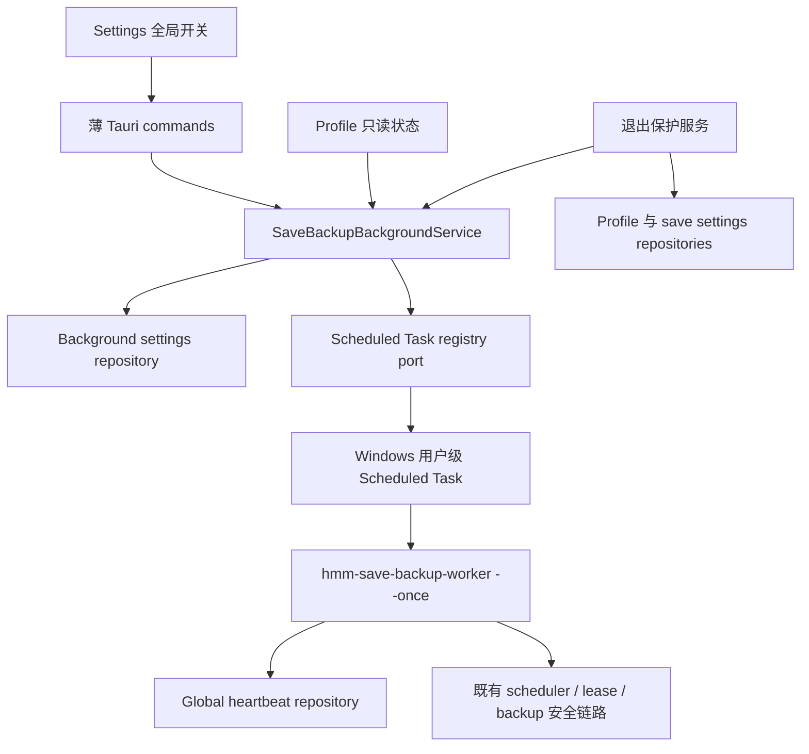

# 后台自动备份用户流程（P7.2b）设计规格

- 日期：2026-07-11
- 对应总任务：T8 存档备份系统 / Phase 7「真实后台守护与计划任务 MVP」
- 前置切片：P7.2a Windows Scheduled Task 平台注册、健康核心与 sidecar
- 状态：设计已确认，等待实施计划

## 1. 背景与问题

P7.2a 已实现 Windows 用户级 Scheduled Task 的受控 inspect、幂等 register/update、
逐字段 read-back、ownership-checked unregister、独立 worker heartbeat 和 sidecar 打包基础。
这些能力尚未暴露给普通用户：Settings 没有正式启停入口，Profile 只能只读展示状态，
窗口关闭偏好和托盘菜单仍可直接退出主客户端。

现有模型还有一个必须在用户流程落地前修正的问题：Scheduled Task 是应用级资源，
但 `background_protection_enabled` 只存在于每个 Profile 的 scheduler state 中，且注册服务
不会写入它。把应用级用户意图复制到当前 Profile 行会遗漏未来 Profile，并在崩溃、重启
或部分失败后产生漂移。

P7.2b 增加单一的全局持久化状态、正式启停用例、首次 heartbeat 验证、Settings/Profile
展示和 fail-closed 退出流程。Scheduled Task 仍只负责唤醒；实际备份继续复用
`SaveBackupTaskRunner -> SaveBackupService -> SaveBackupWriter/Repository/AuditLog`。

## 2. 已确认的产品决策

1. 后台保护是应用级开关，Settings 是唯一启停入口。
2. 每个 Profile 继续独立配置自动备份计划；Profile 页面只读展示其计划是否得到全局保护。
3. register + exact read-back 不等于已保护。启用后先进入 `starting`，等待首次 heartbeat。
4. 首次 heartbeat 宽限为 5 分钟；超时后仍无有效 heartbeat 才进入 `worker_unhealthy`。
5. 存在自动备份计划且后台状态不是 `protected` 时，真正退出必须警告并默认留在托盘。
6. 用户始终可以单次确认退出；应用不得永久阻止退出，也不得记住危险退出选择。
7. `starting` 状态下强制退出不撤销任务或启用意图。Windows 仍会按计划尝试启动 worker。
8. NSIS/WiX 自动卸载 cleanup 拆为 P7.2c 独立规格、实施计划和 release gate。

## 3. 目标

1. 持久化应用级后台保护启用意图、启用时间和全局 worker heartbeat。
2. 提供可重试、可恢复、可审计的启用与停用用例。
3. 只有用户意图、任务 read-back 和本次启用后的新鲜 heartbeat 同时成立时才显示
   `protected`。
4. Settings 提供唯一正式开关和可操作错误状态；Profile 保持只读。
5. 所有真正退出入口统一经过后端安全决策，不允许托盘菜单或已记住偏好旁路。
6. 危险退出需要当次明确确认，且记录脱敏审计。
7. 自动测试不创建、更新、启动或删除真实 Scheduled Task。

## 4. 非目标

P7.2b 不实现：

- 新的备份写入、恢复、manifest、retention 或路径处理逻辑。
- 前端传入 task name、SID、worker path、PowerShell、XML、调度间隔或命令参数。
- 在普通自动测试中调用真实 Windows Scheduled Task 写接口。
- NSIS/WiX installer hooks 或卸载时自动 cleanup；该工作属于 P7.2c。
- Linux / Steam Deck user service。
- Windows Service、管理员级任务、系统启动前运行或提权流程。
- “注册成功即已保护”的乐观文案。
- 用前端 localStorage 作为后台保护事实来源。

## 5. 方案比较与决策

### 5.1 采用：专用 SQLite 全局状态

新增专用 repository 和单例 SQLite 行，统一保存用户意图与 worker 健康事实。GUI 与
headless worker 已共享同一 AppData/SQLite，因此可以在不依赖 WebView 或前端存储的情况下
完成重启恢复和跨进程对账。

优点：

- 与 scheduler/heartbeat 使用同一持久化基础设施。
- 可以区分用户意图、任务存在、配置漂移和 worker 活性。
- `enabled_at` 可以拒绝上一次启用留下的旧 heartbeat。
- 外部平台注册和数据库写入无法组成单一事务时，仍能保守恢复。

### 5.2 不采用：通用 JSON AppSettings

通用 settings repository 已有原子文件保存，但把安全关键的 Scheduled Task 意图放在 JSON、
把 scheduler/heartbeat 放在 SQLite，会增加跨存储恢复矩阵。P7.2b 使用专用 SQLite 状态，
不把该开关混入当前大部分仍是 session preview 的 SettingsState。

### 5.3 不采用：从任务是否存在推断用户意图

任务存在不能区分用户主动启用、配置漂移、旧版本遗留和 foreign task。该方案也无法可靠
表达重新启用后的首次 heartbeat 宽限，因此不采用。

## 6. 总体架构



平台注册、用户意图、heartbeat 和自动备份计划是不同事实：

- SQLite 全局状态回答“用户是否希望启用后台保护”。
- registry read-back 回答“系统任务是否存在且完全匹配”。
- global heartbeat 回答“本次启用后的 worker 是否实际完成过健康检查”。
- Profile save settings 回答“是否存在需要退出后继续保护的自动备份计划”。

## 7. 持久化模型

新增迁移和单例表，例如：

```sql
CREATE TABLE save_backup_background_settings (
    singleton_id INTEGER PRIMARY KEY CHECK (singleton_id = 1),
    desired_enabled INTEGER NOT NULL DEFAULT 0,
    enabled_at INTEGER NULL,
    last_worker_heartbeat_at INTEGER NULL,
    updated_at INTEGER NOT NULL
);
```

约束：

- 缺失行等价于默认关闭，不自动注册任务。
- `desired_enabled = 0` 时 `enabled_at` 必须为空。
- 每次启用写入新的 `enabled_at` 并清空旧 heartbeat，避免旧运行证明新启用健康。
- heartbeat 只能由 headless worker 写入；GUI 查询不能刷新 heartbeat。
- 时间使用现有 Unix milliseconds 和受控 `AppClock`。
- 现有 scheduler state 的 `background_protection_enabled` 暂时保留作兼容快照，但不再是
  Settings、全局健康或退出决策的事实来源；是否移除留给后续 schema cleanup。

`hmm-ports` 新增窄 repository trait：

- `load()`：读取全局状态或默认关闭。
- `begin_enable(enabled_at)`：持久化启用意图并清空 heartbeat。
- `finish_disable(updated_at)`：在任务确认移除后持久化关闭。
- `record_worker_heartbeat(timestamp)`：只更新 heartbeat/updated_at。

SQLite 实现负责单连接写串行和参数化 SQL。repository 不调用 Scheduled Task，也不派生
UI 状态。

## 8. 状态派生

全局控制状态使用稳定值：

- `not_enabled`
- `starting`
- `protected`
- `registration_failed`
- `worker_unhealthy`
- `permission_required`
- `unsupported_platform`

派生顺序必须 fail closed：

1. 读取全局 desired state。
2. 若未启用，返回 `not_enabled`；若发现 owned task 遗留，可返回
   `registration_failed` 和稳定 cleanup error，不自动删除。
3. 若已启用，执行 registry inspect。
4. permission / unsupported / drift / not-registered 按稳定状态与错误码返回。
5. exact registration 后检查 heartbeat。
6. heartbeat 必须满足 `heartbeat >= enabled_at`、`heartbeat <= now` 且位于 45 分钟 TTL 内。
7. 没有本次 heartbeat 且 `now - enabled_at <= 5m` 时返回 `starting`。
8. 超过 5 分钟仍无本次 heartbeat，或 heartbeat 已 stale/future，返回
   `worker_unhealthy`。
9. exact registration + valid heartbeat 才返回 `protected`。

查询保持只读：不注册、不修复、不启动任务、不写 heartbeat、不获取 scheduler lease。

## 9. 启用流程

`enable_save_backup_background_protection` 不接受路径或平台参数：

1. 从 `AppClock` 取得当前时间。
2. `begin_enable(now)` 写入 desired enabled、新 enabled_at 并清空旧 heartbeat。
3. 调用既有 registry register/update。
4. 必须执行 exact read-back。
5. 写现有 `save_backup/background_registration` 审计结果。
6. 成功时返回 `starting`，不能返回 `protected`。

如果注册或 read-back 失败，启用意图保留为 true，使重启后仍能显示可恢复失败并允许
“重试启用”或“停用”。不能因为 command 返回错误就假设系统任务一定不存在。

重复启用是幂等修复：重新写 enabled_at、清空旧 heartbeat、register/update 并 read-back。
这意味着修复后必须重新取得本次启用的 heartbeat。

## 10. 停用流程

`disable_save_backup_background_protection` 的顺序固定：

1. 调用既有 ownership-checked unregister。
2. read-back 必须确认任务 not registered。
3. `finish_disable(now)` 最后写入 desired disabled，并清空 enabled_at/heartbeat。
4. 写脱敏审计。

只有任务确认不存在后才能对用户显示已停用。ownership conflict、permission、timeout、
invalid output 或 unknown failure 都保留 desired enabled，并提示用户重试，不能静默留下任务
却把开关显示为关闭。

重复停用在任务已不存在时成功。停用不修改任何 Profile 的自动备份计划；主客户端运行时
调度仍可继续工作，Profile 状态降级为 `tray_only`。

## 11. Worker 全局 heartbeat

headless `--once` worker 在以下条件满足后记录一次全局 heartbeat：

1. AppData 和 SQLite 成功打开。
2. 共享 scheduler、profile/save settings、game-running detector 和 task service 装配成功。
3. 本轮 profile 枚举与调度检查完成，没有 infrastructure-level 中止。

单个 Profile 因游戏运行、source invalid、destination unavailable 或 task conflict 被正常延后，
不阻止 heartbeat；这些是成功完成的保守业务结果。数据库不可用、profile 列表不可读、clock
失败或 worker panic 不写新 heartbeat。

heartbeat 不声明备份成功，只证明系统任务启动的 worker 完成了一轮受控调度检查。

## 12. Tauri 契约

新增三个全局后台保护命令：

- `get_save_backup_background_control_status`
- `enable_save_backup_background_protection`
- `disable_save_backup_background_protection`

控制 DTO 只允许：

```ts
type SaveBackupBackgroundControlStatusDto = {
  desiredEnabled: boolean;
  status:
    | "not_enabled"
    | "starting"
    | "protected"
    | "registration_failed"
    | "worker_unhealthy"
    | "permission_required"
    | "unsupported_platform";
  enabledAt: number | null;
  lastHeartbeatAt: number | null;
  lastErrorCode: string | null;
};
```

现有 `exit_app` 改为接收显式 request：

```ts
type ExitAppRequestDto = {
  overrideUnprotected: boolean;
};
```

普通窗口关闭、已记住的退出偏好和托盘退出流程只能传 `false`；只有危险退出对话框中的
当次明确确认可以传 `true`。后端不信任前端缓存状态，两个分支都必须重新计算 exit guard。

不得返回 task name、task XML、SID、worker id/path、PowerShell/module path、lease owner、
完整本地路径或原始 stdout/stderr。

现有 per-profile `get_save_backup_background_status` 改为组合 Profile 自动备份状态与全局控制
状态，但仍不暴露内部字段。手动备份 Profile 返回 `not_enabled`；自动备份 Profile 才展示
全局 `starting/protected/...`。

## 13. Settings 与 Profile UI

### 13.1 Settings

Settings 增加独立正式面板，不复用当前 session-preview `SettingsState`：

- 唯一全局 toggle。
- 状态 badge 与简短结果文案。
- `starting` 时显示“正在验证后台保护”。
- 失败时提供“重试启用”或“停用”动作。
- 操作期间禁用重复点击并保留稳定布局。
- unsupported platform 禁用 toggle，不展示伪启用状态。
- permission/error 文案只使用稳定 error code 映射，不显示原始平台错误。
- Settings 顶部当前“这些选项现在只在本次会话中交互预览”的总括文案必须收窄，明确后台
  保护开关是正式持久化设置，不能继续暗示整页所有控件都不会写入。

### 13.2 Profile

Profile 自动备份面板继续只读：

- 手动计划：未启用自动备份。
- 自动计划 + not enabled：仅客户端运行期。
- 自动计划 + starting：后台任务已注册，等待首次验证。
- 自动计划 + protected：退出主客户端后仍由系统任务检查。
- 失败状态：说明保护未生效，并导航用户到 Settings 处理。

Profile 不提供第二个 toggle，不调用 enable/disable，也不根据路径或 task 细节派生状态。

## 14. 退出保护

退出保护是后端用例，不由前端缓存状态决定。它读取：

- 是否存在 cadence 非 manual 的 Profile。
- 当前全局后台保护状态。

安全决策：

- 没有自动备份 Profile：允许正常退出。
- 存在自动备份且状态为 `protected`：允许正常退出。
- 存在自动备份且为其他状态：要求当次确认。
- 退出决策查询失败：按要求确认处理，不能当作安全。

所有真正退出入口统一：

1. 主窗口 close requested。
2. 已记住的“退出应用”偏好。
3. 托盘菜单“退出程序”。

托盘菜单不再直接 `app.exit(0)`；它显示/聚焦主窗口并发出同一 exit request。普通
`exit_app` 命令在后端重新计算决策。unsafe 且没有 override 时返回稳定
`exit_confirmation_required`；前端随后显示危险退出对话框。

危险退出对话框：

- 默认焦点和主操作为“留在托盘”。
- 明确显示 `starting`、unhealthy、registration 或 unknown 原因。
- “仍然退出”调用显式 `overrideUnprotected = true` 的窄命令。
- 不显示或禁用 remember checkbox。
- Escape/关闭按钮取消退出，不执行 platform mutation。

后端在 override 命令内再次计算状态。如果此时已变成 `protected`，按正常退出；如果仍
unsafe，则记录 `save_backup/background_exit_override` 脱敏审计后退出。审计不可用不能永久
困住用户：记录 sanitized warning 后仍允许本次明确确认的退出。

### 14.1 `starting` 时强制退出

用户在首次 1 分钟 trigger 前执意退出时：

- 对话框说明任务已注册但尚未完成首次 heartbeat 验证。
- 说明 Windows 仍会按计划尝试启动 worker，失败时 GUI 无法即时提醒。
- 确认退出不 unregister，也不清除 desired enabled。
- 下次 GUI 启动重新对账；有效 heartbeat -> `protected`，否则 -> `worker_unhealthy`。
- 该选择只对本次有效，不能写入关闭行为偏好。

## 15. 错误与审计

继续使用 P7.2a 稳定错误码，并新增最小状态/退出错误码。前端逻辑只能分支稳定 code，
不能解析 message。

Audit Log：

- category：`save_backup`
- registration operation：沿用 `background_registration`
- forced exit operation：`background_exit_override`
- fields 仅允许 `registration_status`、`protection_status`、`error_code`、
  `task_schema_version`

不得记录路径、SID、task name、worker id、Profile id 列表、用户名、Steam ID、真实存档内容、
PowerShell 输出或第三方 Mod 内容。

## 16. 崩溃与部分失败恢复

外部 Scheduled Task 和 SQLite 不能组成原子事务，设计通过顺序和 read-back 保守恢复：

| 中断位置 | 重启后可见状态 | 恢复动作 |
| --- | --- | --- |
| 启用意图已写，register 前中断 | registration failed | 重试启用或停用 |
| register 后、read-back 前中断 | 由 inspect 决定 starting/drift/failure | 重试启用 |
| exact read-back 后、heartbeat 前退出 | starting | 等待 trigger 或重试 |
| unregister 前失败 | 仍 desired enabled | 重试停用 |
| unregister 成功、关闭状态写入前中断 | desired enabled + not registered | 重试停用 |
| 状态读取或 clock 失败 | unavailable / confirmation required | 不宣称 protected |

任何自动恢复都不得删除 ownership 不匹配的任务。

## 17. 测试策略

### 17.1 Repository 与迁移

- 缺失 singleton 默认关闭。
- begin enable 写新时间并清旧 heartbeat。
- finish disable 清理全局状态。
- heartbeat 只更新允许字段。
- SQLite reopen 保留状态。
- migration 保留既有 scheduler/profile/save 数据。

### 17.2 App service

- enable/disable 调用顺序和 read-back。
- 幂等重试。
- starting 0-5 分钟边界。
- fresh、stale、future、旧启用 heartbeat。
- drift、ownership conflict、permission、unsupported、timeout、invalid output。
- 每个部分失败后的重启派生与恢复动作。
- worker 正常 skip 写 heartbeat；infrastructure failure 不写。
- exit guard 覆盖无自动计划、protected、starting、所有失败和查询失败。
- override audit 字段白名单与 audit failure 仍可退出。

### 17.3 Tauri 与 DTO

- command request 无路径或平台参数。
- DTO serialization 不含内部 task/worker/lease/path 字段。
- ordinary exit 在 unsafe 状态被后端拒绝。
- `ExitAppRequestDto.overrideUnprotected` 普通路径固定为 false，危险确认路径才传 true。
- tray menu 发统一事件，不直接 exit。

### 17.4 Frontend

- Settings toggle 的 loading/starting/protected/error/unsupported 状态。
- Profile 只读状态与 Settings 导航。
- remembered exit 遇到 unsafe 状态仍打开对话框。
- unsafe dialog 不显示 remember，默认焦点为 tray，键盘焦点不逃逸。
- 单次强制退出不写 localStorage preference。
- `1440x900`、`1366x768`、`1280x800` 和窄窗口 smoke，无文本重叠。

### 17.5 真实 Windows 验收

自动化仍不得操作真实任务。一次性账户/VM 手工验收至少覆盖：

- 安装态 sibling worker。
- UI 启用 -> Scheduled Task exact read-back -> starting。
- 首次 trigger -> global fresh heartbeat -> protected。
- starting 时单次强制退出，任务随后独立运行。
- 停用 -> owned task 移除 -> not enabled。
- foreign task 拒绝覆盖/删除。
- 最终 cleanup。

该验收通过前不能宣称 Windows runtime acceptance。

## 18. 文档与交付边界

实现时同步更新：

- `docs/SAVE_BACKUP_BACKGROUND_AUTOMATION_DESIGN.md`
- `docs/FRONTEND_BACKEND_CONTRACT.md`
- `docs/TESTING.md`
- `docs/LOGGING.md`
- `docs/release/发布与产物说明.md`
- `TODO.md`

P7.2b 完成后只可声明“用户启停与退出保护流程已落地”。只有一次性账户/VM 的安装态
task/heartbeat smoke 通过后，才可声明 Windows runtime acceptance。P7.2c 完成并分别验证
NSIS/WiX 后，才可声明 installer 自动 cleanup。

## 19. 验收标准

- [ ] Settings 是唯一正式后台保护开关。
- [ ] 应用级 SQLite 状态是启用意图和全局 heartbeat 的事实来源。
- [ ] register/read-back 后先进入 starting，不提前显示 protected。
- [ ] 只有本次启用后的 fresh global heartbeat 才显示 protected。
- [ ] Profile 页面只读展示全局保护对当前自动备份计划的影响。
- [ ] 所有退出入口经过同一后端安全决策。
- [ ] unsafe exit 默认留在托盘，override 只对本次有效且不保存。
- [ ] starting 时强制退出不注销任务，下一次启动可正确对账。
- [ ] 自动测试不接触真实 Scheduled Task 或玩家数据。
- [ ] NSIS/WiX cleanup 明确留在 P7.2c，不混入本切片完成声明。
