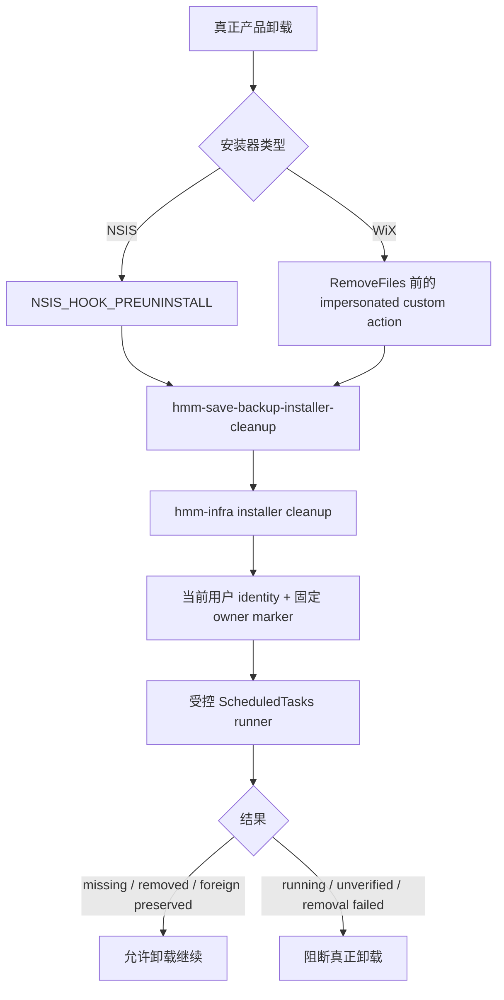

# Windows 安装器 Owned Task 卸载清理（P7.2c）设计规格

- 日期：2026-07-12
- 对应总任务：T8 存档备份系统 / P7.2c
- 前置切片：P7.2a Windows Scheduled Task 平台核心、P7.2b 应用级用户流程
- 状态：规格完成，尚未实现 installer helper、NSIS hook 或 WiX custom action

## 1. 背景

P7.2a 已实现当前 Windows 用户级 Scheduled Task 的确定性身份、固定 ownership
marker、幂等注册、逐字段 read-back 和 ownership-checked unregister。P7.2b 已把用户
启用意图、Settings/Profile 状态与退出保护接到该平台核心上。

当前卸载器仍不会自动移除 owned task。若玩家在后台保护已启用时卸载应用，任务可能继续
尝试启动已经删除的 worker；如果安装器为了避免残留而按名称宽泛删除，又可能误删同名的
foreign task。NSIS 与 WiX 的卸载生命周期也不同，不能用一个未经验证的脚本片段同时覆盖。

P7.2c 先定义一个 installer-neutral、无外部路径参数的窄 helper，再分别接入 NSIS 和
WiX 的真正产品卸载路径。helper 只负责当前用户的 owned Scheduled Task，不承担应用设置、
玩家数据或备份业务。

## 2. 目标

1. 真正卸载产品时，在 helper 二进制被删除前清理当前用户的 HMM owned task。
2. missing 与 owned cleanup 幂等成功；marker 匹配但 task spec 漂移时仍允许清理。
3. foreign task 始终保留，并允许产品卸载继续。
4. owned task 正在运行或排队时阻断卸载，不强杀正在执行备份的 worker。
5. identity、ownership、运行状态或删除后 read-back 无法确认时 fail closed，阻断真正卸载。
6. 升级、repair 和 modify 不执行 cleanup，不改变用户已保存的后台保护意图。
7. NSIS 与 WiX 分别提供可审计的 lifecycle、sequencing、silent uninstall 和失败门禁。
8. 自动化只使用 fake runner、静态配置与生成模板检查；真实任务只在一次性账户或 VM 验收。

## 3. 非目标

P7.2c 不实现：

- 新的存档备份、恢复、retention、manifest 或 Audit Log 链路。
- Settings `disable()`、AppData/SQLite 清理或 `desired_enabled` 改写。
- worker 新参数、worker maintenance mode、任意 task name/SID/path/XML 输入。
- `schtasks /Delete`、Task Scheduler UI 宽泛删除或安装器内复制 PowerShell 删除逻辑。
- 对正在运行的 worker 调用 `Stop-ScheduledTask`、TerminateProcess 或其他强制终止手段。
- 管理员级/SYSTEM task、其他 Windows 用户的 task 或跨用户卸载清理。
- 用 P7.2c 替代 P7.2a 安装态 sibling worker/真实触发/fresh heartbeat 验收。
- 本规格提交中直接实现 Rust helper、sidecar 打包、NSIS hook 或 WiX custom action。

## 4. 既有能力与方案决策

### 4.1 可复用的 ownership 核心

`ScheduledTaskRegistry::unregister()` 已具备：

- 从当前用户 SID 派生确定性 task name。
- 使用固定 `TASK_OWNER_MARKER` 做 raw inspect。
- missing 幂等返回。
- foreign marker 拒绝删除。
- owned task 删除后再次 inspect，只有 missing 才算完成。
- unregister 路径不要求 worker 文件仍存在。

这些规则必须成为 installer cleanup 的唯一任务身份与删除核心。安装器不得重新实现 task
name、SID digest、owner marker、PowerShell 或删除命令。

### 4.2 不直接调用 Settings `disable()`

`SaveBackupBackgroundService::disable()` 还依赖 SQLite settings、clock、transition lock 和
Audit Log，并会修改用户意图。卸载 helper 必须在 AppData、数据库或日志不可用时仍能清理
系统任务，也必须保留用户数据供未来重装对账，因此不调用该 use case。

### 4.3 不扩展 worker CLI

`hmm-save-backup-worker` 的稳定入口严格是 `--once`。把卸载删除能力放进 worker 会扩大后台
进程的权限面和误用面。P7.2c 新增独立的
`hmm-save-backup-installer-cleanup` helper，保持无参数、单一职责。

### 4.4 installer-specific cleanup，而非改变普通 unregister

现有 read-back 不包含 Scheduled Task 的运行状态；普通 unregister 也没有“running 时阻断”
语义。P7.2c 在 `hmm-infra` 增加 installer-specific cleanup outcome，并复用相同 runner、
identity、marker、raw inspect、delete 和 post-delete read-back 原语。Settings 停用路径的既有
契约不随本切片改变。

## 5. 总体架构



helper 不初始化 Tauri、AppState、SQLite、Audit Log、游戏 adapter 或备份服务。它也不读取
worker、Profile、save、backup、Steam userdata 或网络资源。

## 6. 模块边界

### 6.1 `hmm-infra`

负责 installer cleanup 的平台事实：

- 当前用户 identity 与确定性 task name。
- ownership marker 比较。
- running/queued 状态读取。
- owned unregister 与 post-delete missing read-back。
- PowerShell timeout、输出白名单和稳定 outcome 映射。

普通 `SaveBackupBackgroundRegistry` port 的 register/inspect/unregister 契约保持不变。安装器
专用入口可以是 `hmm-infra` 的窄 public function/type，不向 app/ports/frontend 暴露 task
name、SID 或平台命令。

### 6.2 `hmm-tauri` binary package

新增无参数 bin `hmm-save-backup-installer-cleanup`，只做：

1. 拒绝任何命令行参数。
2. 调用 `hmm-infra` installer cleanup。
3. 把 typed outcome 映射为本规格固定的进程退出码。

它不是 Tauri command，不注册到 frontend/backend contract，也不启动 GUI runtime。

### 6.3 packaging

Windows sidecar prepare 从“单 worker”泛化为受控 binary 清单，同时打包：

- `hmm-save-backup-worker.exe`
- `hmm-save-backup-installer-cleanup.exe`

两者都使用 Tauri target-triple 源产物命名、`cargo metadata` target directory、显式
target 校验和 ignored 生成目录。helper 必须与 GUI/worker 位于同一受控安装目录，并在
installer cleanup 执行后才允许被删除。

## 7. Helper 契约

### 7.1 调用面

```text
hmm-save-backup-installer-cleanup.exe
```

- 不接受 flags、task name、SID、path、XML、marker、timeout 或用户输入。
- 不读取 stdin，不联网，不显示 UI。
- 不依赖当前工作目录。
- stdout/stderr 不输出 task name、SID、路径、PowerShell、XML 或原始命令结果；安装器不得
  通过解析文本判断结果。

### 7.2 Typed outcome

Rust 内部 outcome 至少包含：

```text
Removed
AlreadyAbsent
ForeignPreserved
OwnedTaskRunning
OwnershipUnverified
RemovalUnverified
PlatformUnavailable
InvalidInvocation
```

`Removed` 包括 marker 匹配但完整 task spec 漂移的 owned task。`ForeignPreserved` 必须证明
没有发出 delete mutation；它不是 helper 失败，也不能阻止玩家移除产品。

### 7.3 稳定进程退出码

| 退出码 | 稳定含义 | 安装器行为 |
| --- | --- | --- |
| `0` | `proceed`：removed、already absent 或 foreign preserved | 继续卸载 |
| `20` | `owned_task_running`：owned task running/queued | 阻断真正卸载；不得强杀 worker |
| `21` | `ownership_unverified`：identity、owner、state 或 read-back 无法可靠确认 | 阻断真正卸载 |
| `22` | `removal_unverified`：delete 失败或删除后仍为 owned | 阻断真正卸载 |
| `23` | `platform_unavailable`：Windows packaging/runtime 前置不成立 | 阻断真正卸载 |
| `64` | `invalid_invocation`：helper 被传入参数或 contract 被误用 | 阻断真正卸载 |

安装器只依赖退出码，不依赖错误文本。helper 的固定码必须有 Rust mapping tests；NSIS/WiX
配置测试也必须锁定相同映射。

## 8. Cleanup 算法与幂等

1. 拒绝任何参数。
2. 通过既有受控 runner 读取当前交互用户 SID 并在 Rust 中派生 task name。
3. 启动单个受控 `installer_cleanup` PowerShell 操作；该操作首先 raw inspect 固定 owner marker：
   - missing -> `AlreadyAbsent`。
   - marker 不匹配 -> `ForeignPreserved`，不 mutation。
   - permission/module/timeout/invalid output/unknown state -> fail closed。
4. marker 匹配时读取 task state：
   - `Running` 或 `Queued` -> `OwnedTaskRunning`。
   - 只有已知 quiescent 状态可进入删除。
5. 同一个 PowerShell 操作在删除前再次读取 task 并校验 marker 和运行状态。若在第二次检查时变为
   running/queued，返回 busy；不得删除或停止任务。
6. 删除时复用现有 ownership-checked unregister 原语，不调用宽泛名称删除。
7. 同一个 PowerShell 操作在删除后再次 raw inspect：
   - missing -> `Removed`。
   - 仍为 owned -> `RemovalUnverified`。
   - 变为 foreign 或无法确认 -> `OwnershipUnverified`，不得二次删除。

identity 与完整 cleanup 总计只启动两个受控 PowerShell 进程。不得为 preflight、mutation 和
post-delete read-back 分别重复导入 ScheduledTasks 模块；该拆分会放大启动延迟和单命令 timeout 抖动，
并使 installer 在任务仍可验证时错误返回 `ownership_unverified`。

helper 每次调用只执行一次有界 cleanup，不在安装器进程内轮询等待备份结束。用户可在备份完成
后重新运行卸载。missing、owned exact、owned drift 和 foreign preservation 都必须可重复执行。

## 9. Running-task quiescence

- `Running` 和 `Queued` 都视为 busy，避免 worker 已获调度但尚未进入稳定运行态时被卸载。
- 未识别的 state 值不是“未运行”，而是 `OwnershipUnverified`。
- helper 不等待长任务，不持有应用 game/profile lock，也不读取 scheduler lease 或 SQLite。
- helper 不调用 `Stop-ScheduledTask`，不终止 worker，不删除 worker 正在使用的 save/backup 数据。
- 安装器的错误提示只说明“后台备份可能仍在运行，请稍后重试卸载”，不显示任务或路径细节。
- Task Scheduler 的 state-check/delete 不是跨进程强原子事务；同用户进程可在检查窗口内改变任务。
  mutation 前复核与 post-delete read-back 缩小窗口，但不能宣称消除同用户 TOCTOU。

## 10. 生命周期矩阵

| 场景 | 执行 cleanup | `desired_enabled` | 说明 |
| --- | --- | --- | --- |
| 首次安装 | 否 | 不读取/不修改 | 没有卸载语义 |
| 正常升级 | 否 | 保留 | 避免旧版本移除阶段删掉新版本仍需使用的 task |
| repair | 否 | 保留 | repair 只修复产品文件 |
| modify | 否 | 保留 | 不把功能变更当作产品移除 |
| 真正交互卸载 | 是 | 保留 | helper 成功后才删除产品文件 |
| 真正静默卸载 | 是 | 保留 | 相同门禁；不得因 silent 模式忽略非零失败 |

重装后若 AppData 仍含 `desired_enabled = true` 但 task 已不存在，应用按既有状态对账 fail closed，
并提示用户重新启用。安装器不自行重建 task，也不把 retained intent 当作平台注册事实。

## 11. NSIS 接入

Tauri CLI 2.11.2 的 `NsisConfig.installerHooks` 支持
`NSIS_HOOK_PREUNINSTALL`，时点位于删除文件、注册表和快捷方式之前，适合运行仍存在的 helper。

实施约束：

1. 先用锁定 CLI 生成并保存/审阅基线 installer script，确认升级、repair、silent uninstall
   可用变量和控制流；不得凭记忆猜变量名。
2. `NSIS_HOOK_PREUNINSTALL` 只在生成模板已证明是“真正产品移除”时执行 helper。
3. `ExecWait` 或等价受控调用必须使用安装目录内固定 helper，不拼接用户输入。
4. exit `0` 继续；`20/21/22/23/64` 中止真正卸载。
5. 交互卸载显示固定泛化提示；silent uninstall 返回失败并写 installer 自身的非敏感日志，
   不弹窗、不降级为继续。
6. 升级路径不得 cleanup；模板 spike 无法证明升级判定时，NSIS gate 保持未完成。

NSIS uninstaller 的 fail-closed runtime evidence 可以使用 `_?=<安装目录>` direct-uninstaller 参数，
因为该模式会透传 helper 的稳定非零退出码。但 `_?=` 同时关闭 NSIS 的临时副本/self-delete 流程，成功
路径会留下正在运行的 `uninstall.exe`，因此不得用它验收成功卸载或 Running 后恢复重试。成功路径必须
运行正常 uninstaller wrapper，并同时读取 task、安装目录和 synthetic 数据 read-back；wrapper 的 `0`
不能作为 helper 成功的唯一证据。

## 12. WiX 接入

锁定版本的 `WixConfig` 没有 NSIS 对等 hook，只提供 custom template、fragments 和 refs。
WiX 不能复用 `.nsh` 宏，必须先生成并审阅 Tauri WiX 基线模板，再设计 custom action。

实施约束：

1. custom action 运行已安装的固定 helper，并在 `RemoveFiles` 前完成。
2. 条件语义必须等价于：

   ```text
   REMOVE="ALL" AND NOT UPGRADINGPRODUCTCODE
   ```

   同时由生成模板证明 repair/modify 不满足条件。
3. custom action 必须在发起卸载的交互用户上下文运行，不能以 SYSTEM 或其他 SID 派生 task。
4. helper 已把 foreign preservation 映射为 exit `0`，因此 WiX 可以使用标准 check-return 语义；
   任一非零码都必须阻断真正卸载。
5. sequencing、condition、impersonation 和 installed file key 必须有 XML/静态测试；仅“MSI 能构建”
   不足以证明 cleanup 时点或身份正确。
6. 如果生成模板无法证明 helper 在文件删除前仍存在，WiX gate 保持未完成。

## 13. 失败策略

| 观察 | mutation | 产品卸载 |
| --- | --- | --- |
| task missing | 无 | 继续 |
| owned exact、quiescent | 删除并 read-back | missing 后继续 |
| owned drift、quiescent | 删除并 read-back | missing 后继续 |
| foreign marker | 禁止 | 保留 foreign，继续 |
| owned running/queued | 禁止 | 阻断，稍后重试 |
| identity/permission/module/timeout/output/state 不确定 | 禁止 | 阻断 |
| 删除失败或仍读到 owned | 不做宽泛重试 | 阻断 |
| post-delete 出现 foreign | 禁止二次删除 | 阻断并保留 |

foreign 不阻断产品卸载，是因为 HMM 对它没有删除授权；强制用户保留产品也不能提高 foreign
task 的安全性。无法确认 ownership 则不同：同名 task 仍可能是 owned 且继续调用即将删除的
worker，因此真正卸载必须 fail closed。

## 14. 日志与敏感信息

helper 不使用应用 Audit Log，因为卸载时 AppData/SQLite/日志目录可能不可用，且本流程不应因
审计失败跳过系统清理。installer log 与用户提示只允许包含：

- 固定 helper 名称或固定阶段名。
- 本规格的稳定退出码/泛化 reason。
- installer 自身的成功/失败状态。

禁止包含 task name、SID、用户名、安装路径、worker path、PowerShell executable/script、XML、
stdout/stderr、CIM exception、Profile/save/backup/Steam 路径、manifest 或存档内容。

## 15. 自动化与验收矩阵

### 15.1 Fake runner / Rust

至少覆盖：

- missing -> proceed，零 mutation。
- owned exact/owned drift + quiescent -> delete + missing read-back -> proceed。
- foreign -> proceed，零 mutation。
- running/queued -> exit 20，零 mutation。
- mutation 前从 quiescent 变 running -> exit 20，零 delete。
- identity/permission/module/timeout/invalid output/unknown state -> fail closed。
- delete failure、post-delete owned/foreign/invalid output -> 对应非零码。
- helper 有参数 -> exit 64；所有 typed outcome 到退出码映射稳定。
- 普通 `unregister()` 与 worker `--once` 既有 contract 不回归。

自动化不得调用真实 `Register-ScheduledTask`、`Unregister-ScheduledTask`、`schtasks` 或
`Stop-ScheduledTask`。

### 15.2 Packaging 静态门禁

- sidecar prepare 测试证明两个 target-triple 产物都生成并 ignored。
- Tauri config schema/merge 测试证明两个 `externalBin` 均存在。
- NSIS 生成模板与 hook 测试证明时点、真实卸载条件、exit mapping 和 silent 行为。
- WiX XML/生成模板测试证明 condition、interactive-user context、`RemoveFiles` 前 sequencing、
  installed helper file key 和 checked return。
- 禁止字符串扫描证明没有 `schtasks /Delete`、task name、SID、路径/XML 输出或 worker 新参数。

### 15.3 Disposable Windows VM

NSIS 与 WiX 必须分别执行，不能互相替代。每种 installer 至少覆盖：

1. missing task：交互/静默真正卸载成功。
2. owned exact：卸载后 task missing。
3. owned drift：卸载后 task missing。
4. foreign marker：foreign 保留，产品卸载成功。
5. owned running：卸载被阻断，worker 不被强杀；自然完成后重试成功。
6. upgrade：task 保留且新版本可继续对账。
7. repair/modify：task 保留。
8. helper 缺失、权限不足或 read-back 失败：真正卸载 fail closed，不产生部分文件删除。

测试只使用一次性 Windows 账户/VM、synthetic Profile 和临时 save/backup fixture。每个 case
结束都要确认无 owned task、无安装残留、无 fixture；foreign case 只删除测试者明确创建的
foreign fixture，不能用产品 cleanup 删除。

## 16. 残余风险

- Windows ScheduledTasks cmdlet 不提供 ownership/state/delete 的强原子 CAS；同用户恶意进程
  可在检查窗口内替换或启动任务。mutation 前复核与 post-delete read-back 只能缩小窗口。
- 卸载必须在注册该 task 的同一交互用户上下文运行。管理员代替其他用户卸载、多用户机器和
  per-machine install 的语义在 disposable VM 验收前不能宣称支持。
- foreign task 会有意保留。它可能继续引用已经删除的路径，但 HMM 没有删除授权；这是安全
  选择，不是 cleanup 失败。
- helper/安装器文件可能被同用户篡改。代码签名与 installer 完整性属于发布签名 gate，不由
  P7.2c 单独解决。
- 当前 WiX 版本兼容问题和 NSIS 下载失败仍可能阻断 bundle 生成；不能用 Rust/static tests
  宣称 installer runtime gate 已通过。

## 17. 完成定义

只有以下条件同时满足，P7.2c 才能标为实现完成：

- helper、两个 sidecar、NSIS hook 和 WiX custom action 均已实现并通过本地 review。
- fake/static/config/packaging 自动化通过，且未触碰真实 Scheduled Task 或玩家数据。
- NSIS/WiX 在 disposable Windows VM 分别完成完整矩阵与 cleanup 证明。
- release docs 记录真实执行证据、已知限制和签名/版本 gate。

本规格与实施计划本身只代表“P7.2c 已规划”，不得勾选 `TODO.md` 的实现完成项。
